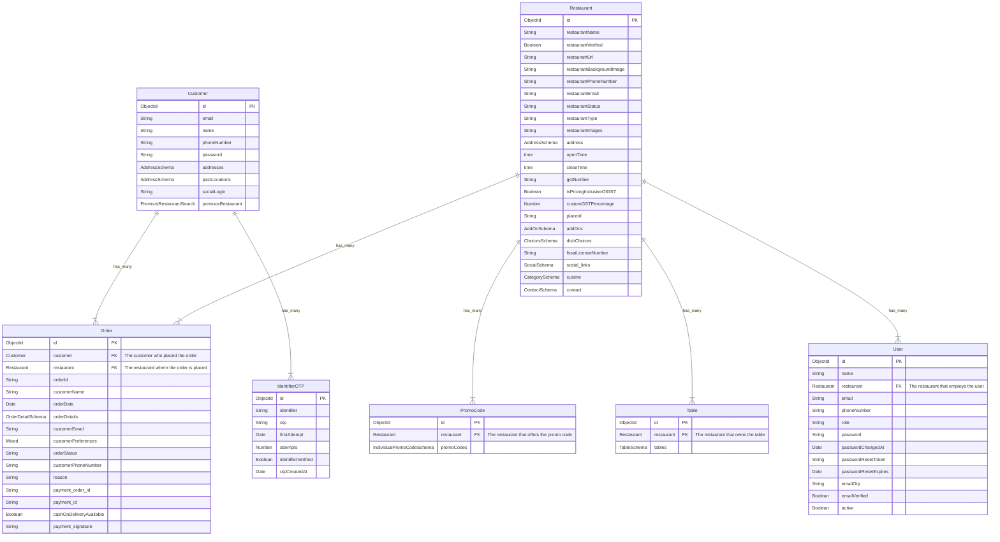

# Digital Menu App: Streamline Restaurant Operations

The Digital Menu App is a comprehensive Angular-based solution designed to modernize and streamline restaurant operations. It offers a robust set of features for menu management, order processing, and customer engagement.

This application serves as a centralized platform for restaurant owners and staff to efficiently manage their digital presence, handle orders, and improve customer service. The app is built with a focus on user experience, performance, and scalability.

## Repository Structure

The repository is organized as follows:

- `src/`: Contains the main application source code
  - `app/`: Angular application modules and components
    - `admin/`: Admin panel components and routing
    - `api/`: Services for API communication and guards
    - `auth/`: Authentication-related components
    - `restaurant/`: Restaurant-specific components
  - `assets/`: Static assets like images and data files
  - `environments/`: Environment-specific configuration files
- `angular.json`: Angular CLI configuration file
- `tsconfig.json`: TypeScript compiler configuration
- `package.json`: NPM package dependencies and scripts

Key Files:
- `src/main.ts`: Entry point of the application
- `src/app/app.module.ts`: Main Angular module
- `src/app/app-routing.module.ts`: Application routing configuration
- `src/environments/environment.ts`: Environment variables

## Usage Instructions

### Installation

Prerequisites:
- Node.js (v14 or later)
- Angular CLI (v12 or later)

To install the application, follow these steps:

1. Clone the repository:
   ```
   git clone <repository-url>
   ```
2. Navigate to the project directory:
   ```
   cd digital-menu-app
   ```
3. Install dependencies:
   ```
   npm install
   ```

### Getting Started

To run the application locally:

1. Start the development server:
   ```
   ng serve
   ```
2. Open a browser and navigate to `http://localhost:4200`

### Configuration

The application can be configured using the environment files located in `src/environments/`. Key configuration options include:

- `apiUrl`: Backend API endpoint
- `socketApiUrl`: WebSocket API endpoint
- `production`: Boolean flag for production mode

### Common Use Cases

1. Adding a new menu item:
   ```typescript
   this.restaurantService.addDish(dishData).subscribe(
     response => {
       console.log('Dish added successfully');
     },
     error => {
       console.error('Error adding dish:', error);
     }
   );
   ```

2. Processing an order:
   ```typescript
   this.orderService.changeOrderStatus({
     orderStatus: 'completed',
     orderId: orderDetail._id
   }).subscribe({
     next: () => {
       console.log('Order completed');
     },
     error: (err) => {
       console.error('Error completing order:', err);
     }
   });
   ```

### Testing & Quality

To run the test suite:

```
ng test
```

### Troubleshooting

Common Issue: API Connection Errors
- Problem: Unable to connect to the backend API
- Diagnostic Steps:
  1. Check the `apiUrl` in the environment configuration
  2. Ensure the backend server is running
  3. Verify network connectivity
- Solution: Update the `apiUrl` in `src/environments/environment.ts` if necessary

Debugging:
- Enable verbose logging by setting `logging: true` in the environment configuration
- Check the browser console for detailed error messages
- Review server logs for backend-related issues

Performance Optimization:
- Use the Angular DevTools extension for Chrome to profile component performance
- Implement lazy loading for feature modules to improve initial load time
- Optimize API calls by implementing caching strategies

## Data Flow

The Digital Menu App follows a typical Angular application data flow:

1. User interacts with the UI components
2. Components call services to fetch or update data
3. Services make HTTP requests to the backend API
4. API responses are processed and stored in services or state management
5. Components update their views based on the new data

```
[User Interface] <-> [Components] <-> [Services] <-> [HTTP Interceptors] <-> [Backend API]
                                        ^
                                        |
                                  [State Management]
```

Important technical considerations:
- Use of RxJS for reactive programming and handling asynchronous operations
- Implementation of interceptors for adding authentication tokens and handling errors
- Proper error handling and user feedback throughout the application

## Deployment

Prerequisites:
- Access to a web server or cloud hosting platform
- SSL certificate for HTTPS (recommended)

Deployment steps:
1. Build the application for production:
   ```
   ng build --prod
   ```
2. Copy the contents of the `dist/` directory to your web server
3. Configure the web server to redirect all requests to `index.html` for proper routing
4. Ensure all API endpoints are accessible from the deployed application

Environment configurations:
- Update `src/environments/environment.prod.ts` with production-specific settings
- Set up environment variables on the server for sensitive information

Monitoring:
- Implement application monitoring using services like Google Analytics or custom logging solutions
- Set up error tracking and reporting using tools like Sentry

### 1.9.5. Entity-Relationship Diagrams (ERD)



### 1.9.6. Sample Queries for Common Use Cases

## Modules and Functions Summary

### Admin Module

#### Components

- `LayoutComponent`
  - **Description**: Main layout component for the admin panel.
  - **Functions**:
    - `ngOnInit()`: Initializes the component.
    - `getRestaurantDetail()`: Fetches restaurant details.
    - `toggleSideBar()`: Toggles the sidebar visibility.
    - `openOrderDialog()`: Opens the order dialog.
    - `logout()`: Logs out the user.

- `DashboardComponent`
  - **Description**: Dashboard component displaying various statistics and information.
  - **Functions**:
    - `ngOnInit()`: Initializes the component.
    - `getOrders()`: Fetches orders based on status.
    - `openDialog(orderDetail)`: Opens the order accept dialog.
    - `completeOrder(orderDetail)`: Completes an order.

- `CustomersComponent`
  - **Description**: Component to manage customers.
  - **Functions**:
    - `ngOnInit()`: Initializes the component.
    - `getCustomers()`: Fetches the list of customers.
    - `toggleLoyalStatus(row)`: Toggles the loyal status of a customer.
    - `toggleBlockedStatus(row)`: Toggles the blocked status of a customer.

#### Services

- `RestaurantPanelService`
  - **Description**: Service for interacting with the restaurant panel API.
  - **Functions**:
    - `getRestaurnatDetail()`: Fetches restaurant details.
    - `getCustomerList()`: Fetches the list of customers.
    - `toggleLoyalOrBlockStatus(type, customerId, status)`: Toggles the loyal or blocked status of a customer.

- `OrderService`
  - **Description**: Service for managing orders.
  - **Functions**:
    - `changeOrderStatus(reqData)`: Changes the status of an order.
    - `getRestaurantOrdersByStatus(reqData)`: Fetches orders based on status.

### Restaurant Module

#### Components

- `RestaurantMenuComponent`
  - **Description**: Component displaying the restaurant menu.
  - **Functions**:
    - `ngOnInit()`: Initializes the component.
    - `getMenuItems()`: Fetches the list of menu items.
    - `addToCart(item)`: Adds an item to the cart.

- `OrderTrackingComponent`
  - **Description**: Component for tracking orders.
  - **Functions**:
    - `ngOnInit()`: Initializes the component.
    - `getOrderStatus(orderId)`: Fetches the status of an order.

#### Services

- `RestaurantService`
  - **Description**: Service for interacting with the restaurant API.
  - **Functions**:
    - `getMenuItems()`: Fetches the list of menu items.
    - `placeOrder(orderData)`: Places a new order.
    - `getOrderStatus(orderId)`: Fetches the status of an order.

### Function Call Relationships

#### Admin Module

- `LayoutComponent`
  - `ngOnInit()` calls `getRestaurantDetail()`.
  - `openOrderDialog()` calls `dialog.open(OrderDialogComponent)`.

- `DashboardComponent`
  - `ngOnInit()` calls `getOrders()`.
  - `openDialog(orderDetail)` calls `dialog.open(OrderAcceptDialogComponent)`.
  - `completeOrder(orderDetail)` calls `orderService.changeOrderStatus()`.

- `CustomersComponent`
  - `ngOnInit()` calls `getCustomers()`.
  - `toggleLoyalStatus(row)` calls `restaurantService.toggleLoyalOrBlockStatus()`.
  - `toggleBlockedStatus(row)` calls `restaurantService.toggleLoyalOrBlockStatus()`.

#### Restaurant Module

- `RestaurantMenuComponent`
  - `ngOnInit()` calls `getMenuItems()`.
  - `addToCart(item)` calls `cartService.addItem()`.

- `OrderTrackingComponent`
  - `ngOnInit()` calls `getOrderStatus(orderId)`.

