# 1. Comprehensive Website Handbook

## 1.1. Index

- [1. Comprehensive Website Handbook](#1-comprehensive-website-handbook)
  - [1.1. Index](#11-index)
  - [1.2. Introduction](#12-introduction)
    - [1.2.1. About the Website](#121-about-the-website)
    - [1.2.2. Purpose of the Handbook](#122-purpose-of-the-handbook)
    - [1.2.3. Target Audience (Developers, Marketers, Testers, etc.)](#123-target-audience-developers-marketers-testers-etc)
    - [1.2.4. How to Use This Handbook](#124-how-to-use-this-handbook)
  - [1.3. Website Overview](#13-website-overview)
    - [1.3.1. Vision and Mission of the Website](#131-vision-and-mission-of-the-website)
    - [1.3.2. Key Features and Offerings](#132-key-features-and-offerings)
    - [1.3.3. Target Audience for the Website (end-users)](#133-target-audience-for-the-website-end-users)
    - [1.3.4. High-Level Overview of the Website Workflow](#134-high-level-overview-of-the-website-workflow)
    - [1.3.5. Glossary of Terms (for technical and non-technical users)](#135-glossary-of-terms-for-technical-and-non-technical-users)
      - [1.3.5.1. General Terms](#1351-general-terms)
      - [1.3.5.2. Order Types](#1352-order-types)
      - [1.3.5.3. User Roles](#1353-user-roles)
      - [1.3.5.4. Technical Terms](#1354-technical-terms)
      - [1.3.5.5. Payment Terms](#1355-payment-terms)
      - [1.3.5.6. Features](#1356-features)
  - [1.4. Functional Flow](#14-functional-flow)
    - [1.4.1. User Flows](#141-user-flows)
    - [1.4.2. Visual Flow Diagrams for Each User Flow](#142-visual-flow-diagrams-for-each-user-flow)
      - [1.4.2.1. delivery order flow](#1421-delivery-order-flow)
      - [1.4.2.2. takeaway order flow](#1422-takeaway-order-flow)
      - [1.4.2.3. dine-in order flow](#1423-dine-in-order-flow)
    - [1.4.3. Use case diagrams](#143-use-case-diagrams)
      - [1.4.3.1. Activity diagrams](#1431-activity-diagrams)
      - [1.4.3.2. State machine diagrams](#1432-state-machine-diagrams)
      - [1.4.3.3. Sequence diagrams](#1433-sequence-diagrams)
      - [1.4.3.4. Communication diagrams](#1434-communication-diagrams)
      - [1.4.3.5. Interaction overview diagrams](#1435-interaction-overview-diagrams)
    - [1.4.4. Key Use Cases and Scenarios](#144-key-use-cases-and-scenarios)
  - [1.5. Technical Architecture](#15-technical-architecture)
    - [1.5.1. Technology Stack Overview](#151-technology-stack-overview)
    - [1.5.2. High-Level Architecture Diagram](#152-high-level-architecture-diagram)
    - [1.5.3. Deployment and Hosting Details](#153-deployment-and-hosting-details)
    - [1.5.4. Environment Setup](#154-environment-setup)
  - [1.6. Beginner’s Guide to Programming](#16-beginners-guide-to-programming)
    - [1.6.1. Introduction to Web Development Basics](#161-introduction-to-web-development-basics)
    - [1.6.2. Overview of Tools and Software to Install](#162-overview-of-tools-and-software-to-install)
    - [1.6.3. Step-by-Step Guide to Setting Up the Project Locally](#163-step-by-step-guide-to-setting-up-the-project-locally)
    - [1.6.4. Suggested Learning Path](#164-suggested-learning-path)
    - [1.6.5. Debugging Basics](#165-debugging-basics)
  - [1.7. Codebase Structure and Flow](#17-codebase-structure-and-flow)
    - [1.7.1. Overview of the Codebase](#171-overview-of-the-codebase)
    - [1.7.2. Code Execution Flow](#172-code-execution-flow)
    - [1.7.3. Understanding Functions and Modules](#173-understanding-functions-and-modules)
      - [1.7.3.1. Core Modules](#1731-core-modules)
      - [1.7.3.2. Key Services](#1732-key-services)
      - [1.7.3.3. Important Components](#1733-important-components)
      - [1.7.3.4. Utility Functions](#1734-utility-functions)
      - [1.7.3.5. Module Interactions](#1735-module-interactions)
      - [1.7.3.6. Admin Module](#1736-admin-module)
        - [1.7.3.6.1. Components](#17361-components)
        - [1.7.3.6.2. Services](#17362-services)
      - [1.7.3.7. Restaurant Module](#1737-restaurant-module)
        - [1.7.3.7.1. Components](#17371-components)
        - [1.7.3.7.2. Services](#17372-services)
      - [1.7.3.8. Function Call Relationships](#1738-function-call-relationships)
        - [1.7.3.8.1. Admin Module](#17381-admin-module)
        - [1.7.3.8.2. Restaurant Module](#17382-restaurant-module)
    - [1.7.4. Step-by-Step Explanation of a Key Feature](#174-step-by-step-explanation-of-a-key-feature)
    - [1.7.5. Reading the Code](#175-reading-the-code)
    - [1.7.6. Code Standards and Best Practices](#176-code-standards-and-best-practices)
  - [1.8. API Documentation](#18-api-documentation)
    - [1.8.1. Overview of API Usage and Purpose](#181-overview-of-api-usage-and-purpose)
    - [1.8.2. API Endpoint List](#182-api-endpoint-list)
      - [1.8.2.1. Admin Panel endpoints](#1821-admin-panel-endpoints)
        - [1.8.2.1.1. Get Restaurants by Status](#18211-get-restaurants-by-status)
        - [1.8.2.1.2. Get Restaurant Payment Details](#18212-get-restaurant-payment-details)
        - [1.8.2.1.3. Get Account Transfer Details](#18213-get-account-transfer-details)
        - [1.8.2.1.4. Get Admin Restaurant Data](#18214-get-admin-restaurant-data)
        - [1.8.2.1.5. Change Restaurant Status](#18215-change-restaurant-status)
        - [1.8.2.1.6. Edit Restaurant Details](#18216-edit-restaurant-details)
        - [1.8.2.1.7. View All Users of a Restaurant](#18217-view-all-users-of-a-restaurant)
        - [1.8.2.1.8. Send Email to Restaurant](#18218-send-email-to-restaurant)
        - [1.8.2.1.9. Export JSON to Excel](#18219-export-json-to-excel)
      - [1.8.2.2. Authentication Endpoints](#1822-authentication-endpoints)
        - [1.8.2.2.1. changePassword](#18221-changepassword)
        - [1.8.2.2.2. resetPassword](#18222-resetpassword)
        - [1.8.2.2.3. register](#18223-register)
        - [1.8.2.2.4. login](#18224-login)
        - [1.8.2.2.5. forgotPassword](#18225-forgotpassword)
        - [1.8.2.2.6. sendEmailVerificationOtp](#18226-sendemailverificationotp)
        - [1.8.2.2.7. verifyEmailOtp](#18227-verifyemailotp)
        - [1.8.2.2.8. Utility Methods](#18228-utility-methods)
      - [1.8.2.3. Customer Details Endpoints](#1823-customer-details-endpoints)
        - [1.8.2.3.1. Store Customer Details](#18231-store-customer-details)
        - [1.8.2.3.2. Get Customer Details](#18232-get-customer-details)
      - [1.8.2.4. Customer Service Endpoints](#1824-customer-service-endpoints)
        - [1.8.2.4.1. Get Customer](#18241-get-customer)
        - [1.8.2.4.2. Add Customer Address](#18242-add-customer-address)
        - [1.8.2.4.3. Edit Customer Address](#18243-edit-customer-address)
        - [1.8.2.4.4. Send Email](#18244-send-email)
        - [1.8.2.4.5. Delete Address of Requesting Customer by ID](#18245-delete-address-of-requesting-customer-by-id)
        - [1.8.2.4.6. Get Nearby Restaurants](#18246-get-nearby-restaurants)
        - [1.8.2.4.7. Get All Restaurants](#18247-get-all-restaurants)
        - [1.8.2.4.8. Get Restaurant Details by URL](#18248-get-restaurant-details-by-url)
        - [1.8.2.4.9. Get Restaurant Details by ID](#18249-get-restaurant-details-by-id)
        - [1.8.2.4.10. Get Promo Codes for Restaurant by URL](#182410-get-promo-codes-for-restaurant-by-url)
        - [1.8.2.4.11. Check If Promo Code is Valid](#182411-check-if-promo-code-is-valid)
        - [1.8.2.4.12. Update Customer Data](#182412-update-customer-data)
        - [1.8.2.4.13. Check If Dine-In is Available](#182413-check-if-dine-in-is-available)
        - [1.8.2.4.14. Get Restaurant Status](#182414-get-restaurant-status)
      - [1.8.2.5. Google Maps Service Endpoints](#1825-google-maps-service-endpoints)
        - [1.8.2.5.1. Get Autocomplete Results](#18251-get-autocomplete-results)
        - [1.8.2.5.2. Get Geocode Details](#18252-get-geocode-details)
        - [1.8.2.5.3. Get Formatted Geocode Details](#18253-get-formatted-geocode-details)
        - [1.8.2.5.4. Get Place Details](#18254-get-place-details)
      - [1.8.2.6. Order Service Endpoints](#1826-order-service-endpoints)
        - [1.8.2.6.1. Place Order](#18261-place-order)
        - [1.8.2.6.2. Store Order](#18262-store-order)
        - [1.8.2.6.3. Get Customer Active Order](#18263-get-customer-active-order)
        - [1.8.2.6.4. Get Restaurant Orders By Status](#18264-get-restaurant-orders-by-status)
        - [1.8.2.6.5. Delete Order By ID](#18265-delete-order-by-id)
        - [1.8.2.6.6. Change Order Status](#18266-change-order-status)
        - [1.8.2.6.7. Change Order Status By User](#18267-change-order-status-by-user)
        - [1.8.2.6.8. Change Order Status By User For Cash On Delivery](#18268-change-order-status-by-user-for-cash-on-delivery)
        - [1.8.2.6.9. Get Customer Order](#18269-get-customer-order)
        - [1.8.2.6.10. Get Order With Payment Order ID](#182610-get-order-with-payment-order-id)
        - [1.8.2.6.11. Get Customer Payment Pending Order](#182611-get-customer-payment-pending-order)
        - [1.8.2.6.12. Generate Bill](#182612-generate-bill)
        - [1.8.2.6.13. Download Bill](#182613-download-bill)
      - [1.8.2.7. Restaurant Service Endpoints](#1827-restaurant-service-endpoints)
        - [1.8.2.7.1. Generate Bill](#18271-generate-bill)
        - [1.8.2.7.2. Change Restaurant Status](#18272-change-restaurant-status)
        - [1.8.2.7.3. Update Dine-In Availability](#18273-update-dine-in-availability)
        - [1.8.2.7.4. Get Restaurant Detail](#18274-get-restaurant-detail)
        - [1.8.2.7.5. Update Restaurant Detail](#18275-update-restaurant-detail)
        - [1.8.2.7.6. Update Payment Gateway](#18276-update-payment-gateway)
        - [1.8.2.7.7. Update Store Settings](#18277-update-store-settings)
        - [1.8.2.7.8. Update Restaurant Cash On Delivery](#18278-update-restaurant-cash-on-delivery)
        - [1.8.2.7.9. Update Restaurant Bypass Auth](#18279-update-restaurant-bypass-auth)
        - [1.8.2.7.10. Update Restaurant Auto Reject](#182710-update-restaurant-auto-reject)
        - [1.8.2.7.11. Update Restaurant Dine-In GST Setting](#182711-update-restaurant-dine-in-gst-setting)
        - [1.8.2.7.12. Update Contact Detail](#182712-update-contact-detail)
        - [1.8.2.7.13. Add Contact Details](#182713-add-contact-details)
        - [1.8.2.7.14. Update Restaurant Banner Image For Mobile](#182714-update-restaurant-banner-image-for-mobile)
        - [1.8.2.7.15. Update Restaurant Banner Image For Small](#182715-update-restaurant-banner-image-for-small)
        - [1.8.2.7.16. Create Table Entry](#182716-create-table-entry)
        - [1.8.2.7.17. Create Room Entry](#182717-create-room-entry)
        - [1.8.2.7.18. Update Table](#182718-update-table)
        - [1.8.2.7.19. Update Room](#182719-update-room)
      - [1.8.2.8. User Service Endpoints](#1828-user-service-endpoints)
        - [1.8.2.8.1. Get All Users](#18281-get-all-users)
        - [1.8.2.8.2. Add User](#18282-add-user)
        - [1.8.2.8.3. Delete User](#18283-delete-user)
        - [1.8.2.8.4. Edit User](#18284-edit-user)
        - [1.8.2.8.5. Get User](#18285-get-user)
        - [1.8.2.8.6. Get Me](#18286-get-me)
    - [1.8.3. Error Codes and Handling](#183-error-codes-and-handling)
      - [1.8.3.1. Error Dialog Component](#1831-error-dialog-component)
      - [1.8.3.2. Common Error Scenarios](#1832-common-error-scenarios)
      - [1.8.3.3. Error Handling Best Practices](#1833-error-handling-best-practices)
    - [1.8.4. How to Test APIs as a Beginner](#184-how-to-test-apis-as-a-beginner)
      - [1.8.4.1. Basic installation and setup](#1841-basic-installation-and-setup)
      - [1.8.4.2. Making a request](#1842-making-a-request)
  - [1.9. Database Design](#19-database-design)
    - [1.9.1. Database Schema Overview](#191-database-schema-overview)
    - [1.9.2. Entities and Attributes](#192-entities-and-attributes)
      - [1.9.2.1. Customer](#1921-customer)
      - [1.9.2.2. IdentifierOTP](#1922-identifierotp)
      - [1.9.2.3. Order](#1923-order)
      - [1.9.2.4. PromoCode](#1924-promocode)
      - [1.9.2.5. Restaurant](#1925-restaurant)
      - [1.9.2.6. Table](#1926-table)
      - [1.9.2.7. User](#1927-user)
    - [1.9.3. Relationships](#193-relationships)
    - [1.9.4. Key Tables and Their Purpose](#194-key-tables-and-their-purpose)
      - [1.9.4.1. Customer Table](#1941-customer-table)
      - [1.9.4.2. IdentifierOTP Table](#1942-identifierotp-table)
      - [1.9.4.3. Order Table](#1943-order-table)
      - [1.9.4.4. PromoCode Table](#1944-promocode-table)
      - [1.9.4.5. Restaurant Table](#1945-restaurant-table)
      - [1.9.4.6. Table Table](#1946-table-table)
      - [1.9.4.7. User Table](#1947-user-table)
    - [1.9.5. Entity-Relationship Diagrams (ERD)](#195-entity-relationship-diagrams-erd)
    - [1.9.6. Sample Queries for Common Use Cases](#196-sample-queries-for-common-use-cases)
      - [1.9.6.1. Retrieve all orders for a specific customer](#1961-retrieve-all-orders-for-a-specific-customer)
      - [1.9.6.2. Find all restaurants offering a specific cuisine](#1962-find-all-restaurants-offering-a-specific-cuisine)
      - [1.9.6.3. Get all active promo codes for a restaurant](#1963-get-all-active-promo-codes-for-a-restaurant)
      - [1.9.6.4. Update the status of an order](#1964-update-the-status-of-an-order)
      - [1.9.6.5. Delete a customer by ID](#1965-delete-a-customer-by-id)
      - [1.9.6.6. Add a new dish to a restaurant's menu](#1966-add-a-new-dish-to-a-restaurants-menu)
      - [1.9.6.7. Retrieve all tables in a restaurant](#1967-retrieve-all-tables-in-a-restaurant)
      - [1.9.6.8. Find all users with a specific role](#1968-find-all-users-with-a-specific-role)
      - [1.9.6.9. Get the details of a specific order](#1969-get-the-details-of-a-specific-order)
      - [1.9.6.10. Update the contact information of a restaurant](#19610-update-the-contact-information-of-a-restaurant)
  - [1.10. User Interface (UI)](#110-user-interface-ui)
    - [1.10.1. Screenshots of All Pages (annotated with descriptions)](#1101-screenshots-of-all-pages-annotated-with-descriptions)
    - [1.10.2. Navigation Map](#1102-navigation-map)
    - [1.10.3. Design Principles Used](#1103-design-principles-used)
  - [1.11. Ad Hoc Process Configuration](#111-ad-hoc-process-configuration)
    - [1.11.1. Payment Gateway Integration](#1111-payment-gateway-integration)
      - [1.11.1.1. Overview of Payment Gateway Used](#11111-overview-of-payment-gateway-used)
      - [1.11.1.2. API Keys, Credentials, and Configuration Steps](#11112-api-keys-credentials-and-configuration-steps)
      - [1.11.1.3. Step-by-Step Guide for Setting Up Payment Flow](#11113-step-by-step-guide-for-setting-up-payment-flow)
    - [1.11.2. Messaging Service Integration (e.g., SMS, WhatsApp)](#1112-messaging-service-integration-eg-sms-whatsapp)
      - [1.11.2.1. Overview of Messaging Providers](#11121-overview-of-messaging-providers)
      - [1.11.2.2. Setting Up API Access and Authentication](#11122-setting-up-api-access-and-authentication)
      - [1.11.2.3. Sending Messages](#11123-sending-messages)
  - [1.12. Testing Guidelines](#112-testing-guidelines)
    - [1.12.1. Overview of Testing Strategy](#1121-overview-of-testing-strategy)
    - [1.12.2. Functional Testing Scenarios](#1122-functional-testing-scenarios)
    - [1.12.3. Technical Testing](#1123-technical-testing)
    - [1.12.4. Bug Reporting Guidelines](#1124-bug-reporting-guidelines)
  - [1.13. Deployment and Maintenance](#113-deployment-and-maintenance)
    - [1.13.1. Deployment Process](#1131-deployment-process)
    - [1.13.2. Version Control Guidelines](#1132-version-control-guidelines)
    - [1.13.3. Backup and Recovery Plan](#1133-backup-and-recovery-plan)
  - [1.14. Troubleshooting Guide](#114-troubleshooting-guide)
    - [1.14.1. Common Issues and Fixes](#1141-common-issues-and-fixes)
    - [1.14.2. Debugging Tips for Developers](#1142-debugging-tips-for-developers)
  - [1.15. Security Considerations](#115-security-considerations)
    - [1.15.1. Security Practices Implemented](#1151-security-practices-implemented)
    - [1.15.2. Guidelines for Handling Sensitive Data](#1152-guidelines-for-handling-sensitive-data)
  - [1.16. FAQ](#116-faq)
    - [1.16.1. Common Questions by Non-Technical Staff](#1161-common-questions-by-non-technical-staff)
    - [1.16.2. Questions Related to API Usage](#1162-questions-related-to-api-usage)
    - [1.16.3. Testing and Debugging FAQs](#1163-testing-and-debugging-faqs)
  - [1.17. Appendix](#117-appendix)
    - [1.17.1. Resources and References](#1171-resources-and-references)
    - [1.17.2. Links to Tools, Libraries, and Frameworks Used](#1172-links-to-tools-libraries-and-frameworks-used)
    - [1.17.3. Glossary of Technical Terms](#1173-glossary-of-technical-terms)

## 1.2. Introduction

### 1.2.1. About the Website

The website isa platformfor the userto order food online. The website provides a list of restaurants, their menus, and allows users to place orders for delivery or pickup or dine in . Users can create accounts, save their favorite orders, and track the status of their orders in real-time.

### 1.2.2. Purpose of the Handbook

The purpose of this handbook is to provide a comprehensive guide to the website's architecture, codebase, and functionality. It is intended for developers, testers, and other stakeholders who need to understand how the website works, how to set it up locally, and how to maintain and troubleshoot it.

### 1.2.3. Target Audience (Developers, Marketers, Testers, etc.)

The target audience for this handbook includes:

- Developers who need to understand the codebase, APIs, and database design.
- Testers who need to know how to test the website and report bugs.
- Marketers who need to understand the website's features and target audience.
- Project managers who need to oversee the development and deployment of the website.
- Non-technical staff who need a high-level overview of the website's functionality.
- New team members who need to onboard quickly and understand the project.
- Anyone interested in learning about web development and programming.

### 1.2.4. How to Use This Handbook

This handbook is organized into sections that cover different aspects of the website, from the high-level overview to the technical details of the codebase and database design. You can use the table of contents to navigate to specific sections or read through the entire handbook to get a comprehensive understanding of the website.

## 1.3. Website Overview

### 1.3.1. Vision and Mission of the Website

The vision of the website is to provide a seamless and convenient online ordering experience for users, connecting them with their favorite restaurants and enabling them to order food with ease. The mission of the website is to offer a wide variety of food options, ensure timely delivery, and provide a user-friendly interface that makes ordering food a pleasant experience.

### 1.3.2. Key Features and Offerings

The website offers the following key features and offerings:

- User registration and account creation
- Restaurant listings with menus and reviews
- Order placement for delivery, pickup, or dine-in
- Real-time order tracking
- Favorite orders and reordering
- Payment gateway integration
- Messaging service integration for order updates

### 1.3.3. Target Audience for the Website (end-users)

The target audience for the website includes:

- Working professionals who want to order food for lunch or dinner
- Families looking to order meals for home delivery
- Students who want to order food for study sessions
- Tourists and travelers looking for local cuisine
- Food enthusiasts who want to explore new restaurants
- Event organizers who need catering services
- Anyone who prefers the convenience of online food ordering
- Anyone who wants to avoid the hassle of cooking

<div style="page-break-after: always;"></div>

### 1.3.4. High-Level Overview of the Website Workflow

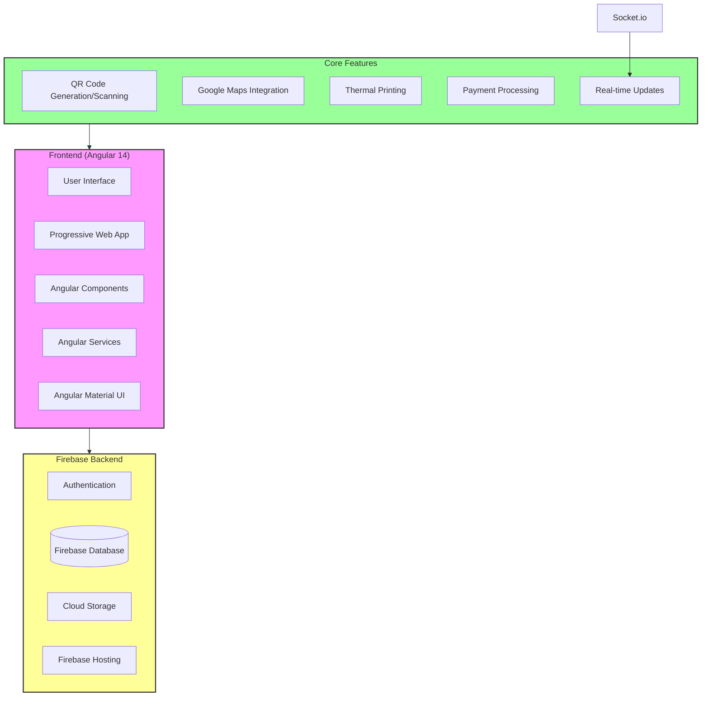

### 1.3.5. Glossary of Terms (for technical and non-technical users)

#### 1.3.5.1. General Terms

- **Digital Menu**: An electronic version of a restaurant's menu that can be accessed through web browsers or mobile devices
- **POS (Point of Sale)**: The system where transactions are processed and orders are managed
- **QR Code**: A square barcode that can be scanned by smartphones to quickly access the digital menu
- **Cart**: A virtual collection of items selected by the customer before placing an order

#### 1.3.5.2. Order Types

- **Dine-in**: Customers eating at the restaurant premises
- **Takeaway**: Customers picking up their order from the restaurant
- **Delivery**: Food being delivered to the customer's specified location

#### 1.3.5.3. User Roles

- **Customer**: End-user who browses the menu and places orders
- **Restaurant Staff**: Personnel who manage orders and update menu items
- **Admin**: System administrator with full access to manage the platform
- **Delivery Partner**: Person responsible for delivering orders to customers

#### 1.3.5.4. Technical Terms

- **Frontend**: The user interface that customers interact with (website/app)
- **Backend**: Server-side system that processes requests and manages data
- **API (Application Programming Interface)**: System that allows different parts of the application to communicate
- **Database**: System that stores all menu items, orders, and user information
- **Authentication**: Process of verifying user identity
- **Cache**: Temporary storage of frequently accessed data for faster performance

#### 1.3.5.5. Payment Terms

- **Payment Gateway**: System that processes online payments securely
- **Transaction**: A completed order payment
- **Payment Status**: Current state of payment (pending/completed/failed)
- **Refund**: Return of payment to customer's account

#### 1.3.5.6. Features

- **Real-time Tracking**: Live monitoring of order status
- **Menu Customization**: Ability to modify menu items based on availability
- **Order History**: Record of all past orders
- **Favorites**: Saved list of frequently ordered items
- **Reviews & Ratings**: Customer feedback system

## 1.4. Functional Flow

<div style="page-break-after: always;"></div>

### 1.4.1. User Flows

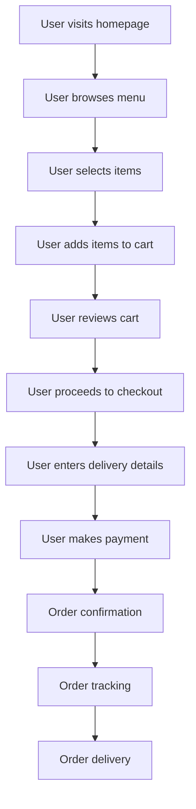

<div style="page-break-after: always;"></div>

### 1.4.2. Visual Flow Diagrams for Each User Flow

#### 1.4.2.1. delivery order flow

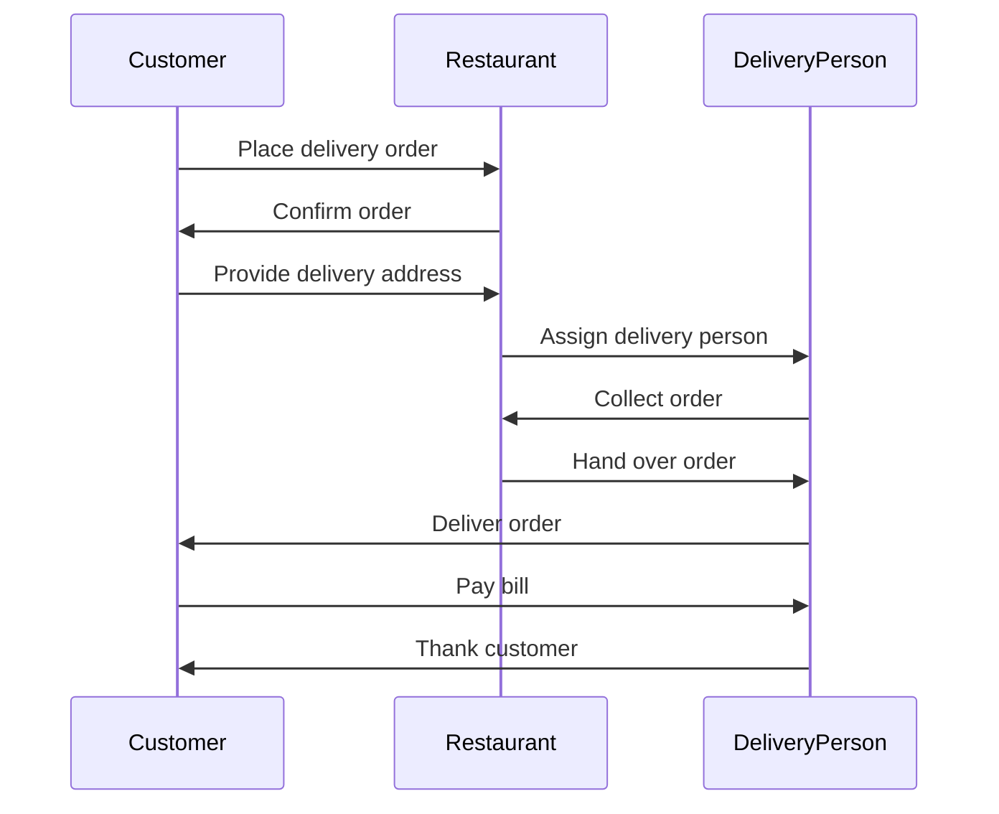

<div style="page-break-after: always;"></div>

#### 1.4.2.2. takeaway order flow

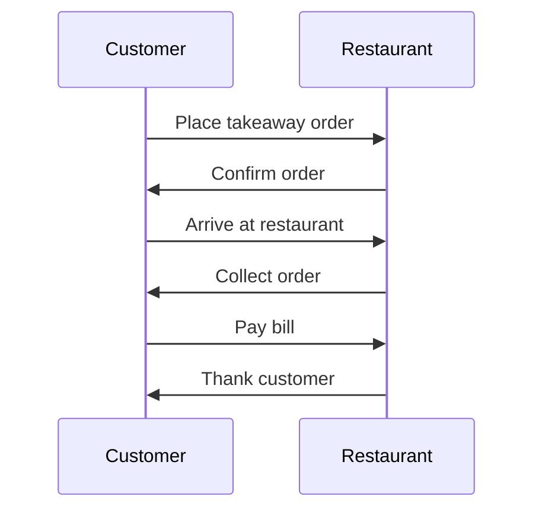

<div style="page-break-after: always;"></div>

#### 1.4.2.3. dine-in order flow

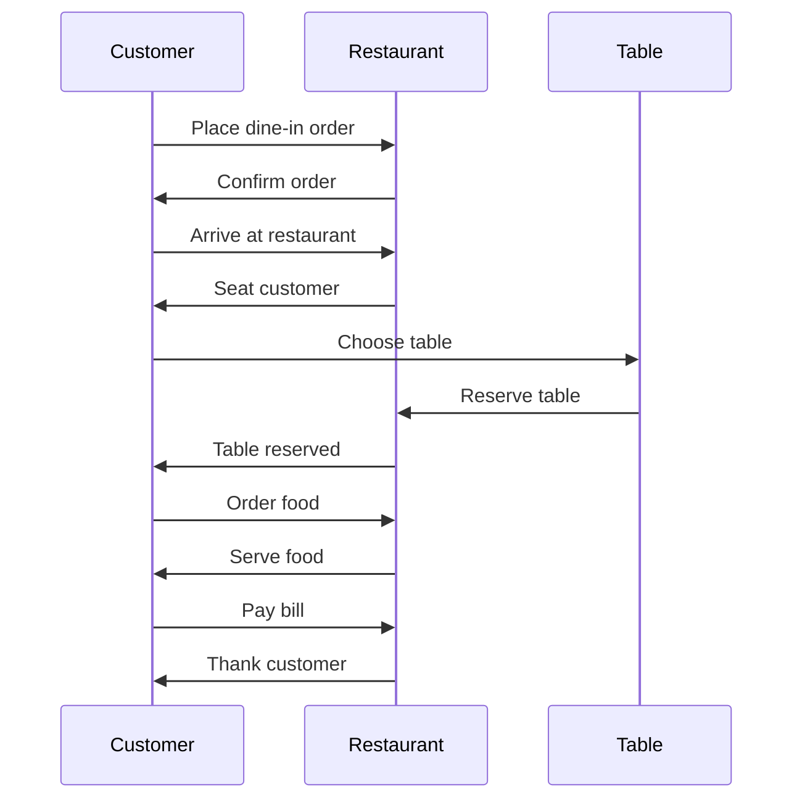

<div style="page-break-after: always;"></div>

### 1.4.3. Use case diagrams

#### 1.4.3.1. Activity diagrams

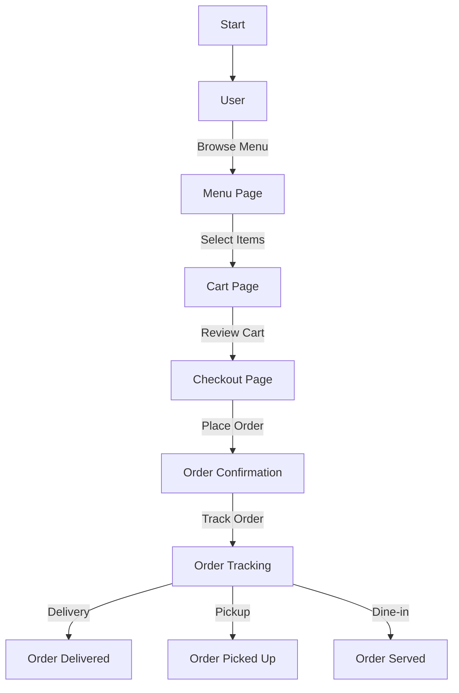

<div style="page-break-after: always;"></div>

#### 1.4.3.2. State machine diagrams

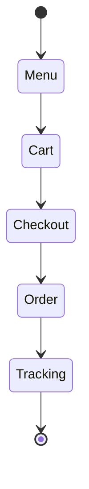

<div style="page-break-after: always;"></div>

#### 1.4.3.3. Sequence diagrams

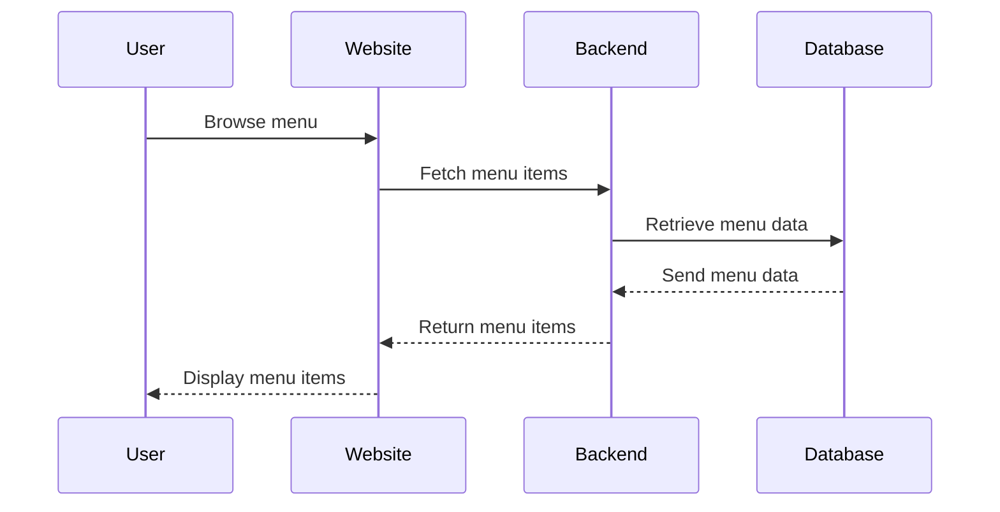

<div style="page-break-after: always;"></div>

#### 1.4.3.4. Communication diagrams

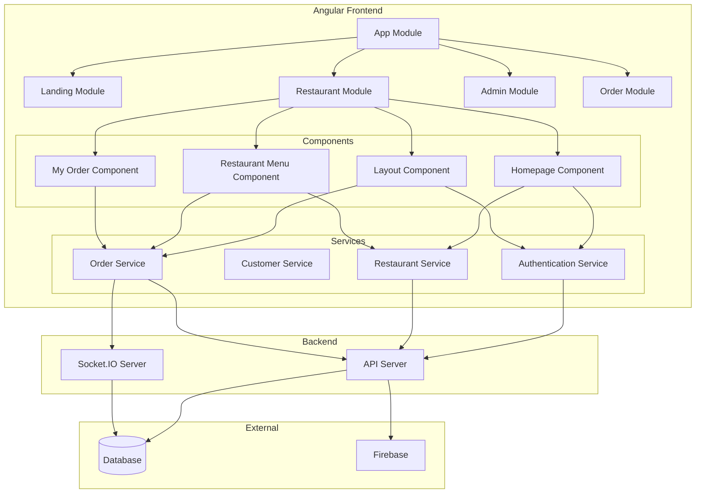

<div style="page-break-after: always;"></div>

#### 1.4.3.5. Interaction overview diagrams

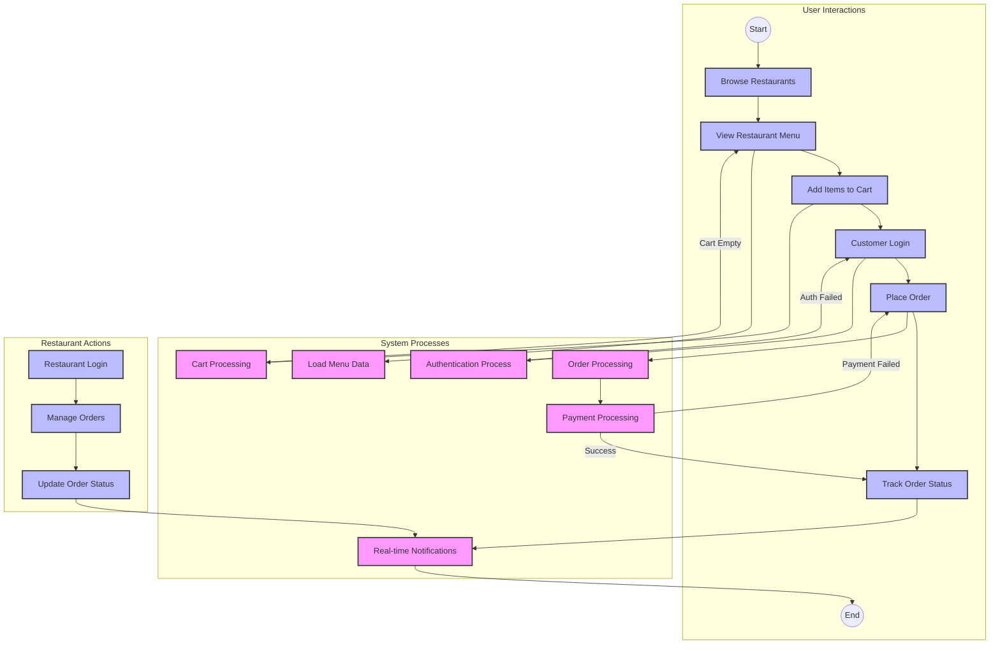

### 1.4.4. Key Use Cases and Scenarios

1. **User Registration and Login**

    - Users can create an account using their phonenumber.
    - Users can log in to their account to access personalized features.

2. **Browsing Restaurant Listings**

    - Users can browse a list of available restaurants based on their location.
    - Users can view restaurant details, including menus, reviews, and ratings.

3. **Placing an Order**

    - Users can select items from a restaurant's menu and add them to their cart.
    - Users can customize their order with special instructions or preferences.
    - Users can choose between delivery, pickup, or dine-in options.

4. **Order Tracking**

    - Users can track the status of their order in real-time.
    - Users receive notifications about order updates, including preparation, delivery, and completion.

5. **Payment Processing**

    - Users can pay for their order using various payment methods, including credit/debit cards, digital wallets, and UPI.
    - Users receive a confirmation of their payment and order details.

6. **User Reviews and Ratings**

    - Users can leave reviews and ratings for restaurants they have ordered from.
    - Users can read reviews and ratings from other customers to make informed decisions.

7. **Customer Support**

    - Users can contact customer support for assistance with their orders.
    - Users can report issues or provide feedback about their experience.

8. **Promotions and Discounts**

    - Users can apply promotional codes or discounts to their orders.
    - Users receive notifications about special offers and promotions.

9. **Account Management**
    - Users can update their account information, including contact details and payment methods.
    - Users can manage their notification preferences and privacy settings.

## 1.5. Technical Architecture

### 1.5.1. Technology Stack Overview

The website is built using the following technologies:

- Frontend: Angular - angular is a platform and framework for building single-page client applications using HTML and TypeScript. Angular is written in TypeScript. It implements core and optional functionality as a set of TypeScript libraries that you import into your apps.
- Backend: Node.js - Node.js is an open-source, cross-platform, back-end JavaScript runtime environment that runs on the V8 engine and executes JavaScript code outside a web browser.
- Database: MongoDB - MongoDB is a general-purpose, document-based, distributed database built for modern application developers and for the cloud era.
- Hosting: firebase.com - Firebase is a platform developed by Google for creating mobile and web applications. It was originally an independent company founded in 2011. In 2014, Google acquired the platform and it is now their flagship offering for app development.
- Payment Gateway: razorpay - Razorpay is a payment gateway that allows businesses to accept, process, and disburse payments with its product suite.
- Messaging Service: whatsapp - WhatsApp is a messaging service that allows users to send text messages, voice messages, images, and videos over the internet.
- Other Tools: Git, Postman, VS Code - Git is a distributed version control system for tracking changes in source code during software development. Postman is a collaboration platform for API development that allows users to design, mock, document, monitor, and test APIs. VS Code is a source-code editor developed by Microsoft for Windows, Linux, and macOS.

### 1.5.2. High-Level Architecture Diagram

### 1.5.3. Deployment and Hosting Details

The website is deployed on firebase.com and hosted on Google Cloud Platform. The deployment process involves building the Angular frontend and deploying it to firebase hosting. The backend is deployed as a Node.js application on firebase functions. The database is hosted on MongoDB Atlas.

### 1.5.4. Environment Setup

1. Go to `https://firebase.google.com/` and click on `Go to console`.
   
2. Click on `Get started with a Firebase project`.
   
3. Enter the project name and click on `Continue`.
   
4. Click on `Create project`.
   
5. Click on `Continue`.
   
6. Click on "hosting".
   
7. Click on `Get started`.
   
8. Install firebase tools using `npm install -g firebase-tools`.
   
9. Login to firebase using `firebase login`.
   
10. Initialize firebase using `firebase init`.
    
11. Deploy to Firebase Hosting using `firebase deploy`.
    
12. deployment successful.
    

## 1.6. Beginner’s Guide to Programming

### 1.6.1. Introduction to Web Development Basics

Web development is the process of building websites and web applications using a combination of HTML, CSS, and JavaScript. HTML is used to create the structure of a web page, CSS is used to style the page, and JavaScript is used to add interactivity and dynamic behavior to the page. Web development also involves working with backend technologies like Node.js and databases like MongoDB to create full-stack applications.

### 1.6.2. Overview of Tools and Software to Install

1. Node.js - Node.js is a JavaScript runtime built on Chrome's V8 JavaScript engine. You can download Node.js from the official website and install it on your machine.
2. Angular CLI - The Angular CLI is a command-line interface tool that you use to initialize, develop, scaffold, and maintain Angular applications directly from a command shell.
3. MongoDB - MongoDB is a general-purpose, document-based, distributed database built for modern application developers and for the cloud era. You can download MongoDB from the official website and install it on your machine.
4. Git - Git is a distributed version control system for tracking changes in source code during software development. You can download Git from the official website and install it on your machine.
5. Postman - Postman is a collaboration platform for API development that allows users to design, mock, document, monitor, and test APIs. You can download Postman from the official website and install it on your machine.
6. VS Code - Visual Studio Code is a source-code editor developed by Microsoft for Windows, Linux, and macOS. You can download VS Code from the official website and install it on your machine.
7. Firebase CLI - The Firebase Command Line Interface (CLI) provides a variety of tools for managing, viewing, and deploying to Firebase projects. You can install the Firebase CLI using npm.
8. Angular Material - Angular Material is a UI component library for Angular that provides a set of high-quality UI components built with Angular and TypeScript. You can install Angular Material using npm.
9. Razorpay - Razorpay is a payment gateway that allows businesses to accept, process, and disburse payments with its product suite. You can sign up for a Razorpay account and get API keys to integrate with your application.
10. WhatsApp Business API - The WhatsApp Business API allows businesses to communicate with customers over WhatsApp. You can sign up for a WhatsApp Business API account and get API credentials to send messages.

### 1.6.3. Step-by-Step Guide to Setting Up the Project Locally

1. open command prompt by pressing `windows + r` and typing `cmd` and press enter.
   
   
2. Clone the repository from GitHub using the `git clone https://github.com/Harsh98992/digitalMenu.git` command.
   
3. Install Node.js from the official website `https://nodejs.org/en/`.
   
4. Install Angular CLI using the `npm install -g @angular/cli` command.
5. Install MongoDB from the official website `https://www.mongodb.com/try/download/community`.
6. Install Git from the official website `https://git-scm.com/`.
7. Install Postman from the official website `https://www.postman.com/`.
8. Install VS Code from the official website `https://code.visualstudio.com/`.
9. Install Firebase CLI using the `npm install -g firebase-tools` command.

### 1.6.4. Suggested Learning Path

If you are new to web development, here is a suggested learning path to get started:

1. **HTML, CSS, and JavaScript Basics**

    - Learn the fundamentals of HTML from the `https://www.w3schools.com/html/` website.
    - Learn the basics of CSS from the `https://www.w3schools.com/css/` website.
    - Learn JavaScript basics from the `https://www.w3schools.com/js/` website.
    - Practice building simple web pages using HTML, CSS, and JavaScript.

2. **Angular Basics**

    - Learn the basics of Angular from the `https://angular.io/docs` website.
    - Build a simple Angular application using components, services, and modules.
    - Learn how to use Angular CLI to scaffold and generate code.

3. **Node.js Basics**

    - Dive into Node.js basics from the [Node.js documentation](https://nodejs.org/en/docs/).
    - Build a simple backend application using Express.js.
    - Explore how to handle routing, middleware, and RESTful API endpoints.

4. **MongoDB Basics**

    - Learn MongoDB basics from the [MongoDB documentation](https://docs.mongodb.com/).
    - Set up a MongoDB database and connect it with your Node.js backend application.
    - Practice performing CRUD operations (Create, Read, Update, Delete).

5. **Deployment to Firebase Hosting**

    - Learn how to deploy your application using [Firebase Hosting](https://firebase.google.com/docs/hosting).
    - Set up Firebase CLI and configure your project for deployment.

6. **Payment Gateway Integration**

    - Integrate a payment gateway like Razorpay. Check out the [Razorpay Documentation](https://razorpay.com/docs/).
    - Implement the necessary steps to handle transactions and payments in your application.

7. **Messaging Service Integration**

    - Learn how to integrate a messaging service like WhatsApp using the [WhatsApp Business API](https://developers.facebook.com/docs/whatsapp).
    - Set up the API and configure messaging functionalities.

8. **Testing and Debugging**
    - Learn how to test and debug your application using tools like [Jest](https://jestjs.io/) for unit testing and [Postman](https://www.postman.com/) for API testing.
    - Implement end-to-end testing to ensure the stability of your application.

### 1.6.5. Debugging Basics

Debugging is the process of finding and fixing errors in your code. Here are some basic debugging techniques:

1. Use console.log() statements to print values and debug information.
   
2. Use the browser developer tools to inspect elements, view console logs, and debug JavaScript code.
   
3. Use breakpoints in your code to pause execution and inspect variables.
4. Use the Angular CLI to run the project in development mode and view error messages in the console.
5. Use the Postman tool to test APIs and view response data.
6. Use the VS Code debugger to step through your code and inspect variables.
7. Use the Firebase CLI to view logs and debug cloud functions.

## 1.7. Codebase Structure and Flow

### 1.7.1. Overview of the Codebase

The repository is organized as follows:

- `src/`: Contains the main application source code
  - `app/`: Angular application modules and components
    - `admin/`: Admin panel components and routing
    - `api/`: Services for API communication and guards
    - `auth/`: Authentication-related components
    - `restaurant/`: Restaurant-specific components
  - `assets/`: Static assets like images and data files
  - `environments/`: Environment-specific configuration files
- `angular.json`: Angular CLI configuration file
- `tsconfig.json`: TypeScript compiler configuration
- `package.json`: NPM package dependencies and scripts

Key Files:

- `src/main.ts`: Entry point of the application
- `src/app/app.module.ts`: Main Angular module
- `src/app/app-routing.module.ts`: Application routing configuration
- `src/environments/environment.ts`: Environment variables
- `src/app/app.component.ts`: Root component

<div style="page-break-after: always;"></div>

### 1.7.2. Code Execution Flow

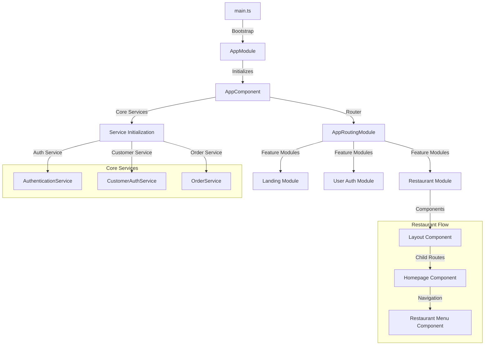

### 1.7.3. Understanding Functions and Modules

In this section, we will break down the key functions and modules used in the project to help you understand their roles and how they interact with each other.

#### 1.7.3.1. Core Modules

1. **AppModule**: The root module that bootstraps the Angular application. It imports essential modules like BrowserModule, AppRoutingModule, and HttpClientModule.

2. **AppRoutingModule**: Manages the routing configuration for the application. It defines the routes and their corresponding components.

3. **SharedModule**: Contains shared components, directives, and pipes that are used across multiple modules in the application.

#### 1.7.3.2. Key Services

1. **AuthService**: Handles authentication-related operations such as login, logout, and token management.

2. **CustomerService**: Manages customer-related data and operations, including fetching customer details, updating profiles, and handling orders.

3. **OrderService**: Responsible for order-related functionalities, such as placing orders, fetching order details, and updating order statuses.

4. **RestaurantService**: Manages restaurant-specific operations, including fetching restaurant details, updating menus, and handling reservations.

#### 1.7.3.3. Important Components

1. **AppComponent**: The root component that initializes the application and contains the main layout.

2. **HeaderComponent**: Displays the navigation bar and handles user interactions related to navigation.

3. **FooterComponent**: Displays the footer content of the application.

4. **HomeComponent**: The landing page component that provides an overview of the application and its features.

5. **MenuComponent**: Displays the restaurant menu and allows users to add items to their cart.

6. **CartComponent**: Manages the shopping cart, displaying selected items and handling checkout operations.

#### 1.7.3.4. Utility Functions

1. **formatDate**: A utility function that formats dates into a readable string format.

2. **calculateTotal**: Calculates the total amount for the items in the cart.

3. **validateEmail**: Validates email addresses to ensure they follow the correct format.

#### 1.7.3.5. Module Interactions

The modules and services interact with each other to provide a seamless user experience. For example:

- The **AuthService** interacts with the **HttpClientModule** to make API calls for authentication.
- The **OrderService** uses the **CustomerService** to fetch customer details when placing an order.
- The **RestaurantService** interacts with the **MenuComponent** to display the restaurant's menu.

Understanding these functions and modules will help you navigate the codebase more effectively and make necessary modifications or enhancements with confidence.

#### 1.7.3.6. Admin Module

##### 1.7.3.6.1. Components

- `LayoutComponent`
  - **Description**: Main layout component for the admin panel.
  - **Functions**:
    - `ngOnInit()`: Initializes the component.
    - `getRestaurantDetail()`: Fetches restaurant details.
    - `toggleSideBar()`: Toggles the sidebar visibility.
    - `openOrderDialog()`: Opens the order dialog.
    - `logout()`: Logs out the user.

- `DashboardComponent`
  - **Description**: Dashboard component displaying various statistics and information.
  - **Functions**:
    - `ngOnInit()`: Initializes the component.
    - `getOrders()`: Fetches orders based on status.
    - `openDialog(orderDetail)`: Opens the order accept dialog.
    - `completeOrder(orderDetail)`: Completes an order.

- `CustomersComponent`
  - **Description**: Component to manage customers.
  - **Functions**:
    - `ngOnInit()`: Initializes the component.
    - `getCustomers()`: Fetches the list of customers.
    - `toggleLoyalStatus(row)`: Toggles the loyal status of a customer.
    - `toggleBlockedStatus(row)`: Toggles the blocked status of a customer.

##### 1.7.3.6.2. Services

- `RestaurantPanelService`
  - **Description**: Service for interacting with the restaurant panel API.
  - **Functions**:
    - `getRestaurnatDetail()`: Fetches restaurant details.
    - `getCustomerList()`: Fetches the list of customers.
    - `toggleLoyalOrBlockStatus(type, customerId, status)`: Toggles the loyal or blocked status of a customer.

- `OrderService`
  - **Description**: Service for managing orders.
  - **Functions**:
    - `changeOrderStatus(reqData)`: Changes the status of an order.
    - `getRestaurantOrdersByStatus(reqData)`: Fetches orders based on status.

#### 1.7.3.7. Restaurant Module

##### 1.7.3.7.1. Components

- `RestaurantMenuComponent`
  - **Description**: Component displaying the restaurant menu.
  - **Functions**:
    - `ngOnInit()`: Initializes the component.
    - `getMenuItems()`: Fetches the list of menu items.
    - `addToCart(item)`: Adds an item to the cart.

- `OrderTrackingComponent`
  - **Description**: Component for tracking orders.
  - **Functions**:
    - `ngOnInit()`: Initializes the component.
    - `getOrderStatus(orderId)`: Fetches the status of an order.

##### 1.7.3.7.2. Services

- `RestaurantService`
  - **Description**: Service for interacting with the restaurant API.
  - **Functions**:
    - `getMenuItems()`: Fetches the list of menu items.
    - `placeOrder(orderData)`: Places a new order.
    - `getOrderStatus(orderId)`: Fetches the status of an order.

#### 1.7.3.8. Function Call Relationships

##### 1.7.3.8.1. Admin Module

- `LayoutComponent`
  - `ngOnInit()` calls `getRestaurantDetail()`.
  - `openOrderDialog()` calls `dialog.open(OrderDialogComponent)`.

- `DashboardComponent`
  - `ngOnInit()` calls `getOrders()`.
  - `openDialog(orderDetail)` calls `dialog.open(OrderAcceptDialogComponent)`.
  - `completeOrder(orderDetail)` calls `orderService.changeOrderStatus()`.

- `CustomersComponent`
  - `ngOnInit()` calls `getCustomers()`.
  - `toggleLoyalStatus(row)` calls `restaurantService.toggleLoyalOrBlockStatus()`.
  - `toggleBlockedStatus(row)` calls `restaurantService.toggleLoyalOrBlockStatus()`.

##### 1.7.3.8.2. Restaurant Module

- `RestaurantMenuComponent`
  - `ngOnInit()` calls `getMenuItems()`.
  - `addToCart(item)` calls `cartService.addItem()`.

- `OrderTrackingComponent`
  - `ngOnInit()` calls `getOrderStatus(orderId)`.

### 1.7.4. Step-by-Step Explanation of a Key Feature

### 1.7.5. Reading the Code

### 1.7.6. Code Standards and Best Practices

Adhering to code standards and best practices is crucial for maintaining a high-quality codebase. Below are some guidelines to follow:

1. **Consistent Naming Conventions**:

    - Use camelCase for variables and functions.
    - Use PascalCase for classes and components.
    - Use UPPER_SNAKE_CASE for constants.

2. **Code Formatting**:

    - Use a eslint to enforce consistent code formatting.
    - 
    - Indent code blocks with 2 spaces.
    - Limit lines to 80 characters.

3. **Commenting and Documentation**:

    - Write clear and concise comments for complex logic.
    - Use JSDoc or similar tools for documenting functions and classes.
    - Update documentation regularly to reflect code changes.

4. **Error Handling**:

    - Use try-catch blocks to handle exceptions.
    - Log errors for debugging purposes.
    - Provide meaningful error messages to users.

5. **Code Reviews**:

    - Conduct regular code reviews to ensure code quality.
    - Provide constructive feedback during code reviews.
    - Address code review comments promptly.

6. **Testing**:

    - Write unit tests for all functions and components.
    - Use test-driven development (TDD) where applicable.
    - Ensure tests cover edge cases and potential failure points.

7. **Version Control**:

    - Use meaningful commit messages.
    - Commit code frequently with small, incremental changes.
    - Use branches for new features and bug fixes.

8. **Performance Optimization**:

    - Optimize code for performance where necessary.
    - Avoid premature optimization; focus on readability and maintainability first.
    - Profile and benchmark code to identify performance bottlenecks.

9. **Security**:

    - Follow best practices for securing code and data.
    - Validate and sanitize user inputs.
    - Use secure coding practices to prevent vulnerabilities.

10. **Continuous Integration and Deployment (CI/CD)**:
    - Use CI/CD pipelines to automate testing and deployment.
    - Ensure that the build process is reliable and repeatable.
    - Monitor deployments and rollback if issues are detected.

## 1.8. API Documentation

### 1.8.1. Overview of API Usage and Purpose

The digital menu system's API infrastructure serves as the backbone of communication between the frontend application and backend services. Our APIs are built using RESTful principles and are primarily used for:

1. **Menu Management**

    - Retrieving restaurant menus and item details
    - Managing menu items, categories, and pricing
    - Handling menu availability and special offers

2. **Order Processing**

    - Creating and managing customer orders
    - Tracking order status and updates
    - Managing delivery/pickup preferences

3. **User Management**

    - Customer authentication and authorization
    - Profile management and preferences
    - Order history and favorites

4. **Restaurant Operations**
    - Staff authentication and role-based access
    - Order queue management
    - Real-time kitchen notifications

All APIs use JSON for data exchange and require proper authentication using JWT tokens. The base URL for all API endpoints is `/api/v1`, and requests are secured using HTTPS protocol.

### 1.8.2. API Endpoint List

#### 1.8.2.1. Admin Panel endpoints

##### 1.8.2.1.1. Get Restaurants by Status

- **Endpoint**: `/api/v1/admin/getRestaurantsByStatus/:restaurantVerified`
- **Method**: GET
- **Description**: Retrieves a list of restaurants based on their verification status.
- **Parameters**:

  - `restaurantVerified` (boolean): Indicates whether the restaurant is verified or not.
  - Example: `/api/v1/admin/getRestaurantsByStatus/true`
  - Example Response:

```json
{
    "restaurants": [
        {
            "id": "123",
            "name": "Restaurant A",
            "verified": true
        },
        {
            "id": "456",
            "name": "Restaurant B",
            "verified": true
        }
    ]
}
```

- **Response**: Returns an array of restaurant objects with their details.
- **Authorization**: Admin role required.
- **Error Handling**: Returns an error message if the request fails.
- **Sample Code**:

    ```typescript
    getRestaurantsByStatus(restaurantVerified: boolean) {
        return this.http.get(
            `${this.apiUrl}/v1/admin/getRestaurantsByStatus/${restaurantVerified}`
        );
    }
    ```

##### 1.8.2.1.2. Get Restaurant Payment Details

- **Endpoint**: `/api/v1/payment/getAccountPaymentDetails`
- **Method**: GET
- **Description**: Fetches payment details for all restaurant accounts.
- **Parameters**: None.
- **Example Response**:

    ```json
    {
        "payments": [
            {
                "restaurantId": "123",
                "restaurantName": "Restaurant A",
                "totalEarnings": 15000,
                "pendingAmount": 5000,
                "lastPaymentDate": "2025-01-10"
            },
            {
                "restaurantId": "456",
                "restaurantName": "Restaurant B",
                "totalEarnings": 20000,
                "pendingAmount": 3000,
                "lastPaymentDate": "2025-01-12"
            }
        ]
    }
    ```

- **Response**: Returns an array of objects containing payment information for each restaurant.
- **Authorization**: Admin role required.
- **Error Handling**: Returns an error message if the request fails.
- **Sample Code**:

    ```typescript
    getRestaurantPayment() {
        return this.http.get(
            `${this.apiUrl}/v1/payment/getAccountPaymentDetails`
        );
    }
    ```

##### 1.8.2.1.3. Get Account Transfer Details

- **Endpoint**: `/api/v1/payment/getAccountTransferDetails/:orderId`
- **Method**: GET
- **Description**: Retrieves transfer details for a specific order.
- **Parameters**:
  - `orderId` (string): The unique identifier for the order.
- **Example**: `/api/v1/payment/getAccountTransferDetails/ORD12345`
- **Example Response**:

    ```json
    {
        "orderId": "ORD12345",
        "restaurantId": "123",
        "transferAmount": 2000,
        "transferDate": "2025-01-15",
        "status": "Completed"
    }
    ```

- **Response**: Returns an object with the details of the account transfer related to the order.
- **Authorization**: Admin role required.
- **Error Handling**: Returns an error message if the order ID is invalid or the request fails.
- **Sample Code**:

    ```typescript
    getAccountTransferDetails(orderId: string) {
        return this.http.get(
            `${this.apiUrl}/v1/payment/getAccountTransferDetails/${orderId}`
        );
    }
    ```

##### 1.8.2.1.4. Get Admin Restaurant Data

- **Endpoint**: `/api/v1/admin/getRestaurantDetail/:id`
- **Method**: GET
- **Description**: Fetches detailed information about a specific restaurant.
- **Parameters**:
  - `id` (string): The unique identifier for the restaurant.
- **Example**: `/api/v1/admin/getRestaurantDetail/123`
- **Example Response**:

    ```json
    {
        "id": "123",
        "name": "Restaurant A",
        "verified": true,
        "owner": "John Doe",
        "contact": "123-456-7890",
        "address": "123 Main St, City, State",
        "cuisine": ["Italian", "Mexican"],
        "ratings": 4.5
    }
    ```

- **Response**: Returns detailed information about the restaurant, including owner details, address, and ratings.
- **Authorization**: Admin role required.
- **Error Handling**: Returns an error message if the restaurant ID is invalid or the request fails.
- **Sample Code**:

    ```typescript
    getAdminRestaurantData(id: string) {
        return this.http.get(
            `${this.apiUrl}/v1/admin/getRestaurantDetail/${id}`
        );
    }
    ```

##### 1.8.2.1.5. Change Restaurant Status

- **Endpoint**: `/api/v1/admin/changeRestaurantStatus/:id`
- **Method**: PATCH
- **Description**: Updates the verification status of a restaurant.
- **Parameters**:

  - `id` (string): The unique identifier for the restaurant.
  - Request Body:

```json
{
    "verified": true
}
```

- **Example**: `/api/v1/admin/changeRestaurantStatus/123`
- **Example Response**:

    ```json
    {
        "message": "Restaurant status updated successfully."
    }
    ```

- **Response**: Returns a success message upon updating the restaurant's status.
- **Authorization**: Admin role required.
- **Error Handling**: Returns an error message if the restaurant ID is invalid or the request fails.
- **Sample Code**:

    ```typescript
    changeRestaurantStatus(id: string, data: any) {
        return this.http.patch(
            `${this.apiUrl}/v1/admin/changeRestaurantStatus/${id}`,
            data
        );
    }
    ```

##### 1.8.2.1.6. Edit Restaurant Details

- **Endpoint**: `/api/v1/admin/editRestaurant/:id`
- **Method**: PATCH
- **Description**: Updates the details of a restaurant.
- **Parameters**:

  - `id` (string): The unique identifier for the restaurant.
  - Request Body:

```json
{
    "name": "New Restaurant Name",
    "contact": "987-654-3210",
    "address": "456 Main St, City, State",
    "cuisine": ["Indian", "Chinese"]
}
```

- **Example**: `/api/v1/admin/editRestaurant/123`
- **Example Response**:

    ```json
    {
        "message": "Restaurant details updated successfully."
    }
    ```

- **Response**: Returns a success message upon updating the restaurant's details.
- **Authorization**: Admin role required.
- **Error Handling**: Returns an error message if the restaurant ID is invalid or the request fails.
- **Sample Code**:

    ```typescript
    editRestaurant(id: string, data: any) {
        return this.http.patch(
            `${this.apiUrl}/v1/admin/editRestaurant/${id}`,
            data
        );
    }
    ```

##### 1.8.2.1.7. View All Users of a Restaurant

- **Endpoint**: `/api/v1/admin/viewAllUsersOfRestaurant/:id`
- **Method**: GET
- **Description**: Retrieves a list of all users associated with a specific restaurant.
- **Parameters**:

  - `id` (string): The unique identifier for the restaurant.
  - Example: `/api/v1/admin/viewAllUsersOfRestaurant/123`
  - Example Response:

```json
{
    "users": [
        {
            "id": "456",
            "name": "User A",
            "email": "abc#example.com",
            "role": "Customer"
        },
        {
            "id": "789",
            "name": "User B",
            "email": "xyz#example.com",
            "role": "Staff"
        }
    ]
}
```

- **Response**: Returns an array of user objects with their details.
- **Authorization**: Admin role required.
- **Error Handling**: Returns an error message if the restaurant ID is invalid or the request fails.
- **Sample Code**:

    ```typescript
    viewAllUsersOfRestaurant(id: string) {
        return this.http.get(
            `${this.apiUrl}/v1/admin/viewAllUsersOfRestaurant/${id}`
        );
    }
    ```

##### 1.8.2.1.8. Send Email to Restaurant

- **Endpoint**: `/api/v1/admin/sendEmailToRestaurant`
- **Method**: POST
- **Description**: Sends an email notification to a restaurant.
- **Request Body**:

    ```json
    {
        "restaurantId": "123",
        "subject": "Order Notification",
        "message": "You have a new order pending."
    }
    ```

- **Response**: Returns a success message upon sending the email.
- **Authorization**: Admin role required.
- **Error Handling**: Returns an error message if the request fails.
- **Sample Code**:

    ```typescript
    sendEmailToRestaurant(data: any) {
        return this.http.post(
            `${this.apiUrl}/v1/admin/sendEmailToRestaurant`,
            data
        );
    }
    ```

##### 1.8.2.1.9. Export JSON to Excel

- **Description**: Converts JSON data to an Excel file and downloads it.
- **Parameters**:

  - `jsonData` (array): The JSON data to export.
  - `fileName` (string): The name of the Excel file.
  - **Sample Code**:

```typescript
        exportJsonToExcel(jsonData: any[], fileName: string): void {
            const worksheet: XLSX.WorkSheet = XLSX.utils.json_to_sheet(jsonData);
            const workbook: XLSX.WorkBook = {
                Sheets: { data: worksheet },
                SheetNames: ["data"],
            };
            const excelBuffer: any = XLSX.write(workbook, {
                bookType: "xlsx",
                type: "array",
            });
            this.saveAsExcelFile(excelBuffer, fileName);
        }

        private saveAsExcelFile(buffer: any, fileName: string): void {
            const data: Blob = new Blob([buffer], { type: this.EXCEL_TYPE });
            saveAs(
                data,
                fileName + "_export_" + new Date().getTime() + this.EXCEL_EXTENSION
            );
        }
```

#### 1.8.2.2. Authentication Endpoints

##### 1.8.2.2.1. changePassword

- **Endpoint**: `/api/v1/user/updatePassword`
- **Method**: PATCH
- **Description**: Updates the user's password.
- **Parameters**:

  - Request Body:

```json
{
    "oldPassword": "password123",
    "newPassword": "newpassword123"
}
```

- **Response**: Returns a success message upon updating the password.
- **Authorization**: User authentication required.
- **Error Handling**: Returns an error message if the request fails.
- **Sample Code**:

    ```typescript
    changePassword(requestData) {
        return this.http.patch(
            `${this.apiUrl}/v1/user/updatePassword`,
            requestData
        );
    }
    ```

##### 1.8.2.2.2. resetPassword

- **Endpoint**: `/api/v1/user/resetPassword/:token`
- **Method**: PATCH
- **Description**: Resets the user's password using a valid reset token.
- **Parameters**:
  - `token` (string): A unique token sent to the user's email for password reset.
  - Request Body:

```json
{
    "password": "newpassword123"
}
```

- **Response**: Returns a success message upon successfully resetting the password.
- **Authorization**: No authentication required; token-based validation.
- **Error Handling**: Returns an error if the token is invalid, expired, or the request fails.
- **Sample Code**:

    ```typescript
    resetPassword(password: string, token: string) {
        return this.http.patch(
            `${this.apiUrl}/v1/user/resetPassword/${token}`,
            { password }
        );
    }
    ```

##### 1.8.2.2.3. register

- **Endpoint**: `/api/v1/user/signup`
- **Method**: POST
- **Description**: Registers a new user with the provided details.
- **Parameters**:
  - Request Body:

```json
{
    "name": "John Doe",
    "email": "johndoe@example.com",
    "password": "password123",
    "confirmPassword": "password123"
}
```

- **Response**: Returns a success message and user details upon successful registration.
- **Authorization**: No authentication required.
- **Error Handling**: Returns an error if the email is already registered or the request fails.
- **Sample Code**:

    ```typescript
    register(userData) {
        return this.http.post(`${this.apiUrl}/v1/user/signup`, userData);
    }
    ```

##### 1.8.2.2.4. login

- **Endpoint**: `/api/v1/user/login`
- **Method**: POST
- **Description**: Logs in a user using their email and password.
- **Parameters**:
  - Request Body:

```json
{
    "email": "johndoe@example.com",
    "password": "password123"
}
```

- **Response**: Returns a success message, user details, and an authentication token upon successful login.
- **Authorization**: No authentication required.
- **Error Handling**: Returns an error if the credentials are invalid or the request fails.
- **Sample Code**:

    ```typescript
    login(userData: { email: string; password: string }) {
        this.customerAuth.removeToken();
        return this.http.post(`${this.apiUrl}/v1/user/login`, userData);
    }
    ```

##### 1.8.2.2.5. forgotPassword

- **Endpoint**: `/api/v1/user/forgotPassword`
- **Method**: POST
- **Description**: Sends a password reset link to the user's email address.
- **Parameters**:
  - Request Body:

```json
{
    "email": "johndoe@example.com"
}
```

- **Response**: Returns a success message confirming that the reset link has been sent.
- **Authorization**: No authentication required.
- **Error Handling**: Returns an error if the email is not registered or the request fails.
- **Sample Code**:

    ```typescript
    forgotPassword(email: string) {
        return this.http.post(`${this.apiUrl}/v1/user/forgotPassword`, { email });
    }
    ```

##### 1.8.2.2.6. sendEmailVerificationOtp

- **Endpoint**: `/api/v1/user/emailVerification`
- **Method**: POST
- **Description**: Sends an OTP to the user's email for email verification.
- **Parameters**:
  - Request Body:

```json
{
    "email": "johndoe@example.com"
}
```

- **Response**: Returns a success message confirming that the OTP has been sent.
- **Authorization**: No authentication required.
- **Error Handling**: Returns an error if the email is invalid or the request fails.
- **Sample Code**:

    ```typescript
    sendEmailVerificationOtp(email: string) {
        const data = { email };
        return this.http.post(`${this.apiUrl}/v1/user/emailVerification`, data);
    }
    ```

##### 1.8.2.2.7. verifyEmailOtp

- **Endpoint**: `/api/v1/user/verifyEmailOtp`
- **Method**: PUT
- **Description**: Verifies the OTP sent to the user's email.
- **Parameters**:
  - Request Body:

```json
{
    "otp": "123456",
    "email": "johndoe@example.com"
}
```

- **Response**: Returns a success message upon successful verification of the email.
- **Authorization**: No authentication required.
- **Error Handling**: Returns an error if the OTP is invalid or expired.
- **Sample Code**:

    ```typescript
    verifyEmailOtp(otp: string, email: string) {
        return this.http.put(`${this.apiUrl}/v1/user/verifyEmailOtp`, {
            otp,
            email,
        });
    }
    ```

##### 1.8.2.2.8. Utility Methods

- **setUserToken**: Saves the user's authentication token to `sessionStorage`.

    ```typescript
    setUserToken(token: string) {
        sessionStorage.clear();
        const driver = this.utilService.getPrinterDriver();
        localStorage.clear();
        if (driver) {
            localStorage.setItem("printerDriver", JSON.stringify(driver));
        }
        sessionStorage.setItem("authToken", token);
    }
    ```

- **getUserToken**: Retrieves the user's authentication token from `sessionStorage`.

    ```typescript
    getUserToken() {
        return sessionStorage.getItem("authToken");
    }
    ```

- **removeToken**: Clears authentication token and resets session/local storage.

    ```typescript
    removeToken() {
        sessionStorage.clear();
        const driver = this.utilService.getPrinterDriver();
        localStorage.clear();
        if (driver) {
            localStorage.setItem("printerDriver", JSON.stringify(driver));
        }
    }
    ```

#### 1.8.2.3. Customer Details Endpoints

##### 1.8.2.3.1. Store Customer Details

- **Description**: Stores the customer's name and phone number in local storage.
- **Parameters**:

  - `name` (string): The customer's name.
  - `phoneNumber` (string): The customer's phone number.
  - **Sample Code**:

  - ```typescript
        storeCustomerDetails(name: string, phoneNumber: string): void {
            localStorage.setItem('customerName', name);
            localStorage.setItem('customerPhoneNumber', phoneNumber);
        }
        ```

- **Usage**:

    ```typescript
    customerDetailsService.storeCustomerDetails("John Doe", "123-456-7890");
    ```

##### 1.8.2.3.2. Get Customer Details

- **Description**: Retrieves the customer's name and phone number from local storage.
- **Parameters**: None.
- **Response**: Returns an object with the customer's name and phone number.
- **Sample Code**:

    ```typescript
    getCustomerDetails(): { name: string, phoneNumber: string } {
        const name = localStorage.getItem('customerName');
        const phoneNumber = localStorage.getItem('customerPhoneNumber');
        return { name: name, phoneNumber: phoneNumber };
    }
    ```

- **Usage**:

    ```typescript
    const customerDetails = customerDetailsService.getCustomerDetails();
    console.log(customerDetails);
    ```

#### 1.8.2.4. Customer Service Endpoints

##### 1.8.2.4.1. Get Customer

- **Endpoint**: `/api/v1/customer/getCustomer`
- **Method**: GET
- **Description**: Retrieves the details of the currently logged-in customer.
- **Parameters**: None.
- **Response**: Returns an object with the customer's details.
- **Authorization**: Customer authentication required.
- **Error Handling**: Returns an error message if the request fails.
- **Sample Code**:

    ```typescript
    getCustomer() {
        return this.http.get(`${this.apiUrl}/v1/customer/getCustomer`);
    }
    ```

- **Usage**:

    ```typescript
    customerService.getCustomer().subscribe((data) => {
        console.log(data);
    });
    ```

##### 1.8.2.4.2. Add Customer Address

- **Endpoint**: `/api/v1/customer/addCustomerAddress`
- **Method**: PATCH
- **Description**: Adds a new address for the currently logged-in customer.
- **Parameters**:

  - `data`: An object containing the customer's address information.

    - Example structure:

```json
{
    "addressLine1": "123 Main St",
    "addressLine2": "Apt 4B",
    "city": "Metropolis",
    "state": "NY",
    "postalCode": "12345",
    "country": "USA"
}
```

- **Response**: Returns a confirmation message if the address is added successfully.
- **Authorization**: Customer authentication required.
- **Error Handling**: Returns an error message if the address cannot be added (e.g., invalid data or server error).
- **Sample Code**:

    ```typescript
    addCustomerAddress(data) {
        return this.http.patch(`${this.apiUrl}/v1/customer/addCustomerAddress`, data);
    }
    ```

- **Usage**:

    ```typescript
    const addressData = {
        addressLine1: "123 Main St",
        addressLine2: "Apt 4B",
        city: "Metropolis",
        state: "NY",
        postalCode: "12345",
        country: "USA",
    };

    customerService.addCustomerAddress(addressData).subscribe((response) => {
        console.log("Address added successfully:", response);
    });
    ```

##### 1.8.2.4.3. Edit Customer Address

- **Endpoint**: `/api/v1/customer/editCustomerAddress`
- **Method**: PATCH
- **Description**: Edits an existing address of the currently logged-in customer.
- **Parameters**:

  - `data`: An object containing the updated address information. It should include an address identifier (like `addressId`) and the updated address fields.
  - Example structure:

```json
{
    "addressId": "123",
    "addressLine1": "456 New St",
    "addressLine2": "Apt 7C",
    "city": "Gotham",
    "state": "NY",
    "postalCode": "67890",
    "country": "USA"
}
```

- **Response**: Returns a confirmation message if the address is successfully updated.
- **Authorization**: Customer authentication required.
- **Error Handling**: Returns an error message if the address update fails (e.g., invalid address ID, missing fields, or server error).
- **Sample Code**:

    ```typescript
    editCustomerAddress(data) {
        return this.http.patch(`${this.apiUrl}/v1/customer/editCustomerAddress`, data);
    }
    ```

- **Usage**:

    ```typescript
    const updatedAddress = {
        addressId: "123",
        addressLine1: "456 New St",
        addressLine2: "Apt 7C",
        city: "Gotham",
        state: "NY",
        postalCode: "67890",
        country: "USA",
    };

    customerService
        .editCustomerAddress(updatedAddress)
        .subscribe((response) => {
            console.log("Address updated successfully:", response);
        });
    ```

##### 1.8.2.4.4. Send Email

- **Endpoint**: `/api/v1/customer/contactUs`
- **Method**: POST
- **Description**: Sends an email message from the customer to the customer service team.
- **Parameters**:

  - `data`: An object containing the email's content (e.g., message, subject).

    - Example structure:

```json
{
    "subject": "Inquiry about Order #1234",
    "message": "I have a question regarding my recent order. Can you help?"
}
```

- **Response**: Returns a success message if the email is sent successfully.
- **Authorization**: Customer authentication required.
- **Error Handling**: Returns an error message if the email fails to send (e.g., server error).
- **Sample Code**:

    ```typescript
    sendEmail(data) {
        return this.http.post(`${this.apiUrl}/v1/customer/contactUs`, data);
    }
    ```

- **Usage**:

    ```typescript
    const emailData = {
        subject: "Inquiry about Order #1234",
        message: "I have a question regarding my recent order. Can you help?",
    };

    customerService.sendEmail(emailData).subscribe((response) => {
        console.log("Email sent successfully:", response);
    });
    ```

##### 1.8.2.4.5. Delete Address of Requesting Customer by ID

- **Endpoint**: `/api/v1/customer/deleteAddressOfRequestCustomerById/{id}`
- **Method**: DELETE
- **Description**: Deletes a specific address of the currently logged-in customer by its ID.
- **Parameters**:
  - `id`: The unique identifier of the address to be deleted.
- **Response**: Returns a confirmation message if the address is deleted successfully.
- **Authorization**: Customer authentication required.
- **Error Handling**: Returns an error message if the address cannot be deleted (e.g., invalid ID, address not found).
- **Sample Code**:

    ```typescript
    deleteAddressOfRequestCustomerById(id) {
        return this.http.delete(`${this.apiUrl}/v1/customer/deleteAddressOfRequestCustomerById/${id}`);
    }
    ```

- **Usage**:

    ```typescript
    const addressId = "123";
    customerService
        .deleteAddressOfRequestCustomerById(addressId)
        .subscribe((response) => {
            console.log("Address deleted successfully:", response);
        });
    ```

##### 1.8.2.4.6. Get Nearby Restaurants

- **Endpoint**: `/api/v1/customer/getNearbyRestaurants`
- **Method**: GET
- **Description**: Retrieves a list of restaurants near a specified latitude and longitude.
- **Parameters**:
  - `latitude`: The latitude of the customer's location.
  - `longitude`: The longitude of the customer's location.
- **Response**: Returns an array of restaurant details located near the specified location.
- **Authorization**: Customer authentication required.
- **Error Handling**: Returns an error message if no restaurants are found or if the request fails.
- **Sample Code**:

    ```typescript
    getNearbyRestaurants(latitude, longitude) {
        return this.http.get(`${this.apiUrl}/v1/customer/getNearbyRestaurants?latitude=${latitude}&longitude=${longitude}`);
    }
    ```

- **Usage**:

    ```typescript
    const latitude = 40.7128;
    const longitude = -74.006;

    customerService
        .getNearbyRestaurants(latitude, longitude)
        .subscribe((restaurants) => {
            console.log("Nearby restaurants:", restaurants);
        });
    ```

##### 1.8.2.4.7. Get All Restaurants

- **Endpoint**: `/api/v1/customer/getAllRestaurants`
- **Method**: GET
- **Description**: Retrieves a list of all available restaurants.
- **Parameters**: None.
- **Response**: Returns an array of restaurant details.
- **Authorization**: Customer authentication required.
- **Error Handling**: Returns an error message if the request fails.
- **Sample Code**:

    ```typescript
    getAllRestaurants() {
        return this.http.get(`${this.apiUrl}/v1/customer/getAllRestaurants`);
    }
    ```

- **Usage**:

    ```typescript
    customerService.getAllRestaurants().subscribe((restaurants) => {
        console.log("All restaurants:", restaurants);
    });
    ```

##### 1.8.2.4.8. Get Restaurant Details by URL

- **Endpoint**: `/api/v1/customer/getRestaurantDetailsFromRestaurantUrl/{restaurantUrl}`
- **Method**: GET
- **Description**: Retrieves the details of a specific restaurant using its URL.
- **Parameters**:
  - `restaurantUrl`: The unique URL of the restaurant.
- **Response**: Returns the details of the restaurant.
- **Authorization**: Customer authentication required.
- **Error Handling**: Returns an error message if the restaurant cannot be found.
- **Sample Code**:

    ```typescript
    getRestaurantDetailsFromRestaurantUrl(restaurantUrl) {
        return this.http.get(`${this.apiUrl}/v1/customer/getRestaurantDetailsFromRestaurantUrl/${restaurantUrl}`);
    }
    ```

- **Usage**:

    ```typescript
    const restaurantUrl = "some-restaurant-url";

    customerService
        .getRestaurantDetailsFromRestaurantUrl(restaurantUrl)
        .subscribe((details) => {
            console.log("Restaurant details:", details);
        });
    ```

##### 1.8.2.4.9. Get Restaurant Details by ID

- **Endpoint**: `/api/v1/customer/getRestaurantDetailsFromRestaurantId/{restaurantId}`
- **Method**: GET
- **Description**: Retrieves the details of a specific restaurant using its ID.
- **Parameters**:
  - `restaurantId`: The unique ID of the restaurant.
- **Response**: Returns the details of the restaurant.
- **Authorization**: Customer authentication required.
- **Error Handling**: Returns an error message if the restaurant cannot be found.
- **Sample Code**:

    ```typescript
    getRestaurantDetailsFromRestaurantId(restaurantId) {
        return this.http.get(`${this.apiUrl}/v1/customer/getRestaurantDetailsFromRestaurantId/${restaurantId}`);
    }
    ```

- **Usage**:

    ```typescript
    const restaurantId = "12345";

    customerService
        .getRestaurantDetailsFromRestaurantId(restaurantId)
        .subscribe((details) => {
            console.log("Restaurant details:", details);
        });
    ```

##### 1.8.2.4.10. Get Promo Codes for Restaurant by URL

- **Endpoint**: `/api/v1/customer/getPromoCodesForRestaurantUrl/{restaurantUrl}`
- **Method**: GET
- **Description**: Retrieves a list of active promo codes for a specific restaurant using its URL.
- **Parameters**:
  - `restaurantUrl`: The unique URL of the restaurant.
- **Response**: Returns an array of promo code details.
- **Authorization**: Customer authentication required.
- **Error Handling**: Returns an error message if no promo codes are available or if the request fails.
- **Sample Code**:

    ```typescript
    getPromoCodesForRestaurantUrl(restaurantUrl) {
        return this.http.get(`${this.apiUrl}/v1/customer/getPromoCodesForRestaurantUrl/${restaurantUrl}`);
    }
    ```

- **Usage**:

    ```typescript
    const restaurantUrl = "some-restaurant-url";

    customerService
        .getPromoCodesForRestaurantUrl(restaurantUrl)
        .subscribe((promoCodes) => {
            console.log("Promo codes:", promoCodes);
        });
    ```

##### 1.8.2.4.11. Check If Promo Code is Valid

- **Endpoint**: `/api/v1/customer/checkIfPromoCodeIsValid`
- **Method**: POST
- **Description**: Validates a promo code for a specific restaurant and order amount.
- **Parameters**:
  - `data`: An object containing the promo code, order amount, and restaurant URL.
    - Example structure:
            ```json
            {
                "promoCodeName": "SAVE20",
                "amountToBePaid": 100,
                "restaurantUrl": "some-restaurant-url"
            }
            ```
- **Response**: Returns a success message with promo code validity details or an error message if invalid.
- **Authorization**: Customer authentication required.
- **Error Handling**: Returns an error message if the promo code is invalid or the request fails.
- **Sample Code**:

    ```typescript
    checkIfPromoCodeIsValid(promoCodeName, amountToBePaid, restaurantUrl) {
        const data = { promoCodeName, amountToBePaid, restaurantUrl };
        return this.http.post(`${this.apiUrl}/v1/customer/checkIfPromoCodeIsValid`, data);
    }
    ```

- **Usage**:

    ```typescript
    const promoCodeData = {
        promoCodeName: "SAVE20",
        amountToBePaid: 100,
        restaurantUrl: "some-restaurant-url",
    };

    customerService
        .checkIfPromoCodeIsValid(
            promoCodeData.promoCodeName,
            promoCodeData.amountToBePaid,
            promoCodeData.restaurantUrl
        )
        .subscribe((response) => {
            console.log("Promo code validity:", response);
        });
    ```

##### 1.8.2.4.12. Update Customer Data

- **Endpoint**: `/api/v1/customer/updateCustomerData`
- **Method**: POST
- **Description**: Updates the personal information of the currently logged-in customer.
- **Parameters**:
  - `data`: An object containing the updated customer information.
    - Example structure:
            ```json
            {
                "name": "John Doe",
                "email": "john.doe@example.com",
                "phone": "1234567890"
            }
            ```
- **Response**: Returns a success message with the updated customer details.
- **Authorization**: Customer authentication required.
- **Error Handling**: Returns an error message if the update fails (e.g., invalid data or server error).
- **Sample Code**:

    ```typescript
    updateCustomerData(data) {
        return this.http.post(`${this.apiUrl}/v1/customer/updateCustomerData`, data);
    }
    ```

- **Usage**:

    ```typescript
    const customerData = {
        name: "John Doe",
        email: "john.doe@example.com",
        phone: "1234567890",
    };

    customerService.updateCustomerData(customerData).subscribe((response) => {
        console.log("Customer data updated successfully:", response);
    });
    ```

##### 1.8.2.4.13. Check If Dine-In is Available

- **Endpoint**: `/api/v1/customer/isDineInAvailable/{restaurantId}`
- **Method**: GET
- **Description**: Checks if dine-in service is available at a specific restaurant.
- **Parameters**:
  - `restaurantId`: The unique ID of the restaurant.
- **Response**: Returns a boolean value indicating whether dine-in is available or not.
- **Authorization**: Customer authentication required.
- **Error Handling**: Returns an error message if the request fails (e.g., invalid restaurant ID or server error).
- **Sample Code**:

    ```typescript
    isDineInAvailable(restaurantId) {
        return this.http.get(`${this.apiUrl}/v1/customer/isDineInAvailable/${restaurantId}`);
    }
    ```

- **Usage**:

    ```typescript
    const restaurantId = "12345";

    customerService.isDineInAvailable(restaurantId).subscribe((isAvailable) => {
        console.log(`Dine-in availability: ${isAvailable}`);
    });
    ```

##### 1.8.2.4.14. Get Restaurant Status

- **Endpoint**: `/api/v1/customer/getRestaurantStatus/{restaurantId}`
- **Method**: GET
- **Description**: Retrieves the current status of a restaurant (e.g., open or closed).
- **Parameters**:
  - `restaurantId`: The unique ID of the restaurant.
- **Response**: Returns an object containing the restaurant's current status and other relevant information.
- **Authorization**: Customer authentication required.
- **Error Handling**: Returns an error message if the request fails (e.g., invalid restaurant ID or server error).
- **Sample Code**:

    ```typescript
    getRestaurantStatus(restaurantId) {
        return this.http.get(`${this.apiUrl}/v1/customer/getRestaurantStatus/${restaurantId}`);
    }
    ```

- **Usage**:

    ```typescript
    const restaurantId = "12345";

    customerService.getRestaurantStatus(restaurantId).subscribe((status) => {
        console.log("Restaurant status:", status);
    });

    ```

#### 1.8.2.5. Google Maps Service Endpoints

##### 1.8.2.5.1. Get Autocomplete Results

- **Endpoint**: `/api/v1/google-maps/autocomplete`
- **Method**: GET
- **Description**: Retrieves search suggestions based on the user's input.
- **Parameters**:
  - `input`: The user's search query.
  - **Response**: Returns an array of prediction objects.
  - **Authorization**: No authentication required.
  - **Error Handling**: Returns an empty array if no suggestions are found or if the request fails.
  - **Sample Code**:

    ```typescript
    getAutocompleteResults(query: string) {
        if (query) {
            const autocompleteUrl = `${this.apiUrl}/v1/google-maps/autocomplete?input=${query}`;
            return this.httpClient.get<any>(autocompleteUrl).pipe(
                map((response) => response.predictions),
                catchError(() => of([]))
            );
        } else {
            return of([]);
        }
    }
    ```

- **Usage**:

    ```typescript
    googleMapsService.getAutocompleteResults("New York").subscribe((results) => {
        console.log("Autocomplete results:", results);
    });
    ```

##### 1.8.2.5.2. Get Geocode Details

- **Endpoint**: `/api/v1/google-maps/geocode-details`
- **Method**: GET
- **Description**: Retrieves the geocode details (address components) for a specific latitude and longitude.
- **Parameters**:
  - `latitude`: The latitude of the location.
  - `longitude`: The longitude of the location.
- **Response**: Returns an object with the geocode details.
- **Authorization**: No authentication required.
- **Error Handling**: Returns an empty object if the details cannot be retrieved or if the request fails.
- **Sample Code**:

    ```typescript
    getGeocodeDetails(latitude: number, longitude: number) {
        let url = `${this.apiUrl}/v1/google-maps/geocode-details?latitude=${latitude}&longitude=${longitude}`;

        return this.httpClient.get<any>(url).pipe(
            map((response) => {
                console.log("Geocoding API response:", response);
                return response;
            }),
            catchError((error) => {
                console.error("Geocoding API error:", error);
                return of("");
            })
        );
    }
    ```

- **Usage**:

    ```typescript
    const latitude = 40.7128;
    const longitude = -74.006;

    googleMapsService.getGeocodeDetails(latitude, longitude).subscribe((details) => {
        console.log("Geocode details:", details);
    });
    ```

##### 1.8.2.5.3. Get Formatted Geocode Details

- **Endpoint**: `/api/v1/google-maps/geocode-details`
- **Method**: GET
- **Description**: Retrieves the formatted geocode details (address components) for a specific latitude and longitude.
- **Parameters**:
  - `latitude`: The latitude of the location.
  - `longitude`: The longitude of the location.
  - **Response**: Returns an object with the formatted geocode details.
  - **Authorization**: No authentication required.
  - **Error Handling**: Returns an empty object if the details cannot be retrieved or if the request fails.
  - **Sample Code**:

    ```typescript
    getFormattedGeocodeDetails(latitude: number, longitude: number) {
        let url = `${this.apiUrl}/v1/google-maps/geocode-details?latitude=${latitude}&longitude=${longitude}`;

        return this.httpClient.get<any>(url).pipe(
            map((response) => {
                console.log("Geocoding API response:", response);
                const addressComponents = response.results[0].address_components;

                const postalCodeComponent = addressComponents.find(
                    (component) => component.types.includes("postal_code")
                );

                return {
                    pinCode: postalCodeComponent ? postalCodeComponent.long_name : "",
                    completeAddress: response.results[0].formatted_address,
                    city: addressComponents.find((component) =>
                        component.types.includes("locality")
                    )
                        ? addressComponents.find((component) =>
                              component.types.includes("locality")
                          ).long_name
                        : "",
                    state: addressComponents.find((component) =>
                        component.types.includes("administrative_area_level_1")
                    )
                        ? addressComponents.find((component) =>
                              component.types.includes("administrative_area_level_1")
                          ).long_name
                        : "",
                    country: addressComponents.find((component) =>
                        component.types.includes("country")
                    )
                        ? addressComponents.find((component) =>
                              component.types.includes("country")
                          ).long_name
                        : "",
                };
            }),
            catchError((error) => {
                console.error("Geocoding API error:", error);
                return of("");
            })
        );
    }
    ```

- **Usage**:

    ```typescript
    const latitude = 40.7128;
    const longitude = -74.006;

    googleMapsService.getFormattedGeocodeDetails(latitude, longitude).subscribe((details) => {
        console.log("Formatted geocode details:", details);
    });
    ```

##### 1.8.2.5.4. Get Place Details

- **Endpoint**: `/api/v1/google-maps/place-details`
- **Method**: GET
- **Description**: Retrieves detailed information about a place using its place ID.
- **Parameters**:
  - `placeId`: The unique ID of the place.
  - **Response**: Returns an object with the place details.
  - **Authorization**: No authentication required.
  - **Error Handling**: Returns an empty object if the details cannot be retrieved or if the request fails.
  - **Sample Code**:

    ```typescript
    getPlaceDetails(placeId: string) {
        const placeDetailsUrl = `${this.apiUrl}/v1/google-maps/place-details?placeId=${placeId}`;
        return this.httpClient.get<any>(placeDetailsUrl).pipe(
            map((response) => response.result),
            catchError(() => of([]))
        );
    }
    ```

- **Usage**:

    ```typescript
    const placeId = "some-place-id";

    googleMapsService.getPlaceDetails(placeId).subscribe((details) => {
        console.log("Place details:", details);
    });
    ```

#### 1.8.2.6. Order Service Endpoints
<!--
import { HttpClient } from "@angular/common/http";
import { Injectable } from "@angular/core";
import { MatDialog } from "@angular/material/dialog";
import { environment } from "src/environments/environment";
import { PaymentDialogComponent } from "../angular-material/payment-dialog/payment-dialog.component";
import { io } from "socket.io-client";

@Injectable({
    providedIn: "root",
})
export class OrderService {
    apiUrl = environment.apiUrl;
    constructor(private http: HttpClient, private dialog: MatDialog) {
        this.socket = io(this.socketApiUrl);
    }

    socket: any;
    socketApiUrl = environment.socketApiUrl;

    placeOrder(data: any) {
        return this.http.post(`${this.apiUrl}/v1/orders/placeOrder`, data);
    }
    storeOrder(data: any) {
        return this.http.post(`${this.apiUrl}/v1/orders/storeOrder`, data);
    }
    getCustomerActiveOrder() {
        return this.http.get(`${this.apiUrl}/v1/orders/getCustomerActiveOrder`);
    }
    getRestaurantOrdersByStatus(data) {
        return this.http.put(
            `${this.apiUrl}/v1/orders/getRestaurantOrdersByStatus`,
            data
        );
    }
    deleteOrderById(orderId: String) {
        return this.http.delete(
            `${this.apiUrl}/v1/orders/deleteOrderById/${orderId}`
        );
    }
    changeOrderStatus(data) {
        return this.http.patch(
            `${this.apiUrl}/v1/orders/changeOrderStatus`,
            data
        );
    }
    changeOrderStatusByUser(data) {
        return this.http.patch(
            `${this.apiUrl}/v1/orders/changeOrderStatusByUser`,
            data
        );
    }
    changeOrderStatusByUserForCashOnDelivery(data) {
        return this.http.patch(
            `${this.apiUrl}/v1/orders/changeOrderStatusByUserForCashOnDelivery`,
            data
        );
    }
    getCustomerOrder() {
        return this.http.get(`${this.apiUrl}/v1/orders/customerOrder`);
    }
    getOrderwithPaymentOrderId(orderId) {
        return this.http.get(`${this.apiUrl}/v1/orders/getOrderwithPaymentOrderId/${orderId}`);
    }
    getCustomerPaymentPendingOrder() {
        return this.http.get(
            `${this.apiUrl}/v1/orders/getCustomerPaymentPendingOrder`
        );
    }
    generateBill(orderId: String) {
        return this.http.get(
            `${this.apiUrl}/v1/orders/generateBill/${orderId}`
        );
    }
    downloadBill(base64String: string, filename: string) {
        const blob = this.base64toBlob(base64String, "application/pdf");
        const url = window.URL.createObjectURL(blob);

        const link = document.createElement("a");
        link.href = url;
        link.download = filename;
        link.click();

        window.URL.revokeObjectURL(url);
    }
    base64toBlob(base64: string, mimeType: string): Blob {
        const byteCharacters = atob(base64);
        const byteArrays = [];

        for (let offset = 0; offset < byteCharacters.length; offset += 512) {
            const slice = byteCharacters.slice(offset, offset + 512);

            const byteNumbers = new Array(slice.length);
            for (let i = 0; i < slice.length; i++) {
                byteNumbers[i] = slice.charCodeAt(i);
            }

            const byteArray = new Uint8Array(byteNumbers);
            byteArrays.push(byteArray);
        }

        return new Blob(byteArrays, { type: mimeType });
    }
    checkForOrderWithPendingPayment() {
        // this.getCustomerPaymentPendingOrder().subscribe({
        //     next: (res: any) => {
        //         if (res && res.data && res.data?.orderData?._id)
        //             this.dialog.open(PaymentDialogComponent, {
        //                 panelClass: "add-item-dialog",
        //                 data: res.data.orderData,
        //                 disableClose: true,
        //             });
        //     },
        // });
    }
} -->

##### 1.8.2.6.1. Place Order

- **Endpoint**: `/api/v1/orders/placeOrder`
- **Method**: POST
- **Description**: Places an order for the customer.
- **Parameters**:
  - `data`: An object containing the order details.
    - Example structure:

```json
{
    "restaurantId": "123",
    "items": [
        {
            "itemId": "456",
            "quantity": 2
        }
    ],
    "totalAmount": 100,
    "paymentMethod": "card"
}
```

- **Response**: Returns a success message with the order details.
- **Authorization**: Customer authentication required.
- **Error Handling**: Returns an error message if the order placement fails (e.g., invalid data or server error).
- **Sample Code**:

    ```typescript
    placeOrder(data) {
        return this.http.post(`${this.apiUrl}/v1/orders/placeOrder`, data);
    }
    ```

- **Usage**:

    ```typescript
    const orderData = {
        restaurantId: "123",
        items: [
            {
                itemId: "456",
                quantity: 2,
            },
        ],
        totalAmount: 100,
        paymentMethod: "card",
    };

    orderService.placeOrder(orderData).subscribe((response) => {
        console.log("Order placed successfully:", response);
    });
    ```

##### 1.8.2.6.2. Store Order

- **Endpoint**: `/api/v1/orders/storeOrder`
- **Method**: POST
- **Description**: Stores an order in the system for later processing or review.
- **Parameters**:
  - `data`: An object containing the order details to be stored.
    - Example structure:

```json
{
    "restaurantId": "123",
    "items": [
        {
            "itemId": "456",
            "quantity": 2
        }
    ],
    "totalAmount": 100,
    "paymentMethod": "card"
}
```

- **Response**: Returns a success message with the order data.
- **Authorization**: Customer or admin authentication required.
- **Error Handling**: Returns an error message if storing the order fails (e.g., invalid data, server error, or missing required fields).
- **Sample Code**:

    ```typescript
    storeOrder(data) {
        return this.http.post(`${this.apiUrl}/v1/orders/storeOrder`, data);
    }
    ```

- **Usage**:

    ```typescript
    const orderData = {
        restaurantId: "123",
        items: [
            {
                itemId: "456",
                quantity: 2,
            },
        ],
        totalAmount: 100,
        paymentMethod: "card",
    };

    orderService.storeOrder(orderData).subscribe((response) => {
        console.log("Order stored successfully:", response);
    });
    ```

---

##### 1.8.2.6.3. Get Customer Active Order

- **Endpoint**: `/api/v1/orders/getCustomerActiveOrder`
- **Method**: GET
- **Description**: Retrieves the customer's active order, if any.
- **Parameters**: None
- **Response**: Returns the details of the active order.
- **Authorization**: Customer authentication required.
- **Error Handling**: Returns an error message if no active order is found or if there is an issue with the request.
- **Sample Code**:

    ```typescript
    getCustomerActiveOrder() {
        return this.http.get(`${this.apiUrl}/v1/orders/getCustomerActiveOrder`);
    }
    ```

- **Usage**:

    ```typescript
    orderService.getCustomerActiveOrder().subscribe((response) => {
        console.log("Active order:", response);
    });
    ```

---

##### 1.8.2.6.4. Get Restaurant Orders By Status

- **Endpoint**: `/api/v1/orders/getRestaurantOrdersByStatus`
- **Method**: PUT
- **Description**: Retrieves orders from a restaurant based on their current status.
- **Parameters**:
  - `data`: An object containing the status filter criteria.
    - Example structure:

```json
{
    "restaurantId": "123",
    "status": "pending"
}
```

- **Response**: Returns a list of orders that match the status.
- **Authorization**: Restaurant authentication required.
- **Error Handling**: Returns an error message if no orders are found or if the request fails.
- **Sample Code**:

    ```typescript
    getRestaurantOrdersByStatus(data) {
        return this.http.put(`${this.apiUrl}/v1/orders/getRestaurantOrdersByStatus`, data);
    }
    ```

- **Usage**:

    ```typescript
    const statusData = {
        restaurantId: "123",
        status: "pending",
    };

    orderService.getRestaurantOrdersByStatus(statusData).subscribe((response) => {
        console.log("Orders by status:", response);
    });
    ```

---

##### 1.8.2.6.5. Delete Order By ID

- **Endpoint**: `/api/v1/orders/deleteOrderById/:orderId`
- **Method**: DELETE
- **Description**: Deletes an order from the system based on the provided order ID.
- **Parameters**:
  - `orderId`: The unique identifier of the order to delete.
- **Response**: Returns a success message if the order is deleted successfully.
- **Authorization**: Admin authentication required.
- **Error Handling**: Returns an error message if the order deletion fails (e.g., invalid order ID or server error).
- **Sample Code**:

    ```typescript
    deleteOrderById(orderId: String) {
        return this.http.delete(`${this.apiUrl}/v1/orders/deleteOrderById/${orderId}`);
    }
    ```

- **Usage**:

    ```typescript
    const orderId = "789";

    orderService.deleteOrderById(orderId).subscribe((response) => {
        console.log("Order deleted successfully:", response);
    });
    ```

---

##### 1.8.2.6.6. Change Order Status

- **Endpoint**: `/api/v1/orders/changeOrderStatus`
- **Method**: PATCH
- **Description**: Changes the status of an order.
- **Parameters**:
  - `data`: An object containing the order ID and the new status.
    - Example structure:

```json
{
    "orderId": "789",
    "status": "completed"
}
```

- **Response**: Returns the updated order details with the new status.
- **Authorization**: Admin or restaurant authentication required.
- **Error Handling**: Returns an error message if the status update fails (e.g., invalid status, order not found, or server error).
- **Sample Code**:

    ```typescript
    changeOrderStatus(data) {
        return this.http.patch(`${this.apiUrl}/v1/orders/changeOrderStatus`, data);
    }
    ```

- **Usage**:

    ```typescript
    const statusData = {
        orderId: "789",
        status: "completed",
    };

    orderService.changeOrderStatus(statusData).subscribe((response) => {
        console.log("Order status updated:", response);
    });
    ```

---

##### 1.8.2.6.7. Change Order Status By User

- **Endpoint**: `/api/v1/orders/changeOrderStatusByUser`
- **Method**: PATCH
- **Description**: Allows a customer to change the status of their order.
- **Parameters**:
  - `data`: An object containing the order ID and the new status chosen by the user.
    - Example structure:

```json
{
    "orderId": "789",
    "status": "canceled"
}
```

- **Response**: Returns the updated order details with the new status.
- **Authorization**: Customer authentication required.
- **Error Handling**: Returns an error message if the status change is invalid or the order is already completed.
- **Sample Code**:

    ```typescript
    changeOrderStatusByUser(data) {
        return this.http.patch(`${this.apiUrl}/v1/orders/changeOrderStatusByUser`, data);
    }
    ```

- **Usage**:

    ```typescript
    const statusData = {
        orderId: "789",
        status: "canceled",
    };

    orderService.changeOrderStatusByUser(statusData).subscribe((response) => {
        console.log("User status updated:", response);
    });
    ```

---

##### 1.8.2.6.8. Change Order Status By User For Cash On Delivery

- **Endpoint**: `/api/v1/orders/changeOrderStatusByUserForCashOnDelivery`
- **Method**: PATCH
- **Description**: Allows a customer to change the status of their Cash on Delivery order.
- **Parameters**:
  - `data`: An object containing the order ID and the new status.
    - Example structure:

```json
{
    "orderId": "789",
    "status": "waiting for payment"
}
```

- **Response**: Returns the updated order details.
- **Authorization**: Customer authentication required.
- **Error Handling**: Returns an error message if the request fails.
- **Sample Code**:

    ```typescript
    changeOrderStatusByUserForCashOnDelivery(data) {
        return this.http.patch(`${this.apiUrl}/v1/orders/changeOrderStatusByUserForCashOnDelivery`, data);
    }
    ```

- **Usage**:

    ```typescript
    const statusData = {
        orderId: "789",
        status: "waiting for payment",
    };

    orderService.changeOrderStatusByUserForCashOnDelivery(statusData).subscribe((response) => {
        console.log("Cash on delivery order status updated:", response);
    });
    ```

---

##### 1.8.2.6.9. Get Customer Order

- **Endpoint**: `/api/v1/orders/customerOrder`
- **Method**: GET
- **Description**: Retrieves all orders placed by the customer.
- **Parameters**: None
- **Response**: Returns a list of the customer's orders.
- **Authorization**: Customer authentication required.
- **Error Handling**: Returns an error message if the request fails.
- **Sample Code**:

    ```typescript
    getCustomerOrder() {
        return this.http.get(`${this.apiUrl}/v1/orders/customerOrder`);
    }
    ```

- **Usage**:

    ```typescript
    orderService.getCustomerOrder().subscribe((response) => {
        console.log("Customer orders:", response);
    });
    ```

---

##### 1.8.2.6.10. Get Order With Payment Order ID

- **Endpoint**: `/api/v1/orders/getOrderwithPaymentOrderId/:orderId`
- **Method**: GET
- **Description**: Retrieves an order's details based on the payment order ID.
- **Parameters**:
  - `orderId`: The payment order ID to look up.
- **Response**: Returns the order details corresponding to the payment order ID.
- **Authorization**: Customer authentication required.
- **Error Handling**: Returns an error message if the order is not found or if the payment order ID is incorrect.
- **Sample Code**:

    ```typescript
    getOrderwithPaymentOrderId(orderId) {
        return this.http.get(`${this.apiUrl}/v1/orders/getOrderwithPaymentOrderId/${orderId}`);
    }
    ```

- **Usage**:

    ```typescript
    const orderId = "456";

    orderService.get

OrderwithPaymentOrderId(orderId).subscribe((response) => {
        console.log("Order details:", response);
    });
    ```

---

##### 1.8.2.6.11. Get Customer Payment Pending Order

- **Endpoint**: `/api/v1/orders/getCustomerPaymentPendingOrder`
- **Method**: GET
- **Description**: Retrieves orders with pending payment for the customer.
- **Parameters**: None
- **Response**: Returns a list of orders with pending payments.
- **Authorization**: Customer authentication required.
- **Error Handling**: Returns an error message if there are no pending orders or the request fails.
- **Sample Code**:

    ```typescript
    getCustomerPaymentPendingOrder() {
        return this.http.get(`${this.apiUrl}/v1/orders/getCustomerPaymentPendingOrder`);
    }
    ```

- **Usage**:

    ```typescript
    orderService.getCustomerPaymentPendingOrder().subscribe((response) => {
        console.log("Payment pending orders:", response);
    });
    ```

---

##### 1.8.2.6.12. Generate Bill

- **Endpoint**: `/api/v1/orders/generateBill/:orderId`
- **Method**: GET
- **Description**: Generates a bill for the given order ID.
- **Parameters**:
  - `orderId`: The order ID to generate a bill for.
- **Response**: Returns the generated bill (usually in PDF format).
- **Authorization**: Customer authentication required.
- **Error Handling**: Returns an error message if the order is not found or the bill generation fails.
- **Sample Code**:

    ```typescript
    generateBill(orderId: String) {
        return this.http.get(`${this.apiUrl}/v1/orders/generateBill/${orderId}`);
    }
    ```

- **Usage**:

    ```typescript
    const orderId = "789";

    orderService.generateBill(orderId).subscribe((response) => {
        console.log("Bill generated:", response);
    });
    ```

---

##### 1.8.2.6.13. Download Bill

- **Endpoint**: N/A (Method is for client-side processing)
- **Method**: N/A
- **Description**: Downloads the generated bill in PDF format.
- **Parameters**:
  - `base64String`: The base64 encoded string of the bill.
  - `filename`: The name of the file to download.
- **Response**: Initiates the download of the bill.
- **Authorization**: None required.
- **Sample Code**:

    ```typescript
    downloadBill(base64String: string, filename: string) {
        const blob = this.base64toBlob(base64String, "application/pdf");
        const url = window.URL.createObjectURL(blob);

        const link = document.createElement("a");
        link.href = url;
        link.download = filename;
        link.click();

        window.URL.revokeObjectURL(url);
    }

    base64toBlob(base64: string, mimeType: string): Blob {
        const byteCharacters = atob(base64);
        const byteArrays = [];

        for (let offset = 0; offset < byteCharacters.length; offset += 512) {
            const slice = byteCharacters.slice(offset, offset + 512);

            const byteNumbers = new Array(slice.length);
            for (let i = 0; i < slice.length; i++) {
                byteNumbers[i] = slice.charCodeAt(i);
            }

            const byteArray = new Uint8Array(byteNumbers);
            byteArrays.push(byteArray);
        }

        return new Blob(byteArrays, { type: mimeType });
    }
    ```

- **Usage**:

    ```typescript
    const base64String = "<base64 encoded string>";
    const filename = "bill.pdf";

    orderService.downloadBill(base64String, filename);
    ```

#### 1.8.2.7. Restaurant Service Endpoints
<!--
import { HttpClient } from "@angular/common/http";
import { Injectable } from "@angular/core";
import { BehaviorSubject, Subject, of } from "rxjs";
import { environment } from "src/environments/environment";
import { UtilService } from "./util.service";
import { OrderService } from "./order.service";
import { OrderRecievedDialogComponent } from "../angular-material/order-recieved-dialog/order-recieved-dialog.component";
import { MatDialog } from "@angular/material/dialog";

@Injectable({
    providedIn: "root",
})
export class RestaurantPanelService {
    apiUrl = environment.apiUrl;
    restaurantData = new BehaviorSubject({});
    audio: HTMLAudioElement;
    isPlaying: boolean = false;
    constructor(
        private http: HttpClient,
        private utilService: UtilService,
        private orderService: OrderService,
        public dialog: MatDialog
    ) {
        this.audio = new Audio(
            "assets/audio/mixkit-clear-announce-tones-2861.wav"
        ); // Update with your audio file path
        this.audio.muted = true;
        this.audio.onended = () => {
            if (this.isPlaying) {
                this.audio.currentTime = 0;
                this.audio.play();
            }
        };
    }
    private soundTimeout: any; // Property to store the timeout ID

    playSound(flag: boolean) {
        if (flag) {
            if (!this.isPlaying) {
                // Check if it's not already playing
                this.audio.muted = false;
                this.isPlaying = true;

                this.audio.play().catch((err) => {
                    console.log(err);

                    this.showOrderPopUp();
                });

                if (this.soundTimeout) {
                    clearTimeout(this.soundTimeout);
                }

                this.soundTimeout = setTimeout(() => {
                    this.stopSound();
                }, 30000);
            }
        } else {
            this.stopSound();
        }
    }

    stopSound() {
        this.isPlaying = false;
        this.audio.muted = true;
        this.audio.pause();
        this.audio.currentTime = 0;
    }
    generateBill(reqData:any) {
        return this.http.post(
            `${this.apiUrl}/v1/restaurant/generateBill`,
            reqData
        );
    }

    showOrderPopUp() {
        this.dialog.open(OrderRecievedDialogComponent, {
            panelClass: "add-item-dialog",
            disableClose: true,
        });
    }
    playDashboardActionSound() {
        const audioElement = new Audio();
        audioElement.src = "assets/audio/Google Chat - Notification Tone.mp3";
        audioElement.autoplay = true;
    }
    callStatusApi() {
        const reqData = {
            orderStatus: ["pending"],
        };

        this.orderService.getRestaurantOrdersByStatus(reqData).subscribe({
            next: (res: any) => {
                if (
                    res &&
                    res?.data &&
                    res.data &&
                    res.data?.orderData.length
                ) {
                    this.playSound(true);
                }
            },
        });
    }
    setRestaurantData(result?: any) {
        this.getRestaurnatDetail().subscribe({
            next: (res: any) => {
                this.restaurantData.next(res.data.restaurantDetail);
                if (res && res?.data) {
                    this.setRestaurantStatus(
                        res.data.restaurantDetail.restaurantVerified
                    );
                }
                if (result && result.data) {
                    this.utilService.openSnackBar(result.data.message);
                }
            },
        });
    }
    changeRestaurantStatus(data) {
        return this.http.patch(
            `${this.apiUrl}/v1/restaurant/changeRestaurantStatus`,
            data
        );
    }
    changeDineInStatus(data) {
        return this.http.patch(
            `${this.apiUrl}/v1/restaurant/updateDineInAvailablity`,
            data
        );
    }
    setRestaurantStatus(data) {
        sessionStorage.setItem("restaurantVerified", data);
    }
    getRestaurantStatus() {
        return sessionStorage.getItem("restaurantVerified");
    }
    getRestaurnatDetail() {
        return this.http.get(`${this.apiUrl}/v1/restaurant/restaurantDetail`);
    }
    updateRestaurantDetail(restaurantData: any) {
        return this.http.post(
            `${this.apiUrl}/v1/restaurant/restaurantDetail`,
            restaurantData
        );
    }
    updatePaymentGateway(data: any) {
        return this.http.post(
            `${this.apiUrl}/v1/admin/updatePaymentGateway`,
            data
        );
    }

    updateStoreSettings(gstData: any) {
        return this.http.patch(
            `${this.apiUrl}/v1/restaurant/updateStoreSettings`,
            gstData
        );
    }
    updateRestaurantCashOnDelivery(data: any) {
        return this.http.patch(
            `${this.apiUrl}/v1/restaurant/updateRestaurantCashOnDelivery`,
            data
        );
    }
    updateRestaurantByPassAuth(data: any) {
        return this.http.patch(
            `${this.apiUrl}/v1/restaurant/updateRestaurantByPassAuth`,
            data
        );
    }
    updateRestaurantAutoReject(data: any) {
        return this.http.patch(
            `${this.apiUrl}/v1/restaurant/updateRestaurantAutoReject`,
            data
        );
    }
    updateRestaurantDineInGstSetting(data: any) {
        return this.http.patch(
            `${this.apiUrl}/v1/restaurant/updateRestaurantDineInGstSetting`,
            data
        );
    }
    updateContactDetail(data: any) {
        return this.http.patch(
            `${this.apiUrl}/v1/restaurant/updateContactDetail`,
            data
        );
    }
    addContactDetails(data: any) {
        return this.http.patch(
            `${this.apiUrl}/v1/restaurant/addContactDetail`,
            data
        );
    }
    deleteTableById(id: string) {
        return this.http.delete(
            `${this.apiUrl}/v1/restaurant/deleteTableById/${id}`
        );
    }
    deleteRoomById(id: string) {
        return this.http.delete(
            `${this.apiUrl}/v1/restaurant/deleteRoomById/${id}`
        );
    }
    deleteContactDetail(id: string) {
        return this.http.delete(
            `${this.apiUrl}/v1/restaurant/deleteContactDetail/${id}`
        );
    }
    getContactDetailById(id: string) {
        return this.http.get(
            `${this.apiUrl}/v1/restaurant/getContactDetailById/${id}`
        );
    }
    updateRestaurantBackgoundImage(imageData: { image: any }) {
        return this.http.put(
            `${this.apiUrl}/v1/restaurant/updateImage`,
            imageData
        );
    }
    updateRestaurantBannerImageForMobile(imageData: { image: any }) {
        return this.http.put(
            `${this.apiUrl}/v1/restaurant/updateRestaurantBannerImageForMobile`,
            imageData
        );
    }
    updateRestaurantBannerImageForSmall(imageData: { image: any }) {
        return this.http.put(
            `${this.apiUrl}/v1/restaurant/updateRestaurantBannerImageForSmall`,
            imageData
        );
    }

    createTableEntry(data: any) {
        return this.http.post(
            `${this.apiUrl}/v1/restaurant/createTableEntry`,
            data
        );
    }
    createRoomEntry(data: any) {
        return this.http.post(
            `${this.apiUrl}/v1/restaurant/createRoomEntry`,
            data
        );
    }
    updateTable(data) {
        return this.http.patch(
            `${this.apiUrl}/v1/restaurant/editTableById`,
            data
        );
    }
    updateRoom(data) {
        return this.http.patch(
            `${this.apiUrl}/v1/restaurant/editRoomById`,
            data
        );
    }
    getAllTables() {
        return this.http.get(`${this.apiUrl}/v1/restaurant/getAllTables`);
    }
    getAllRooms() {
        return this.http.get(`${this.apiUrl}/v1/restaurant/getAllRooms`);
    }

    updateRestaurantImage(imageData: { image: any }) {
        return this.http.patch(
            `${this.apiUrl}/v1/restaurant/updateRestaurantImage`,
            imageData
        );
    }

    deleteRestaurantImage(imageData: { image: any }) {
        return this.http.patch(
            `${this.apiUrl}/v1/restaurant/deleteRestaurantImage`,
            imageData
        );
    }
    getResataurantOrder() {
        return this.http.get("assets/data/comapny.json");
    }
    updatePlaceId(data) {
        return this.http.patch(`${this.apiUrl}/v1/restaurant/placeId`, data);
    }
    addExtraIngredient(data: any) {
        return this.http.post(
            `${this.apiUrl}/v1/restaurant/dishes/extraIngredents`,
            data
        );
    }
    editExtraIngredient(data: any) {
        return this.http.patch(
            `${this.apiUrl}/v1/restaurant/dishes/extraIngredents/edit`,
            data
        );
    }
    deleteExtraIngredient(id: string) {
        return this.http.delete(
            `${this.apiUrl}/v1/restaurant/dishes/extraIngredents/delete/${id}`
        );
    }
    addDish(data: any) {
        return this.http.post(
            `${this.apiUrl}/v1/restaurant/dishes/addDish`,
            data
        );
    }
    editDish(data: any) {
        return this.http.put(
            `${this.apiUrl}/v1/restaurant/dishes/editDish`,
            data
        );
    }
    deleteDish(id: string, data: any) {
        return this.http.put(
            `${this.apiUrl}/v1/restaurant/dishes/deleteDish/${id}`,
            data
        );
    }
    addVariantsToDish(data: any) {
        return this.http.put(
            `${this.apiUrl}/v1/restaurant/dishes/addVariants`,
            data
        );
    }
    addCategory(reqBody) {
        return this.http.patch(
            `${this.apiUrl}/v1/restaurant/dishes/addCategory`,
            reqBody
        );
    }
    updateCategory(reqData: any) {
        return this.http.patch(
            `${this.apiUrl}/v1/restaurant/dishes/editCategory`,
            reqData
        );
    }
    getCategory() {
        return this.http.get(`${this.apiUrl}/v1/restaurant/dishes/getCategory`);
    }
    addAddons(data: any) {
        return this.http.patch(
            `${this.apiUrl}/v1/restaurant/dishes/addAddons`,
            data
        );
    }
    addDishChoices(data: any) {
        return this.http.patch(
            `${this.apiUrl}/v1/restaurant/dishes/addDishChoices`,
            data
        );
    }
    editDishChoices(data: any) {
        return this.http.patch(
            `${this.apiUrl}/v1/restaurant/dishes/editDishChoices`,
            data
        );
    }
    editAddons(data: any) {
        return this.http.patch(
            `${this.apiUrl}/v1/restaurant/dishes/editAddons`,
            data
        );
    }
    deleteAddons(id: string) {
        return this.http.delete(
            `${this.apiUrl}/v1/restaurant/dishes/deleteAddons/${id}`
        );
    }
    deleteCategory(id: string) {
        return this.http.delete(
            `${this.apiUrl}/v1/restaurant/dishes/deleteCategory/${id}`
        );
    }
    deleteChoices(id: string) {
        return this.http.delete(
            `${this.apiUrl}/v1/restaurant/dishes/deleteChoices/${id}`
        );
    }
    setSelectedDish(data) {
        sessionStorage.setItem("dishDetail", JSON.stringify(data));
    }
    getSelectedDish() {
        const data = sessionStorage.getItem("dishDetail");
        if (data) {
            return JSON.parse(data);
        }
        return null;
    }
    getIndianStates() {
        let indianStates = [
            "Andhra Pradesh",
            "Arunachal Pradesh",
            "Assam",
            "Bihar",
            "Chhattisgarh",
            "Goa",
            "Gujarat",
            "Haryana",
            "Himachal Pradesh",
            "Jharkhand",
            "Karnataka",
            "Kerala",
            "Madhya Pradesh",
            "Maharashtra",
            "Manipur",
            "Meghalaya",
            "Mizoram",
            "Nagaland",
            "Odisha",
            "Punjab",
            "Rajasthan",
            "Sikkim",
            "Tamil Nadu",
            "Telangana",
            "Tripura",
            "Uttar Pradesh",
            "Uttarakhand",
            "West Bengal",
            "Andaman and Nicobar Islands",
            "Chandigarh",
            "Dadra and Nagar Haveli and Daman and Diu",
            "Delhi",
            "Ladakh",
            "Lakshadweep",
            "Puducherry",
        ];

        return indianStates;
    }

    getCustomerList() {
        return this.http.get(`${this.apiUrl}/v1/restaurant/getCustomerList`);
    }

    addPromoCode(data: any) {
        return this.http.patch(
            `${this.apiUrl}/v1/restaurant/addPromoCode`,
            data
        );
    }

    getPromoCode() {
        return this.http.get(`${this.apiUrl}/v1/restaurant/getPromoCode`);
    }

    // Add these methods to your RestaurantPanelService
    toggleLoyalOrBlockStatus(
        LoyalOrBlock: string,
        customerId: string,
        isLoyal: boolean
    ) {
        let url = `/v1/restaurant/${LoyalOrBlock}/${
            isLoyal ? "add" : "remove"
        }/`;

        const data = {
            customerId: customerId,
        };

        return this.http.patch(`${this.apiUrl}${url}`, data);
    }
} -->

##### 1.8.2.7.1. Generate Bill

- **Endpoint**: `/api/v1/restaurant/generateBill`
- **Method**: POST
- **Description**: Generates a bill for the given order.
- **Parameters**:
  - `reqData`: An object containing the order ID and other details required for bill generation.
    - Example structure:

```json
{
    "orderId": "789",
    "customerName": "John Doe",
    "totalAmount": 100,
    "items": [
        {
            "name": "Item 1",
            "price": 50,
            "quantity": 2
        }
    ]
}
```

- **Response**: Returns the generated bill (usually in PDF format).
- **Authorization**: Restaurant authentication required.
- **Error Handling**: Returns an error message if the bill generation fails.
- **Sample Code**:

    ```typescript
    generateBill(reqData: any) {
        return this.http.post(`${this.apiUrl}/v1/restaurant/generateBill`, reqData);
    }
    ```

- **Usage**:

    ```typescript
    const billData = {
        orderId: "789",
        customerName: "John Doe",
        totalAmount: 100,
        items: [
            {
                name: "Item 1",
                price: 50,
                quantity: 2,
            },
        ],
    };

    restaurantService.generateBill(billData).subscribe((response) => {
        console.log("Bill generated:", response);
    });
    ```

##### 1.8.2.7.2. Change Restaurant Status

- **Endpoint**: `/api/v1/restaurant/changeRestaurantStatus`
- **Method**: PATCH
- **Description**: Updates the operational status of the restaurant (e.g., open or closed).
- **Parameters**:
  - `data`: An object containing the necessary status change details.
    - Example structure:

      ```json
      {
          "status": "open"
      }
      ```

- **Response**:
  - **Success**: Returns a confirmation message indicating the updated status.
    - Example:

      ```json
      {
          "message": "Restaurant status updated successfully."
      }
      ```

  - **Error**: Returns an error message if the update fails.

- **Authorization**: Restaurant authentication required.

- **Error Handling**:
  - Validation errors if `status` is invalid or missing.
  - Server errors if the operation cannot be performed.

- **Sample Code**:

    ```typescript
    changeRestaurantStatus(data: any) {
        return this.http.patch(
            `${this.apiUrl}/v1/restaurant/changeRestaurantStatus`,
            data
        );
    }
    ```

- **Usage**:

    ```typescript
    const statusData = {
        status: "open", // or "closed"
    };

    restaurantService.changeRestaurantStatus(statusData).subscribe((response) => {
        console.log("Status updated:", response);
    });
    ```

##### 1.8.2.7.3. Update Dine-In Availability

- **Endpoint**: `/api/v1/restaurant/updateDineInAvailablity`
- **Method**: PATCH
- **Description**: Toggles dine-in availability for the restaurant.

- **Parameters**:
  - `data`: An object containing the dine-in availability status.
    - Example structure:

      ```json
      {
          "isDineInAvailable": true
      }
      ```

- **Response**:
  - **Success**: Returns a confirmation message indicating the updated availability.
    - Example:

      ```json
      {
          "message": "Dine-in availability updated successfully."
      }
      ```

  - **Error**: Returns an error message if the update fails.

- **Authorization**: Restaurant authentication required.

- **Error Handling**:
  - Validation errors if `isDineInAvailable` is invalid or missing.
  - Server errors if the operation cannot be performed.

- **Sample Code**:

    ```typescript
    changeDineInStatus(data: any) {
        return this.http.patch(
            `${this.apiUrl}/v1/restaurant/updateDineInAvailablity`,
            data
        );
    }
    ```

- **Usage**:

    ```typescript
    const dineInStatus = {
        isDineInAvailable: true, // or false
    };

    restaurantService.changeDineInStatus(dineInStatus).subscribe((response) => {
        console.log("Dine-in availability updated:", response);
    });
    ```

##### 1.8.2.7.4. Get Restaurant Detail

- **Endpoint**: `/api/v1/restaurant/restaurantDetail`
- **Method**: GET
- **Description**: Retrieves the details of the restaurant.
- **Parameters**: None
- **Response**: Returns the restaurant details.
- **Authorization**: Restaurant authentication required.
- **Error Handling**: Returns an error message if the request fails.
- **Sample Code**:

    ```typescript
    getRestaurnatDetail() {
        return this.http.get(`${this.apiUrl}/v1/restaurant/restaurantDetail`);
    }
    ```

- **Usage**:

    ```typescript
    restaurantService.getRestaurnatDetail().subscribe((response) => {
        console.log("Restaurant details:", response);
    });
    ```

---

##### 1.8.2.7.5. Update Restaurant Detail

- **Endpoint**: `/api/v1/restaurant/restaurantDetail`
- **Method**: POST
- **Description**: Updates the details of the restaurant.
- **Parameters**:
  - `restaurantData`: An object containing the updated restaurant details.
    - Example structure:

```json
{
    "restaurantName": "New Restaurant Name",
    "restaurantPhoneNumber": "9876543210",
    "restaurantEmail": "
    "restaurantType": "Fast Food",
    "openTime": "08:00 AM",
    "closeTime": "10:00 PM",
    "gstNumber": "GST1234567890",
    "address": {
        "street": "123 Main St",
        "city": "City",
        "state": "State",
        "country": "Country",
        "pincode": "123456"
    }
}
```

- **Response**: Returns a success message if the update is successful.
- **Authorization**: Restaurant authentication required.
- **Error Handling**: Returns an error message if the update fails.
- **Sample Code**:

    ```typescript
    updateRestaurantDetail(restaurantData: any) {
        return this.http.post(`${this.apiUrl}/v1/restaurant/restaurantDetail`, restaurantData);
    }
    ```

- **Usage**:

    ```typescript
    const updatedData = {
        restaurantName: "New Restaurant Name",
        restaurantPhoneNumber: "9876543210",
        restaurantEmail: "email@gmaik,com",

        restaurantType: "Fast Food",
        openTime: "08:00 AM",
        closeTime: "10:00 PM",
        gstNumber: "GST1234567890",
        address: {
            street: "123 Main St",
            city: "City",
            state: "State",
            country: "Country",
            pincode: "123456",
        },
    };

    restaurantService.updateRestaurantDetail(updatedData).subscribe((response) => {
        console.log("Restaurant details updated:", response);
    });
    ```

---

##### 1.8.2.7.6. Update Payment Gateway

- **Endpoint**: `/api/v1/admin/updatePaymentGateway`
- **Method**: POST
- **Description**: Updates the razorpay payment gateway settings for the restaurant.
- **Parameters**:
  - `data`: An object containing the updated payment gateway details.
    - Example structure:

```json
{
    "paymentGateway": "razorpay",
    "razorpayKey": "YOUR_RAZORPAY_KEY",
    "razorpaySecret": "YOUR_RAZORPAY_SECRET"
}
```

- **Response**: Returns a success message if the update is successful.
- **Authorization**: Restaurant authentication required.
- **Error Handling**: Returns an error message if the update fails.
- **Sample Code**:

    ```typescript
    updatePaymentGateway(data: any) {
        return this.http.post(`${this.apiUrl}/v1/admin/updatePaymentGateway`, data);
    }
    ```

- **Usage**:

    ```typescript
    const paymentData = {
        paymentGateway: "razorpay",
        razorpayKey: "YOUR_RAZORPAY_KEY",
        razorpaySecret: "YOUR_RAZORPAY_SECRET",
    };

    restaurantService.updatePaymentGateway(paymentData).subscribe((response) => {
        console.log("Payment gateway updated:", response);
    });
    ```

---

##### 1.8.2.7.7. Update Store Settings

- **Endpoint**: `/api/v1/restaurant/updateStoreSettings`
- **Method**: PATCH
- **Description**: Updates the store settings for the restaurant.
- **Parameters**:
  - `gstData`: An object containing the updated GST settings.
    - Example structure:

```json
{
    "gstNumber": "GST1234567890",
    "isGstEnabled": true
}
```

- **Response**: Returns a success message if the update is successful.
- **Authorization**: Restaurant authentication required.
- **Error Handling**: Returns an error message if the update fails.
- **Sample Code**:

    ```typescript
    updateStoreSettings(gstData: any) {
        return this.http.patch(`${this.apiUrl}/v1/restaurant/updateStoreSettings`, gstData);
    }
    ```

- **Usage**:

    ```typescript
    const gstData = {
        gstNumber: "GST1234567890",
        isGstEnabled: true,
    };

    restaurantService.updateStoreSettings(gstData).subscribe((response) => {
        console.log("Store settings updated:", response);
    });
    ```

---

##### 1.8.2.7.8. Update Restaurant Cash On Delivery

- **Endpoint**: `/api/v1/restaurant/updateRestaurantCashOnDelivery`
- **Method**: PATCH
- **Description**: Updates the cash on delivery settings for the restaurant.
- **Parameters**:
  - `data`: An object containing the updated cash on delivery settings.
    - Example structure:

```json
{
    "isCashOnDeliveryEnabled": true
}
```

- **Response**: Returns a success message if the update is successful.
- **Authorization**: Restaurant authentication required.
- **Error Handling**: Returns an error message if the update fails.
- **Sample Code**:

    ```typescript
    updateRestaurantCashOnDelivery(data: any) {
        return this.http.patch(`${this.apiUrl}/v1/restaurant/updateRestaurantCashOnDelivery`, data);
    }
    ```

- **Usage**:

    ```typescript
    const cashOnDeliveryData = {
        isCashOnDeliveryEnabled: true,
    };

    restaurantService.updateRestaurantCashOnDelivery(cashOnDeliveryData).subscribe((response) => {
        console.log("Cash on delivery settings updated:", response);
    });
    ```

---

##### 1.8.2.7.9. Update Restaurant Bypass Auth

- **Endpoint**: `/api/v1/restaurant/updateRestaurantByPassAuth`
- **Method**: PATCH
- **Description**: Updates the bypass authentication settings for the restaurant.
- **Parameters**:
  - `data`: An object containing the updated bypass authentication settings.
    - Example structure:

```json
{
    "isBypassAuthEnabled": true
}
```

- **Response**: Returns a success message if the update is successful.
- **Authorization**: Restaurant authentication required.
- **Error Handling**: Returns an error message if the update fails.
- **Sample Code**:

    ```typescript
    updateRestaurantByPassAuth(data: any) {
        return this.http.patch(`${this.apiUrl}/v1/restaurant/updateRestaurantByPassAuth`, data);
    }
    ```

- **Usage**:

    ```typescript
    const bypassAuthData = {
        isBypassAuthEnabled: true,
    };

    restaurantService.updateRestaurantByPassAuth(bypassAuthData).subscribe((response) => {
        console.log("Bypass authentication settings updated:", response);
    });
    ```

---

##### 1.8.2.7.10. Update Restaurant Auto Reject

- **Endpoint**: `/api/v1/restaurant/updateRestaurantAutoReject`
- **Method**: PATCH
- **Description**: Updates the auto-reject settings for the restaurant.
- **Parameters**:
  - `data`: An object containing the updated auto-reject settings.
    - Example structure:

```json
{
    "isAutoRejectEnabled": true
}
```

- **Response**: Returns a success message if the update is successful.
- **Authorization**: Restaurant authentication required.
- **Error Handling**: Returns an error message if the update fails.
- **Sample Code**:

    ```typescript
    updateRestaurantAutoReject(data: any) {
        return this.http.patch(`${this.apiUrl}/v1/restaurant/updateRestaurantAutoReject`, data);
    }
    ```

- **Usage**:

    ```typescript
    const autoRejectData = {
        isAutoRejectEnabled: true,
    };

    restaurantService.updateRestaurantAutoReject(autoRejectData).subscribe((response) => {
        console.log("Auto-reject settings updated:", response);
    });
    ```

---

##### 1.8.2.7.11. Update Restaurant Dine-In GST Setting

- **Endpoint**: `/api/v1/restaurant/updateRestaurantDineInGstSetting`
- **Method**: PATCH
- **Description**: Updates the dine-in GST settings for the restaurant.
- **Parameters**:
  - `data`: An object containing the updated dine-in GST settings.
    - Example structure:

```json
{
    "isDineInGstEnabled": true,
    "dineInGstPercentage": 18
}
```

- **Response**: Returns a success message if the update is successful.
- **Authorization**: Restaurant authentication required.
- **Error Handling**: Returns an error message if the update fails.
- **Sample Code**:

    ```typescript
    updateRestaurantDineInGstSetting(data: any) {
        return this.http.patch(`${this.apiUrl}/v1/restaurant/updateRestaurantDineInGstSetting`, data);
    }
    ```

- **Usage**:

    ```typescript
    const dineInGstData = {
        isDineInGstEnabled: true,
        dineInGstPercentage: 18,
    };

    restaurantService.updateRestaurantDineInGstSetting(dineInGstData).subscribe((response) => {
        console.log("Dine-in GST settings updated:", response);
    });
    ```

---

##### 1.8.2.7.12. Update Contact Detail

- **Endpoint**: `/api/v1/restaurant/updateContactDetail`
- **Method**: PATCH
- **Description**: Updates the contact details for the restaurant.
- **Parameters**:
  - `data`: An object containing the updated contact details.
    - Example structure:

```json
{
    "contactNumber": "9876543210",
    "email": "jane@example.com",
    "website": "https://example.com"
    }
```

- **Response**: Returns a success message if the update is successful.
- **Authorization**: Restaurant authentication required.
- **Error Handling**: Returns an error message if the update fails.
- **Sample Code**:

    ```typescript
    updateContactDetail(data: any) {
        return this.http.patch(`${this.apiUrl}/v1/restaurant/updateContactDetail`, data);
    }
    ```

- **Usage**:

    ```typescript
    const contactData = {
        contactNumber: "9876543210",
        email: "
        website: "https://example.com",
    };


    restaurantService.updateContactDetail(contactData).subscribe((response) => {
        console.log("Contact details updated:", response);
    });
    ```

---

##### 1.8.2.7.13. Add Contact Details

- **Endpoint**: `/api/v1/restaurant/addContactDetail`
- **Method**: PATCH
- **Description**: Adds contact details for the restaurant.
- **Parameters**:
  - `data`: An object containing the contact details.
    - Example structure:

```json
{
    "contactNumber": "9876543210",
    "email": "jane@example.com",
    "website": "https://example.com"
}

- **Response**: Returns a success message if the addition is successful.
- **Authorization**: Restaurant authentication required.
- **Error Handling**: Returns an error message if the addition fails.
- **Sample Code**:

    ```typescript
    addContactDetails(data: any) {
        return this.http.patch(`${this.apiUrl}/v1/restaurant/addContactDetail`, data);
    }
    ```
- **Usage**:

    ```typescript
    const contactData = {
        contactNumber: "9876543210",
        email: "jane@example.com",
        website: "https://example.com",
    };

    restaurantService.addContactDetails(contactData).subscribe((response) => {
        console.log("Contact details added:", response);
    });
    ```
---

##### Delete Table By Id

- **Endpoint**: `/api/v1/restaurant/deleteTableById/:id`
- **Method**: DELETE
- **Description**: Deletes a table from the restaurant.
- **Parameters**:
  - `id`: The ID of the table to delete.
- **Response**: Returns a success message if the deletion is successful.
- **Authorization**: Restaurant authentication required.
- **Error Handling**: Returns an error message if the deletion fails.
- **Sample Code**:

    ```typescript
    deleteTableById(id: string) {
        return this.http.delete(`${this.apiUrl}/v1/restaurant/deleteTableById/${id}`);
    }
    ```
- **Usage**:

    ```typescript
    const tableId = "123";

    restaurantService.deleteTableById(tableId).subscribe((response) => {
        console.log("Table deleted successfully:", response);
    });
    ```
---

##### Delete Room By Id

- **Endpoint**: `/api/v1/restaurant/deleteRoomById/:id`
- **Method**: DELETE
- **Description**: Deletes a room from the restaurant.
- **Parameters**:
  - `id`: The ID of the room to delete.
- **Response**: Returns a success message if the deletion is successful.
- **Authorization**: Restaurant authentication required.
- **Error Handling**: Returns an error message if the deletion fails.
- **Sample Code**:

    ```typescript
    deleteRoomById(id: string) {
        return this.http.delete(`${this.apiUrl}/v1/restaurant/deleteRoomById/${id}`);
    }
    ```
- **Usage**:

    ```typescript
    const roomId = "123";

    restaurantService.deleteRoomById(roomId).subscribe((response) => {
        console.log("Room deleted successfully:", response);
    });
    ```
---

##### Delete Contact Detail

- **Endpoint**: `/api/v1/restaurant/deleteContactDetail/:id`
- **Method**: DELETE
- **Description**: Deletes a contact detail from the restaurant.
- **Parameters**:
  - `id`: The ID of the contact detail to delete.
- **Response**: Returns a success message if the deletion is successful.
- **Authorization**: Restaurant authentication required.
- **Error Handling**: Returns an error message if the deletion fails.
- **Sample Code**:

    ```typescript
    deleteContactDetail(id: string) {
        return this.http.delete(`${this.apiUrl}/v1/restaurant/deleteContactDetail/${id}`);
    }
    ```
- **Usage**:

    ```typescript
    const contactId = "123";

    restaurantService.deleteContactDetail(contactId).subscribe((response) => {
        console.log("Contact detail deleted successfully:", response);
    });
    ```
---

##### Get Contact Detail By Id

- **Endpoint**: `/api/v1/restaurant/getContactDetailById/:id`
- **Method**: GET
- **Description**: Retrieves a contact detail by its ID.
- **Parameters**:
  - `id`: The ID of the contact detail to retrieve.
- **Response**: Returns the contact detail.
- **Authorization**: Restaurant authentication required.
- **Error Handling**: Returns an error message if the request fails.
- **Sample Code**:

    ```typescript
    getContactDetailById(id: string) {
        return this.http.get(`${this.apiUrl}/v1/restaurant/getContactDetailById/${id}`);
    }
    ```
- **Usage**:

    ```typescript
    const contactId = "123";

    restaurantService.getContactDetailById(contactId).subscribe((response) => {
        console.log("Contact detail:", response);
    });
    ```
---

##### Update Restaurant Background Image

- **Endpoint**: `/api/v1/restaurant/updateImage`
- **Method**: PUT
- **Description**: Updates the background image of the restaurant.
- **Parameters**:
  - `imageData`: An object containing the new image data.
    - Example structure:

```json
{
    "image": "base64-encoded-image-data"
}
```

- **Response**: Returns a success message if the update is successful.
- **Authorization**: Restaurant authentication required.
- **Error Handling**: Returns an error message if the update fails.
- **Sample Code**:

    ```typescript
    updateRestaurantBackgoundImage(imageData: { image: any }) {
        return this.http.put(`${this.apiUrl}/v1/restaurant/updateImage`, imageData);
    }
    ```

- **Usage**:

    ```typescript
    const image = { image: "base64-encoded-image-data" };

    restaurantService.updateRestaurantBackgoundImage(image).subscribe((response) => {
        console.log("Background image updated:", response);
    });
    ```

---

##### 1.8.2.7.14. Update Restaurant Banner Image For Mobile

- **Endpoint**: `/api/v1/restaurant/updateRestaurantBannerImageForMobile`
- **Method**: PUT
- **Description**: Updates the banner image for mobile devices.
- **Parameters**:
  - `imageData`: An object containing the new image data.
    - Example structure:

```json
{
    "image": "base64-encoded-image-data"
}
```

- **Response**: Returns a success message if the update is successful.
- **Authorization**: Restaurant authentication required.
- **Error Handling**: Returns an error message if the update fails.
- **Sample Code**:

    ```typescript
    updateRestaurantBannerImageForMobile(imageData: { image: any }) {
        return this.http.put(`${this.apiUrl}/v1/restaurant/updateRestaurantBannerImageForMobile`, imageData);
    }
    ```

- **Usage**:

    ```typescript
    const image = { image: "base64-encoded-image-data" };

    restaurantService.updateRestaurantBannerImageForMobile(image).subscribe((response) => {
        console.log("Banner image for mobile updated:", response);
    });
    ```

---

##### 1.8.2.7.15. Update Restaurant Banner Image For Small

- **Endpoint**: `/api/v1/restaurant/updateRestaurantBannerImageForSmall`
- **Method**: PUT
- **Description**: Updates the banner image for small devices.
- **Parameters**:
  - `imageData`: An object containing the new image data.
    - Example structure:

```json
{
    "image": "base64-encoded-image-data"
}
```

- **Response**: Returns a success message if the update is successful.
- **Authorization**: Restaurant authentication required.
- **Error Handling**: Returns an error message if the update fails.
- **Sample Code**:

    ```typescript
    updateRestaurantBannerImageForSmall(imageData: { image: any }) {
        return this.http.put(`${this.apiUrl}/v1/restaurant/updateRestaurantBannerImageForSmall`, imageData);
    }
    ```

- **Usage**:

    ```typescript
    const image = { image: "base64-encoded-image-data" };

    restaurantService.updateRestaurantBannerImageForSmall(image).subscribe((response) => {
        console.log("Banner image for small devices updated:", response);
    });
    ```

---

##### 1.8.2.7.16. Create Table Entry

- **Endpoint**: `/api/v1/restaurant/createTableEntry`
- **Method**: POST
- **Description**: Adds a new table entry to the restaurant.
- **Parameters**:
  - `data`: An object containing the table details.
    - Example structure:

```json
{
    "tableNumber": "1",
    "seats": 4,
    "isReserved": false
}
```

- **Response**: Returns a success message and the details of the created table.
- **Authorization**: Restaurant authentication required.
- **Error Handling**: Returns an error message if the creation fails.
- **Sample Code**:

    ```typescript
    createTableEntry(data: any) {
        return this.http.post(`${this.apiUrl}/v1/restaurant/createTableEntry`, data);
    }
    ```

- **Usage**:

    ```typescript
    const tableData = {
        tableNumber: "1",
        seats: 4,
        isReserved: false,
    };


    restaurantService.createTableEntry(tableData).subscribe((response) => {
        console.log("Table created successfully:", response);
    });
    ```

---
<!--
    createRoomEntry(data: any) {
        return this.http.post(
            `${this.apiUrl}/v1/restaurant/createRoomEntry`,
            data
        );
    }
    updateTable(data) {
        return this.http.patch(
            `${this.apiUrl}/v1/restaurant/editTableById`,
            data
        );
    }
    updateRoom(data) {
        return this.http.patch(
            `${this.apiUrl}/v1/restaurant/editRoomById`,
            data
        );
    }
    getAllTables() {
        return this.http.get(`${this.apiUrl}/v1/restaurant/getAllTables`);
    }
    getAllRooms() {
        return this.http.get(`${this.apiUrl}/v1/restaurant/getAllRooms`);
    }

    updateRestaurantImage(imageData: { image: any }) {
        return this.http.patch(
            `${this.apiUrl}/v1/restaurant/updateRestaurantImage`,
            imageData
        );
    }

    deleteRestaurantImage(imageData: { image: any }) {
        return this.http.patch(
            `${this.apiUrl}/v1/restaurant/deleteRestaurantImage`,
            imageData
        );
    }
    getResataurantOrder() {
        return this.http.get("assets/data/comapny.json");
    }
    updatePlaceId(data) {
        return this.http.patch(`${this.apiUrl}/v1/restaurant/placeId`, data);
    }
    addExtraIngredient(data: any) {
        return this.http.post(
            `${this.apiUrl}/v1/restaurant/dishes/extraIngredents`,
            data
        );
    }
    editExtraIngredient(data: any) {
        return this.http.patch(
            `${this.apiUrl}/v1/restaurant/dishes/extraIngredents/edit`,
            data
        );
    }
    deleteExtraIngredient(id: string) {
        return this.http.delete(
            `${this.apiUrl}/v1/restaurant/dishes/extraIngredents/delete/${id}`
        );
    }
    addDish(data: any) {
        return this.http.post(
            `${this.apiUrl}/v1/restaurant/dishes/addDish`,
            data
        );
    }
    editDish(data: any) {
        return this.http.put(
            `${this.apiUrl}/v1/restaurant/dishes/editDish`,
            data
        );
    }
    deleteDish(id: string, data: any) {
        return this.http.put(
            `${this.apiUrl}/v1/restaurant/dishes/deleteDish/${id}`,
            data
        );
    }
    addVariantsToDish(data: any) {
        return this.http.put(
            `${this.apiUrl}/v1/restaurant/dishes/addVariants`,
            data
        );
    }
    addCategory(reqBody) {
        return this.http.patch(
            `${this.apiUrl}/v1/restaurant/dishes/addCategory`,
            reqBody
        );
    }
    updateCategory(reqData: any) {
        return this.http.patch(
            `${this.apiUrl}/v1/restaurant/dishes/editCategory`,
            reqData
        );
    }
    getCategory() {
        return this.http.get(`${this.apiUrl}/v1/restaurant/dishes/getCategory`);
    }
    addAddons(data: any) {
        return this.http.patch(
            `${this.apiUrl}/v1/restaurant/dishes/addAddons`,
            data
        );
    }
    addDishChoices(data: any) {
        return this.http.patch(
            `${this.apiUrl}/v1/restaurant/dishes/addDishChoices`,
            data
        );
    }
    editDishChoices(data: any) {
        return this.http.patch(
            `${this.apiUrl}/v1/restaurant/dishes/editDishChoices`,
            data
        );
    }
    editAddons(data: any) {
        return this.http.patch(
            `${this.apiUrl}/v1/restaurant/dishes/editAddons`,
            data
        );
    }
    deleteAddons(id: string) {
        return this.http.delete(
            `${this.apiUrl}/v1/restaurant/dishes/deleteAddons/${id}`
        );
    }
    deleteCategory(id: string) {
        return this.http.delete(
            `${this.apiUrl}/v1/restaurant/dishes/deleteCategory/${id}`
        );
    }
    deleteChoices(id: string) {
        return this.http.delete(
            `${this.apiUrl}/v1/restaurant/dishes/deleteChoices/${id}`
        );
    }
    setSelectedDish(data) {
        sessionStorage.setItem("dishDetail", JSON.stringify(data));
    }
    getSelectedDish() {
        const data = sessionStorage.getItem("dishDetail");
        if (data) {
            return JSON.parse(data);
        }
        return null;
    }
    getIndianStates() {
        let indianStates = [
            "Andhra Pradesh",
            "Arunachal Pradesh",
            "Assam",
            "Bihar",
            "Chhattisgarh",
            "Goa",
            "Gujarat",
            "Haryana",
            "Himachal Pradesh",
            "Jharkhand",
            "Karnataka",
            "Kerala",
            "Madhya Pradesh",
            "Maharashtra",
            "Manipur",
            "Meghalaya",
            "Mizoram",
            "Nagaland",
            "Odisha",
            "Punjab",
            "Rajasthan",
            "Sikkim",
            "Tamil Nadu",
            "Telangana",
            "Tripura",
            "Uttar Pradesh",
            "Uttarakhand",
            "West Bengal",
            "Andaman and Nicobar Islands",
            "Chandigarh",
            "Dadra and Nagar Haveli and Daman and Diu",
            "Delhi",
            "Ladakh",
            "Lakshadweep",
            "Puducherry",
        ];

        return indianStates;
    }

    getCustomerList() {
        return this.http.get(`${this.apiUrl}/v1/restaurant/getCustomerList`);
    }

    addPromoCode(data: any) {
        return this.http.patch(
            `${this.apiUrl}/v1/restaurant/addPromoCode`,
            data
        );
    }

    getPromoCode() {
        return this.http.get(`${this.apiUrl}/v1/restaurant/getPromoCode`);
    }

    // Add these methods to your RestaurantPanelService
    toggleLoyalOrBlockStatus(
        LoyalOrBlock: string,
        customerId: string,
        isLoyal: boolean
    ) {
        let url = `/v1/restaurant/${LoyalOrBlock}/${
            isLoyal ? "add" : "remove"
        }/`;

        const data = {
            customerId: customerId,
        };

        return this.http.patch(`${this.apiUrl}${url}`, data);
    }
} -->

##### 1.8.2.7.17. Create Room Entry

- **Endpoint**: `/api/v1/restaurant/createRoomEntry`
- **Method**: POST
- **Description**: Adds a new room entry to the restaurant.
- **Parameters**:
  - `data`: An object containing the room details.
    - Example structure:

```json
{
    "roomNumber": "1",
    "seats": 4,
    "isReserved": false
}
```

- **Response**: Returns a success message and the details of the created room.
- **Authorization**: Restaurant authentication required.
- **Error Handling**: Returns an error message if the creation fails.
- **Sample Code**:

    ```typescript
    createRoomEntry(data: any) {
        return this.http.post(`${this.apiUrl}/v1/restaurant/createRoomEntry`, data);
    }
    ```

- **Usage**:

    ```typescript
    const roomData = {
        roomNumber: "1",
        seats: 4,
        isReserved: false,
    };

    restaurantService.createRoomEntry(roomData).subscribe((response) => {
        console.log("Room created successfully:", response);
    });
    ```

---

##### 1.8.2.7.18. Update Table

- **Endpoint**: `/api/v1/restaurant/editTableById`
- **Method**: PATCH
- **Description**: Updates the details of an existing table.
- **Parameters**:
  - `data`: An object containing the updated table details.
    - Example structure:

```json
{
    "tableId": "123",
    "tableNumber": "1",
    "seats": 4,
    "isReserved": false
}
```

- **Response**: Returns a success message and the updated table details.
- **Authorization**: Restaurant authentication required.
- **Error Handling**: Returns an error message if the update fails.
- **Sample Code**:

    ```typescript
    updateTable(data) {
        return this.http.patch(`${this.apiUrl}/v1/restaurant/editTableById`, data);
    }
    ```

- **Usage**:

    ```typescript
    const updatedTableData = {
        tableId: "123",
        tableNumber: "1",
        seats: 4,
        isReserved: false,
    };

    restaurantService.updateTable(updatedTableData).subscribe((response) => {
        console.log("Table updated successfully:", response);
    });
    ```

---

##### 1.8.2.7.19. Update Room

- **Endpoint**: `/api/v1/restaurant/editRoomById`
- **Method**: PATCH
- **Description**: Updates the details of an existing room.
- **Parameters**:
  - `data`: An object containing the updated room details.
    - Example structure:

```json
{
    "roomId": "123",
    "roomNumber": "1",
    "seats": 4,
    "isReserved": false
}
```

- **Response**: Returns a success message and the updated room details.
- **Authorization**: Restaurant authentication required.
- **Error Handling**: Returns an error message if the update fails.
- **Sample Code**:

    ```typescript
    updateRoom(data) {
        return this.http.patch(`${this.apiUrl}/v1/restaurant/editRoomById`, data);
    }
    ```

- **Usage**:

    ```typescript
    const updatedRoomData = {
        roomId: "123",
        roomNumber: "1",
        seats: 4,
        isReserved: false,
    };

    restaurantService.updateRoom(updatedRoomData).subscribe((response) => {
        console.log("Room updated successfully:", response);
    });
    ```

---

#### 1.8.2.8. User Service Endpoints

##### 1.8.2.8.1. Get All Users

- **Endpoint**: `/api/v1/user/getAllUsers`
- **Method**: GET
- **Description**: Retrieves a list of all users.
- **Parameters**: None
- **Response**: Returns a list of user details.
- **Authorization**: Admin authentication required.
- **Error Handling**: Returns an error message if the request fails.
- **Sample Code**:

    ```typescript
    getAllUsers() {
        return this.http.get(`${this.apiUrl}/v1/user/getAllUsers`);
    }
    ```

- **Usage**:

    ```typescript
    userService.getAllUsers().subscribe((response) => {
        console.log("All users:", response);
    });
    ```

---

##### 1.8.2.8.2. Add User

- **Endpoint**: `/api/v1/user/addUser`
- **Method**: POST
- **Description**: Adds a new user to the system.
- **Parameters**:
  - **Request Body**: JSON object containing user details. Example:

    ```json
    {
        "name": "John Doe",
        "email": "johndoe@example.com",
        "phone": "1234567890",
        "role": "user"
    }
    ```

- **Response**:
  - **Success**: Returns a success message and the details of the created user.
    Example:

    ```json
    {
        "message": "User added successfully",
        "user": {
            "id": "123",
            "name": "John Doe",
            "email": "johndoe@example.com",
            "phone": "1234567890",
            "role": "user"
        }
    }
    ```

  - **Error**: Returns an error message if the request fails (e.g., validation errors, missing fields). Example:

    ```json
    {
        "message": "Invalid input data",
        "errors": {
            "email": "Email is already in use."
        }
    }
    ```

- **Authorization**: Admin authentication required.
- **Error Handling**:
  - Handles duplicate entries (e.g., duplicate email or phone).
  - Validates required fields before submission.
- **Sample Code**:

    ```typescript
    addUser(userData) {
        return this.http.post(`${this.apiUrl}/v1/user/addUser`, userData);
    }
    ```

- **Usage**:

    ```typescript
    const newUser = {
        name: "Jane Smith",
        email: "janesmith@example.com",
        phone: "9876543210",
        role: "admin"
    };

    userService.addUser(newUser).subscribe(
        (response) => {
            console.log("User added successfully:", response);
        },
        (error) => {
            console.error("Error adding user:", error);
        }
    );
    ```

---

##### 1.8.2.8.3. Delete User

- **Endpoint**: `/api/v1/user/deleteUser/:userId`
- **Method**: DELETE
- **Description**: Deletes a user from the system.
- **Parameters**:
  - `userId`: The ID of the user to delete.
  - **Response**:
    - **Success**: Returns a success message if the user is deleted.
    - **Error**: Returns an error message if the deletion fails.
    - **Authorization**: Admin authentication required.
    - **Error Handling**: Returns an error message if the request fails.
    - **Sample Code**:

    ```typescript
    deleteUser(userId) {
        return this.http.delete(`${this.apiUrl}/v1/user/deleteUser/${userId}`);
    }
    ```

- **Usage**:

    ```typescript
    const userId = "123";

    userService.deleteUser(userId).subscribe(
        (response) => {
            console.log("User deleted successfully:", response);
        },
        (error) => {
            console.error("Error deleting user:", error);
        }
    );
    ```

---

##### 1.8.2.8.4. Edit User

- **Endpoint**: `/api/v1/user/editUser/:userId`
- **Method**: PATCH
- **Description**: Updates the details of an existing user.
- **Parameters**:
  - `userId`: The ID of the user to edit.
  - **Request Body**: JSON object containing the updated user details. Example:

    ```json
    {
        "name": "Jane Doe",
        "email": "janedoe#example.com",
        "phone": "9876543210",
        "role": "admin"
    }
    ```

- **Response**:
- **Success**: Returns a success message and the updated user details.
  Example:

  ```json
  {
      "message": "User updated successfully",
        "user": {
            "id": "123",
            "name": "Jane Doe",
            "email": "janedoe@example.com",
            "phone": "9876543210",
            "role": "admin"
        }
    }
    ```

  - **Error**: Returns an error message if the update fails (e.g., validation errors, missing fields). Example:

```json
{
    "message": "Invalid input data",
    "errors": {
        "email": "Email is already in use."
    }
}
```

- **Authorization**: Admin authentication required.
- **Error Handling**:
  - Handles duplicate entries (e.g., duplicate email or phone).
  - Validates required fields before submission.
  - **Sample Code**:

    ```typescript
    editUser(userId, userData) {
        return this.http.patch(`${this.apiUrl}/v1/user/editUser/${userId}`, userData);
    }
    ```

- **Usage**:

    ```typescript
    const userId = "123";
    const updatedUser = {
        name: "Jane Doe",
        email: "jane#example.com",
        phone: "9876543210",
        role: "admin"
    };

    userService.editUser(userId, updatedUser).subscribe(
        (response) => {
            console.log("User updated successfully:", response);
        },
        (error) => {
            console.error("Error updating user:", error);
        }
    );
    ```

---

##### 1.8.2.8.5. Get User

- **Endpoint**: `/api/v1/user/getUser/:userId`
- **Method**: GET
- **Description**: Retrieves the details of a specific user.
- **Parameters**:
  - `userId`: The ID of the user to retrieve.
  - **Response**: Returns the details of the requested user.
  - **Authorization**: Admin authentication required.
  - **Error Handling**: Returns an error message if the request fails.
  - **Sample Code**:

    ```typescript
    getUser(userId) {
        return this.http.get(`${this.apiUrl}/v1/user/getUser/${userId}`);
    }
    ```

- **Usage**:

    ```typescript
    const userId = "123";

    userService.getUser(userId).subscribe((response) => {
        console.log("User details:", response);
    });
    ```

---

##### 1.8.2.8.6. Get Me

- **Endpoint**: `/api/v1/user/getMe`
- **Method**: GET
- **Description**: Retrieves the details of the currently authenticated user.
- **Parameters**: None
- **Response**: Returns the details of the authenticated user.
- **Authorization**: User authentication required.
- **Error Handling**: Returns an error message if the request fails.
- **Sample Code**:

    ```typescript
    getMe() {
        return this.http.get(`${this.apiUrl}/v1/user/getMe`);
    }
    ```

- **Usage**:

    ```typescript
    userService.getMe().subscribe((response) => {
        console.log("My details:", response);
    });
    ```

---

### 1.8.3. Error Codes and Handling

The Digital Menu application implements a comprehensive error handling system using Angular's Material Dialog components and HTTP interceptors. Here's how errors are handled:

#### 1.8.3.1. Error Dialog Component

The application uses a centralized error dialog component (`ErrorDialogComponent`) to display user-friendly error messages. The dialog includes:

- A title indicating the type of error
- A detailed error message
- Action buttons for user response
- Option to contact the restaurant in case of critical errors

#### 1.8.3.2. Common Error Scenarios

1. **Authentication Errors**
   - 401: Unauthorized access - User needs to log in
   - 403: Forbidden - User doesn't have permission for the requested action

2. **Data Errors**
   - 404: Resource not found - Menu item, restaurant, or order doesn't exist
   - 400: Bad request - Invalid input data or request format

3. **Server Errors**
   - 500: Internal server error - Generic server-side error
   - 503: Service unavailable - Restaurant system temporarily down

4. **Network Errors**
   - Connection timeout
   - Network unavailable
   - Server unreachable

#### 1.8.3.3. Error Handling Best Practices

1. **User Communication**
   - Display clear, non-technical error messages
   - Provide actionable next steps
   - Include contact options for critical errors

2. **Error Recovery**
   - Automatic retry for network errors
   - Graceful fallback to cached data when possible
   - Session recovery after authentication errors

3. **Error Prevention**
   - Input validation before submission
   - Connection status monitoring
   - Session token refresh mechanisms

### 1.8.4. How to Test APIs as a Beginner

Testing APIs is an essential part of software development. Here's a beginner-friendly guide to testing APIs using tools like Thunder Client.

#### 1.8.4.1. Basic installation and setup

1. search for "Thunder Client" in the extensions marketplace.

2. Install the extension and reload your VS Code window.

3. Open the Thunder Client extension from the sidebar.

4. Click on the `New Request` button to create a new request.


#### 1.8.4.2. Making a request

1. Enter the URL of the API endpoint you want to test.

2. Select the HTTP method (GET, POST, PUT, DELETE, etc.).
3. Add any required headers, query parameters, or request body.
4. Click the `Send` button to make the request.
5. View the response in the right-hand panel.

6. Check the status code, response body, and headers.
7. Use the response data for further testing or debugging.

## 1.9. Database Design

### 1.9.1. Database Schema Overview

The database schema models the relationships and data for a restaurant management and ordering system. Below is an explanation of the entities, attributes, and their relationships:

### 1.9.2. Entities and Attributes

#### 1.9.2.1. Customer

- **Purpose:** Stores customer details.
- **Attributes:**

  - `id`: Primary key (ObjectId).
  - `email`: Customer's email.
  - `name`: Customer's name.
  - `phoneNumber`: Customer's phone number.
  - `password`: Password for account login.
  - `addresses`: List of saved addresses (AddressSchema).
  - `pastLocations`: Previously visited locations (AddressSchema).
  - `socialLogin`: Social login details, if applicable.
  - `previousRestaurant`: Customer's last searched restaurant (PreviousRestaurantSearch).

---

#### 1.9.2.2. IdentifierOTP

- **Purpose:** Manages OTP-based verification for customers.
- **Attributes:**
  - `id`: Primary key (ObjectId).
  - `identifier`: Email or phone number for verification.
  - `otp`: OTP code.
  - `firstAttempt`: Timestamp of the first verification attempt.
  - `attempts`: Number of OTP attempts made.
  - `identifierVerified`: Status of identifier verification (Boolean).
  - `otpCreatedAt`: OTP creation timestamp.

---

#### 1.9.2.3. Order

- **Purpose:** Represents orders placed by customers.
- **Attributes:**

  - `id`: Primary key (ObjectId).
  - `customer`: Foreign key referencing the customer who placed the order.
  - `restaurant`: Foreign key referencing the restaurant where the order was placed.
  - `orderId`: Unique order identifier.
  - `customerName`: Name of the customer.
  - `orderDate`: Timestamp of the order.
  - `orderDetails`: Details of the order (OrderDetailSchema).
  - `customerEmail`: Customer's email.
  - `customerPreferences`: Additional preferences provided by the customer.
  - `orderStatus`: Status of the order (e.g., pending, completed).
  - `reason`: Reason for order cancellation, if applicable.
  - `payment_order_id`: ID for payment order.
  - `payment_id`: ID for payment transaction.
  - `cashOnDeliveryAvailable`: Indicates if cash on delivery is available.
  - `payment_signature`: Signature for payment verification.

---

#### 1.9.2.4. PromoCode

- **Purpose:** Stores promo codes offered by restaurants.
- **Attributes:**
  - `id`: Primary key (ObjectId).
  - `restaurant`: Foreign key referencing the associated restaurant.
  - `promoCodes`: Promo code details (IndividualPromoCodeSchema).

---

#### 1.9.2.5. Restaurant

- **Purpose:** Represents restaurant details.
- **Attributes:**
  - `id`: Primary key (ObjectId).
  - `restaurantName`: Name of the restaurant.
  - `restaurantVerified`: Whether the restaurant is verified.
  - `restaurantUrl`: Website URL.
  - `restaurantBackgroundImage`: Background image URL.
  - `restaurantPhoneNumber`: Contact number.
  - `restaurantEmail`: Contact email.
  - `restaurantStatus`: Operational status of the restaurant.
  - `restaurantType`: Type/category of the restaurant.
  - `restaurantImages`: Images of the restaurant.
  - `address`: Address of the restaurant (AddressSchema).
  - `openTime`: Opening time.
  - `closeTime`: Closing time.
  - `gstNumber`: GST registration number.
  - `isPricingInclusiveOfGST`: Indicates if pricing includes GST.
  - `customGSTPercentage`: Custom GST percentage, if applicable.
  - `placeId`: Identifier for the restaurant location.
  - `addOns`: Add-on items available at the restaurant (AddOnSchema).
  - `dishChoices`: Options for dishes (ChoicesSchema).
  - `fssaiLicenseNumber`: FSSAI license number.
  - `social_links`: Social media links (SocialSchema).
  - `cuisine`: Type of cuisines offered (CategorySchema).
  - `contact`: Contact details (ContactSchema).

---

#### 1.9.2.6. Table

- **Purpose:** Represents tables available in a restaurant.
- **Attributes:**

  - `id`: Primary key (ObjectId).
  - `restaurant`: Foreign key referencing the associated restaurant.
  - `tables`: Details of tables (TableSchema).

---

#### 1.9.2.7. User

- **Purpose:** Represents employees working at restaurants.
- **Attributes:**

  - `id`: Primary key (ObjectId).
  - `name`: Name of the user.
  - `restaurant`: Foreign key referencing the associated restaurant.
  - `email`: User's email.
  - `phoneNumber`: User's phone number.
  - `role`: Role of the user (e.g., manager, staff).
  - `password`: User account password.
  - `passwordChangedAt`: Timestamp of the last password change.
  - `passwordResetToken`: Token for password reset.
  - `passwordResetExpires`: Expiration timestamp for the reset token.
  - `emailOtp`: OTP for email verification.
  - `emailVerified`: Indicates if the email is verified.
  - `active`: Status of the user's account (active/inactive).

---

### 1.9.3. Relationships

1. **Customer ↔ Order**:
   - One customer can place many orders (`1:N` relationship).

2. **Customer ↔ IdentifierOTP**:
   - One customer can have multiple OTP identifiers (`1:N` relationship).
3. **Restaurant ↔ Order**:
   - One restaurant can have many orders (`1:N` relationship).
4. **Restaurant ↔ PromoCode**:
   - One restaurant can offer multiple promo codes (`1:N` relationship).
5. **Restaurant ↔ Table**:
   - One restaurant can have many tables (`1:N` relationship).
6. **Restaurant ↔ User**:
   - One restaurant can employ many users (`1:N` relationship).

---

This schema is well-suited for handling complex workflows in restaurant and food delivery platforms. Each entity is designed with extensibility in mind to accommodate future growth.

### 1.9.4. Key Tables and Their Purpose

The database schema includes several key tables, each with a distinct role in managing customer interactions, restaurant operations, and orders. Below is an explanation of the purpose of the primary tables:

---

#### 1.9.4.1. Customer Table

- **Purpose:**
  The `Customer` table stores information about the users of the platform, such as personal details, contact information, and account credentials. It also tracks addresses, past locations, and previous restaurant searches for a personalized user experience.

---

#### 1.9.4.2. IdentifierOTP Table

- **Purpose:**
  The `IdentifierOTP` table manages the OTP verification process, storing details like the OTP code, number of attempts, and verification status for secure user authentication during registration, login, or sensitive operations.

---

#### 1.9.4.3. Order Table

- **Purpose:**
  The `Order` table records all details related to customer orders, including the customer placing the order, the restaurant fulfilling it, the items ordered, payment details, and the order's status. It acts as the central hub for tracking transaction and delivery details.

---

#### 1.9.4.4. PromoCode Table

- **Purpose:**
  The `PromoCode` table stores promotional offers provided by restaurants. It helps in managing discounts and deals, which can be associated with specific restaurants and applied during customer orders.

---

#### 1.9.4.5. Restaurant Table

- **Purpose:**
  The `Restaurant` table captures comprehensive details about restaurants, such as their name, address, contact information, opening and closing times, GST information, and available cuisines. It is the core table for managing restaurant-related data.

---

#### 1.9.4.6. Table Table

- **Purpose:**
  The `Table` table manages seating arrangements in restaurants, including table availability and details. This table can assist in reservation systems or for tracking dine-in seating.

---

#### 1.9.4.7. User Table

- **Purpose:**
  The `User` table stores details about employees working in restaurants, including their roles, contact information, and account credentials. It ensures restaurant staff management and operational control.

---

These tables collectively form the backbone of the system, ensuring efficient storage and retrieval of information related to customers, orders, promotions, and restaurant operations. They are designed to handle various functionalities critical for a restaurant and food delivery platform.

<div style="page-break-after: always;"></div>

### 1.9.5. Entity-Relationship Diagrams (ERD)


### 1.9.6. Sample Queries for Common Use Cases

#### 1.9.6.1. Retrieve all orders for a specific customer

```javascript
db.orders.find({ customerId: ObjectId("CUSTOMER_ID") });
```

#### 1.9.6.2. Find all restaurants offering a specific cuisine

```javascript
db.restaurants.find({ cuisines: "Italian" });
```

#### 1.9.6.3. Get all active promo codes for a restaurant

```javascript
db.promoCodes.find({ restaurantId: ObjectId("RESTAURANT_ID"), isActive: true });
```

#### 1.9.6.4. Update the status of an order

```javascript
db.orders.updateOne(
  { _id: ObjectId("ORDER_ID") },
  { $set: { status: "Delivered" } }
);
```

#### 1.9.6.5. Delete a customer by ID

```javascript
db.customers.deleteOne({ _id: ObjectId("CUSTOMER_ID") });
```

#### 1.9.6.6. Add a new dish to a restaurant's menu

```javascript
db.restaurants.updateOne(
  { _id: ObjectId("RESTAURANT_ID") },
  { $push: { menu: { name: "New Dish", price: 10.99, category: "Main Course" } } }
);
```

#### 1.9.6.7. Retrieve all tables in a restaurant

```javascript
db.tables.find({ restaurantId: ObjectId("RESTAURANT_ID") });
```

#### 1.9.6.8. Find all users with a specific role

```javascript
db.users.find({ role: "Admin" });
```

#### 1.9.6.9. Get the details of a specific order

```javascript
db.orders.findOne({ _id: ObjectId("ORDER_ID") });
```

#### 1.9.6.10. Update the contact information of a restaurant

```javascript
db.restaurants.updateOne(
  { _id: ObjectId("RESTAURANT_ID") },
  { $set: { contact: { phone: "123-456-7890", email: "contact@restaurant.com" } } }
);
```

## 1.10. User Interface (UI)

### 1.10.1. Screenshots of All Pages (annotated with descriptions)

1. **Login Page**

    - User authentication interface
    - 
    - Phone number input
    - OTP verification
    - 

2. **Menu Page**

    - Category-wise menu items
    - 
    - Item details with images
    - 
    - Add to cart functionality
    - 

3. **Cart Page**

    - Order summary
    - 
    - Item quantity adjustment
    - 
    - Checkout process
    - 
    - payment options
    - 

4. **Admin Dashboard**
    - Order management
    - Menu management
    - Analytics overview

### 1.10.2. Navigation Map

### 1.10.3. Design Principles Used

1. **Material Design**

    - Consistent UI components
    - Responsive layouts
    - Intuitive interactions

2. **User Experience**
    - Clear navigation
    - Fast loading
    - Error handling

## 1.11. Ad Hoc Process Configuration

### 1.11.1. Payment Gateway Integration

#### 1.11.1.1. Overview of Payment Gateway Used

- Razorpay integration
- Secure payment processing
- Multiple payment methods

#### 1.11.1.2. API Keys, Credentials, and Configuration Steps

1. Obtain Razorpay API keys
2. Configure in environment files
3. Set up webhook endpoints

#### 1.11.1.3. Step-by-Step Guide for Setting Up Payment Flow

1. Initialize Razorpay
2. Create order
3. Handle payment response
4. Verify payment status

### 1.11.2. Messaging Service Integration (e.g., SMS, WhatsApp)

#### 1.11.2.1. Overview of Messaging Providers

- WhatsApp Business API
- Firebase Cloud Messaging
- SMS gateway integration

#### 1.11.2.2. Setting Up API Access and Authentication

1. WhatsApp Business account setup
2. API key configuration
3. Template message approval

#### 1.11.2.3. Sending Messages

```typescript
async function sendWhatsAppMessage(
    to: string,
    template: string,
    params: any[]
) {}
```

## 1.12. Testing Guidelines

### 1.12.1. Overview of Testing Strategy

1. **Unit Testing**

    - Component testing
    - Service testing
    - Utility function testing

2. **Integration Testing**
    - API endpoint testing
    - Database operations
    - Authentication flow

### 1.12.2. Functional Testing Scenarios

1. **Order Flow Testing**

    - Menu item selection
    - Cart operations
    - Checkout process
    - Payment integration

2. **Admin Operations**
    - Menu management
    - Order processing
    - User management

### 1.12.3. Technical Testing

1. **Performance Testing**

    - Load time optimization
    - API response times
    - Database query performance

2. **Security Testing**
    - Authentication
    - Authorization
    - Data encryption

### 1.12.4. Bug Reporting Guidelines

1. **Bug Report Format**

    - Title: Short description of the issue
    - Description: Detailed explanation of the problem
    - Steps to Reproduce: Step-by-step guide to reproduce the bug
    - Expected Behavior: What should happen
    - Actual Behavior: What is happening
    - Screenshots: Visual evidence of the bug
    - Environment: Browser, device, OS
    - Severity: Low/Medium/High
    - Priority: Low/Medium/High

## 1.13. Deployment and Maintenance

### 1.13.1. Deployment Process

1. **Build Process**

    ```bash
    ng build --configuration production
    ```

2. **Firebase Deployment**

    ```bash
    firebase use production
    firebase deploy
    ```

### 1.13.2. Version Control Guidelines

1. **Branch Strategy**
    - main: production
    - develop: development
    - feature branches: new features
    - bugfix branches: bug fixes
    - hotfix branches: critical fixes
    - release branches: version releases
2. **Commit Messages**
    - feat: new feature
    - fix: bug fix
    - docs: documentation
    - style: formatting
    - refactor: code restructuring

### 1.13.3. Backup and Recovery Plan

1. **Database Backup**

    - Daily automated backups
    - Manual backup before major updates
    - Backup verification process

2. **Recovery Procedures**
    - Database restoration
    - Application rollback
    - Emergency contacts

## 1.14. Troubleshooting Guide

### 1.14.1. Common Issues and Fixes

1. **Authentication Issues**

    - Check Firebase configuration
    - Verify API keys
    - Clear browser cache

2. **Payment Issues**
    - Verify Razorpay integration
    - Check webhook configuration
    - Monitor payment logs

### 1.14.2. Debugging Tips for Developers

1. **Frontend Debugging**

    - Use Chrome DevTools
    - Check console logs
    - Monitor network requests

2. **Backend Debugging**
    - Firebase Functions logs
    - Database queries
    - API responses

## 1.15. Security Considerations

### 1.15.1. Security Practices Implemented

1. **Authentication**

    - Phone number verification
    - JWT token management
    - Session handling

2. **Data Security**
    - HTTPS encryption
    - Firebase security rules
    - Input validation

### 1.15.2. Guidelines for Handling Sensitive Data

1. **User Data**

    - Encryption at rest
    - Secure transmission
    - Access control

2. **Payment Information**
    - PCI compliance
    - Tokenization
    - Secure storage

## 1.16. FAQ

### 1.16.1. Common Questions by Non-Technical Staff

Q: How do I update menu items?
A: Use the admin dashboard menu management section.

Q: How do I process orders?
A: Monitor the order management dashboard and update order statuses.

### 1.16.2. Questions Related to API Usage

Q: How do I test API endpoints?
A: Use Postman or the Firebase Emulator Suite.

Q: How do I handle API errors?
A: Check error codes and implement proper error handling.

### 1.16.3. Testing and Debugging FAQs

Q: How do I run tests?
A: Use `ng test` for unit tests.

Q: How do I debug issues?
A: Use browser DevTools and Firebase Console.

## 1.17. Appendix

### 1.17.1. Resources and References

1. **Documentation**

    - [Angular Documentation](https://angular.io/docs)
    - [Firebase Documentation](https://firebase.google.com/docs)
    - [Razorpay Documentation](https://razorpay.com/docs)

2. **Tutorials**
    - Angular tutorials
    - Firebase guides
    - Testing guides

### 1.17.2. Links to Tools, Libraries, and Frameworks Used

1. **Development Tools**

    - [Visual Studio Code](https://code.visualstudio.com)
    - [Git](https://git-scm.com)
    - [Node.js](https://nodejs.org)

2. **Frameworks and Libraries**
    - [Angular](https://angular.io)
    - [Angular Material](https://material.angular.io)
    - [Firebase](https://firebase.google.com)

### 1.17.3. Glossary of Technical Terms

- **Angular**: Frontend framework
- **Firebase**: Backend platform
- **API**: Application Programming Interface
- **JWT**: JSON Web Token
- **REST**: Representational State Transfer
- **OTP**: One-Time Password
- **UI/UX**: User Interface/User Experience
- **CI/CD**: Continuous Integration/Continuous Deployment
