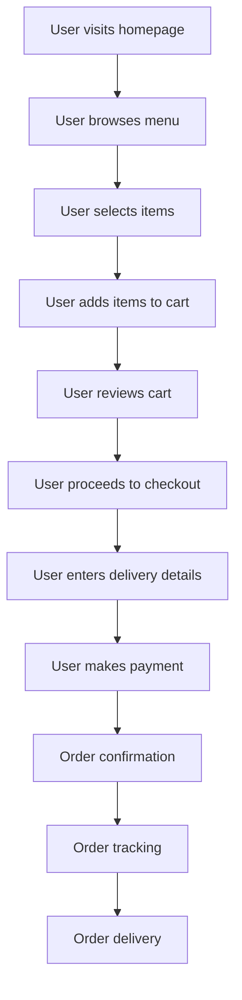

# 1. Comprehensive Website Handbook

## 1.1. Index

- [1. Comprehensive Website Handbook](#1-comprehensive-website-handbook)
  - [1.1. Index](#11-index)
  - [1.2. Introduction](#12-introduction)
    - [1.2.1. About the Website](#121-about-the-website)
    - [1.2.2. Purpose of the Handbook](#122-purpose-of-the-handbook)
    - [1.2.3. Target Audience (Developers, Marketers, Testers, etc.)](#123-target-audience-developers-marketers-testers-etc)
    - [1.2.4. How to Use This Handbook](#124-how-to-use-this-handbook)
  - [1.3. Website Overview](#13-website-overview)
    - [1.3.1. Vision and Mission of the Website](#131-vision-and-mission-of-the-website)
    - [1.3.2. Key Features and Offerings](#132-key-features-and-offerings)
    - [1.3.3. Target Audience for the Website (end-users)](#133-target-audience-for-the-website-end-users)
    - [1.3.4. High-Level Overview of the Website Workflow](#134-high-level-overview-of-the-website-workflow)
    - [1.3.5. Glossary of Terms (for technical and non-technical users)](#135-glossary-of-terms-for-technical-and-non-technical-users)
  - [1.4. Functional Flow](#14-functional-flow)
    - [1.4.1. User Flows](#141-user-flows)
    - [1.4.2. Visual Flow Diagrams for Each User Flow](#142-visual-flow-diagrams-for-each-user-flow)
    - [1.4.3. Key Use Cases and Scenarios](#143-key-use-cases-and-scenarios)
  - [1.5. Technical Architecture](#15-technical-architecture)
    - [1.5.1. Technology Stack Overview](#151-technology-stack-overview)
    - [1.5.2. High-Level Architecture Diagram](#152-high-level-architecture-diagram)
    - [1.5.3. Deployment and Hosting Details](#153-deployment-and-hosting-details)
    - [1.5.4. Environment Setup](#154-environment-setup)
  - [1.6. Beginner’s Guide to Programming](#16-beginners-guide-to-programming)
    - [1.6.1. Introduction to Web Development Basics](#161-introduction-to-web-development-basics)
    - [1.6.2. Overview of Tools and Software to Install](#162-overview-of-tools-and-software-to-install)
    - [1.6.3. Step-by-Step Guide to Setting Up the Project Locally](#163-step-by-step-guide-to-setting-up-the-project-locally)
    - [1.6.4. Suggested Learning Path](#164-suggested-learning-path)
    - [1.6.5. Debugging Basics](#165-debugging-basics)
  - [1.7. Codebase Structure and Flow](#17-codebase-structure-and-flow)
    - [1.7.1. Overview of the Codebase](#171-overview-of-the-codebase)
    - [1.7.2. Code Execution Flow](#172-code-execution-flow)
    - [1.7.3. Understanding Functions and Modules](#173-understanding-functions-and-modules)
    - [1.7.4. Step-by-Step Explanation of a Key Feature](#174-step-by-step-explanation-of-a-key-feature)
    - [1.7.5. Reading the Code](#175-reading-the-code)
    - [1.7.6. Code Standards and Best Practices](#176-code-standards-and-best-practices)
  - [1.8. API Documentation](#18-api-documentation)
    - [1.8.1. Overview of API Usage and Purpose](#181-overview-of-api-usage-and-purpose)
    - [1.8.2. API Endpoint List](#182-api-endpoint-list)
    - [1.8.3. Error Codes and Handling](#183-error-codes-and-handling)
    - [1.8.4. How to Test APIs as a Beginner](#184-how-to-test-apis-as-a-beginner)
  - [1.9. Database Design](#19-database-design)
    - [1.9.1. Database Schema Overview](#191-database-schema-overview)
    - [1.9.2. Key Tables and Their Purpose](#192-key-tables-and-their-purpose)
    - [1.9.3. Entity-Relationship Diagrams (ERD)](#193-entity-relationship-diagrams-erd)
    - [1.9.4. Sample Queries for Common Use Cases](#194-sample-queries-for-common-use-cases)
  - [1.10. User Interface (UI)](#110-user-interface-ui)
    - [1.10.1. Screenshots of All Pages (annotated with descriptions)](#1101-screenshots-of-all-pages-annotated-with-descriptions)
    - [1.10.2. Navigation Map](#1102-navigation-map)
    - [1.10.3. Design Principles Used](#1103-design-principles-used)
  - [1.11. Ad Hoc Process Configuration](#111-ad-hoc-process-configuration)
    - [1.11.1. Payment Gateway Integration](#1111-payment-gateway-integration)
      - [1.11.1.1. Overview of Payment Gateway Used](#11111-overview-of-payment-gateway-used)
      - [1.11.1.2. API Keys, Credentials, and Configuration Steps](#11112-api-keys-credentials-and-configuration-steps)
      - [1.11.1.3. Step-by-Step Guide for Setting Up Payment Flow](#11113-step-by-step-guide-for-setting-up-payment-flow)
      - [1.11.1.4. Handling Payment Status Updates (webhooks, callbacks)](#11114-handling-payment-status-updates-webhooks-callbacks)
      - [1.11.1.5. Debugging Common Payment Issues## Ad Hoc Process Configuration](#11115-debugging-common-payment-issues-ad-hoc-process-configuration)
    - [1.11.2. Payment Gateway Integration](#1112-payment-gateway-integration)
      - [1.11.2.1. Overview of Payment Gateway Used](#11121-overview-of-payment-gateway-used)
      - [1.11.2.2. API Keys, Credentials, and Configuration Steps](#11122-api-keys-credentials-and-configuration-steps)
      - [1.11.2.3. Step-by-Step Guide for Setting Up Payment Flow](#11123-step-by-step-guide-for-setting-up-payment-flow)
      - [1.11.2.4. Handling Payment Status Updates (webhooks, callbacks)](#11124-handling-payment-status-updates-webhooks-callbacks)
      - [1.11.2.5. Debugging Common Payment Issues](#11125-debugging-common-payment-issues)
    - [1.11.3. Messaging Service Integration (e.g., SMS, WhatsApp)](#1113-messaging-service-integration-eg-sms-whatsapp)
      - [1.11.3.1. Overview of Messaging Providers (e.g., Twilio, Firebase)](#11131-overview-of-messaging-providers-eg-twilio-firebase)
      - [1.11.3.2. Setting Up API Access and Authentication](#11132-setting-up-api-access-and-authentication)
      - [1.11.3.3. Sending SMS or WhatsApp Messages (sample code snippets)](#11133-sending-sms-or-whatsapp-messages-sample-code-snippets)
      - [1.11.3.4. Configuring OTP Logic and Expiry Timers](#11134-configuring-otp-logic-and-expiry-timers)
      - [1.11.3.5. Error Handling and Logging for Message Delivery Failures](#11135-error-handling-and-logging-for-message-delivery-failures)
    - [1.11.4. WhatsApp OTP Setup](#1114-whatsapp-otp-setup)
      - [1.11.4.1. Details of Provider (e.g., Meta’s WhatsApp Business API)](#11141-details-of-provider-eg-metas-whatsapp-business-api)
      - [1.11.4.2. Required Credentials (Phone Numbers, API Tokens)](#11142-required-credentials-phone-numbers-api-tokens)
      - [1.11.4.3. Configuring WhatsApp Templates for OTP Messages](#11143-configuring-whatsapp-templates-for-otp-messages)
      - [1.11.4.4. Implementing Message Flow (request, send, verify OTP)](#11144-implementing-message-flow-request-send-verify-otp)
      - [1.11.4.5. Troubleshooting Common WhatsApp API Issues](#11145-troubleshooting-common-whatsapp-api-issues)
    - [1.11.5. Government Compliance-Related Processes](#1115-government-compliance-related-processes)
      - [1.11.5.1. Overview of Compliance Requirements](#11151-overview-of-compliance-requirements)
      - [1.11.5.2. Step-by-Step Implementation (e.g., GST APIs, Aadhaar Verification)](#11152-step-by-step-implementation-eg-gst-apis-aadhaar-verification)
      - [1.11.5.3. Sample Data Formats for Government APIs](#11153-sample-data-formats-for-government-apis)
      - [1.11.5.4. Error Handling and Validation for Compliance APIs](#11154-error-handling-and-validation-for-compliance-apis)
      - [1.11.5.5. Documentation Links to Government APIs and Resources](#11155-documentation-links-to-government-apis-and-resources)
  - [1.12. Testing Guidelines](#112-testing-guidelines)
    - [1.12.1. Overview of Testing Strategy](#1121-overview-of-testing-strategy)
    - [1.12.2. Functional Testing Scenarios](#1122-functional-testing-scenarios)
    - [1.12.3. Technical Testing](#1123-technical-testing)
    - [1.12.4. Bug Reporting Guidelines](#1124-bug-reporting-guidelines)
  - [1.13. Deployment and Maintenance](#113-deployment-and-maintenance)
    - [1.13.1. Deployment Process (step-by-step)](#1131-deployment-process-step-by-step)
    - [1.13.2. Version Control Guidelines](#1132-version-control-guidelines)
    - [1.13.3. Backup and Recovery Plan](#1133-backup-and-recovery-plan)
  - [1.14. Troubleshooting Guide](#114-troubleshooting-guide)
    - [1.14.1. Common Issues and Fixes](#1141-common-issues-and-fixes)
    - [1.14.2. Debugging Tips for Developers](#1142-debugging-tips-for-developers)
  - [1.15. Security Considerations](#115-security-considerations)
    - [1.15.1. Security Practices Implemented](#1151-security-practices-implemented)
    - [1.15.2. Guidelines for Handling Sensitive Data](#1152-guidelines-for-handling-sensitive-data)
  - [1.16. FAQ](#116-faq)
    - [1.16.1. Common Questions by Non-Technical Staff](#1161-common-questions-by-non-technical-staff)
    - [1.16.2. Questions Related to API Usage](#1162-questions-related-to-api-usage)
    - [1.16.3. Testing and Debugging FAQs](#1163-testing-and-debugging-faqs)
  - [1.17. Appendix](#117-appendix)
    - [1.17.1. Resources and References](#1171-resources-and-references)
    - [1.17.2. Links to Tools, Libraries, and Frameworks Used](#1172-links-to-tools-libraries-and-frameworks-used)
    - [1.17.3. Glossary of Technical Terms](#1173-glossary-of-technical-terms)

## 1.2. Introduction

### 1.2.1. About the Website

The website isa platformfor the userto order food online. The website provides a list of restaurants, their menus, and allows users to place orders for delivery or pickup or dine in . Users can create accounts, save their favorite orders, and track the status of their orders in real-time.

### 1.2.2. Purpose of the Handbook

The purpose of this handbook is to provide a comprehensive guide to the website's architecture, codebase, and functionality. It is intended for developers, testers, and other stakeholders who need to understand how the website works, how to set it up locally, and how to maintain and troubleshoot it.

### 1.2.3. Target Audience (Developers, Marketers, Testers, etc.)

The target audience for this handbook includes:

- Developers who need to understand the codebase, APIs, and database design.
- Testers who need to know how to test the website and report bugs.
- Marketers who need to understand the website's features and target audience.
- Project managers who need to oversee the development and deployment of the website.
- Non-technical staff who need a high-level overview of the website's functionality.
- New team members who need to onboard quickly and understand the project.
- Anyone interested in learning about web development and programming.

### 1.2.4. How to Use This Handbook

This handbook is organized into sections that cover different aspects of the website, from the high-level overview to the technical details of the codebase and database design. You can use the table of contents to navigate to specific sections or read through the entire handbook to get a comprehensive understanding of the website.

## 1.3. Website Overview

### 1.3.1. Vision and Mission of the Website

The vision of the website is to provide a seamless and convenient online ordering experience for users, connecting them with their favorite restaurants and enabling them to order food with ease. The mission of the website is to offer a wide variety of food options, ensure timely delivery, and provide a user-friendly interface that makes ordering food a pleasant experience.

### 1.3.2. Key Features and Offerings

The website offers the following key features and offerings:

- User registration and account creation
- Restaurant listings with menus and reviews
- Order placement for delivery, pickup, or dine-in
- Real-time order tracking
- Favorite orders and reordering
- Payment gateway integration
- Messaging service integration for order updates

### 1.3.3. Target Audience for the Website (end-users)

The target audience for the website includes:

- Working professionals who want to order food for lunch or dinner
- Families looking to order meals for home delivery
- Students who want to order food for study sessions
- Tourists and travelers looking for local cuisine
- Food enthusiasts who want to explore new restaurants
- Event organizers who need catering services
- Anyone who prefers the convenience of online food ordering
- Anyone who wants to avoid the hassle of cooking

### 1.3.4. High-Level Overview of the Website Workflow

### 1.3.5. Glossary of Terms (for technical and non-technical users)

## 1.4. Functional Flow

### 1.4.1. User Flows

### 1.4.2. Visual Flow Diagrams for Each User Flow

### 1.4.3. Key Use Cases and Scenarios

## 1.5. Technical Architecture

### 1.5.1. Technology Stack Overview

### 1.5.2. High-Level Architecture Diagram

### 1.5.3. Deployment and Hosting Details

### 1.5.4. Environment Setup

## 1.6. Beginner’s Guide to Programming

### 1.6.1. Introduction to Web Development Basics

### 1.6.2. Overview of Tools and Software to Install

### 1.6.3. Step-by-Step Guide to Setting Up the Project Locally

### 1.6.4. Suggested Learning Path

### 1.6.5. Debugging Basics

## 1.7. Codebase Structure and Flow

### 1.7.1. Overview of the Codebase

### 1.7.2. Code Execution Flow

### 1.7.3. Understanding Functions and Modules

### 1.7.4. Step-by-Step Explanation of a Key Feature

### 1.7.5. Reading the Code

### 1.7.6. Code Standards and Best Practices

## 1.8. API Documentation

### 1.8.1. Overview of API Usage and Purpose

### 1.8.2. API Endpoint List

### 1.8.3. Error Codes and Handling

### 1.8.4. How to Test APIs as a Beginner

## 1.9. Database Design

### 1.9.1. Database Schema Overview

### 1.9.2. Key Tables and Their Purpose

### 1.9.3. Entity-Relationship Diagrams (ERD)

### 1.9.4. Sample Queries for Common Use Cases

## 1.10. User Interface (UI)

### 1.10.1. Screenshots of All Pages (annotated with descriptions)

### 1.10.2. Navigation Map

### 1.10.3. Design Principles Used

## 1.11. Ad Hoc Process Configuration

### 1.11.1. Payment Gateway Integration

#### 1.11.1.1. Overview of Payment Gateway Used

#### 1.11.1.2. API Keys, Credentials, and Configuration Steps

#### 1.11.1.3. Step-by-Step Guide for Setting Up Payment Flow

#### 1.11.1.4. Handling Payment Status Updates (webhooks, callbacks)

#### 1.11.1.5. Debugging Common Payment Issues## Ad Hoc Process Configuration

### 1.11.2. Payment Gateway Integration

#### 1.11.2.1. Overview of Payment Gateway Used

#### 1.11.2.2. API Keys, Credentials, and Configuration Steps

#### 1.11.2.3. Step-by-Step Guide for Setting Up Payment Flow

#### 1.11.2.4. Handling Payment Status Updates (webhooks, callbacks)

#### 1.11.2.5. Debugging Common Payment Issues

### 1.11.3. Messaging Service Integration (e.g., SMS, WhatsApp)

#### 1.11.3.1. Overview of Messaging Providers (e.g., Twilio, Firebase)

#### 1.11.3.2. Setting Up API Access and Authentication

#### 1.11.3.3. Sending SMS or WhatsApp Messages (sample code snippets)

#### 1.11.3.4. Configuring OTP Logic and Expiry Timers

#### 1.11.3.5. Error Handling and Logging for Message Delivery Failures

### 1.11.4. WhatsApp OTP Setup

#### 1.11.4.1. Details of Provider (e.g., Meta’s WhatsApp Business API)

#### 1.11.4.2. Required Credentials (Phone Numbers, API Tokens)

#### 1.11.4.3. Configuring WhatsApp Templates for OTP Messages

#### 1.11.4.4. Implementing Message Flow (request, send, verify OTP)

#### 1.11.4.5. Troubleshooting Common WhatsApp API Issues

### 1.11.5. Government Compliance-Related Processes

#### 1.11.5.1. Overview of Compliance Requirements

#### 1.11.5.2. Step-by-Step Implementation (e.g., GST APIs, Aadhaar Verification)

#### 1.11.5.3. Sample Data Formats for Government APIs

#### 1.11.5.4. Error Handling and Validation for Compliance APIs

#### 1.11.5.5. Documentation Links to Government APIs and Resources

## 1.12. Testing Guidelines

### 1.12.1. Overview of Testing Strategy

### 1.12.2. Functional Testing Scenarios

### 1.12.3. Technical Testing

### 1.12.4. Bug Reporting Guidelines

## 1.13. Deployment and Maintenance

### 1.13.1. Deployment Process (step-by-step)

### 1.13.2. Version Control Guidelines

### 1.13.3. Backup and Recovery Plan

## 1.14. Troubleshooting Guide

### 1.14.1. Common Issues and Fixes

### 1.14.2. Debugging Tips for Developers

## 1.15. Security Considerations

### 1.15.1. Security Practices Implemented

### 1.15.2. Guidelines for Handling Sensitive Data

## 1.16. FAQ

### 1.16.1. Common Questions by Non-Technical Staff

### 1.16.2. Questions Related to API Usage

### 1.16.3. Testing and Debugging FAQs

## 1.17. Appendix

### 1.17.1. Resources and References

### 1.17.2. Links to Tools, Libraries, and Frameworks Used

### 1.17.3. Glossary of Technical Terms
