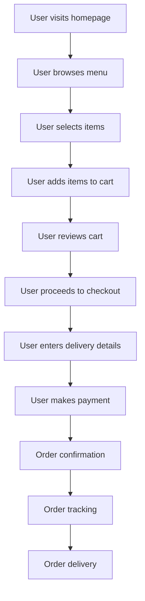
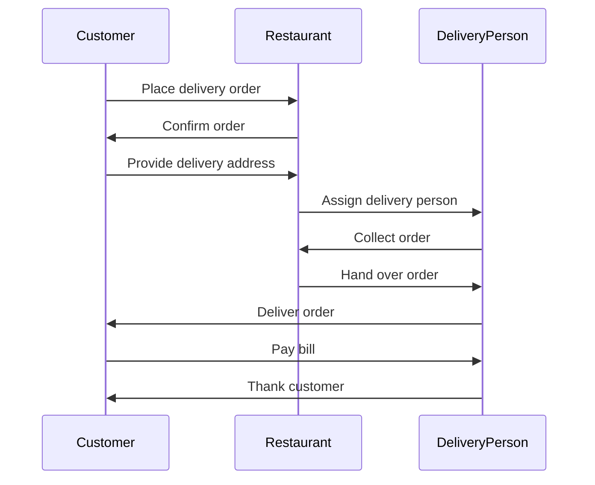
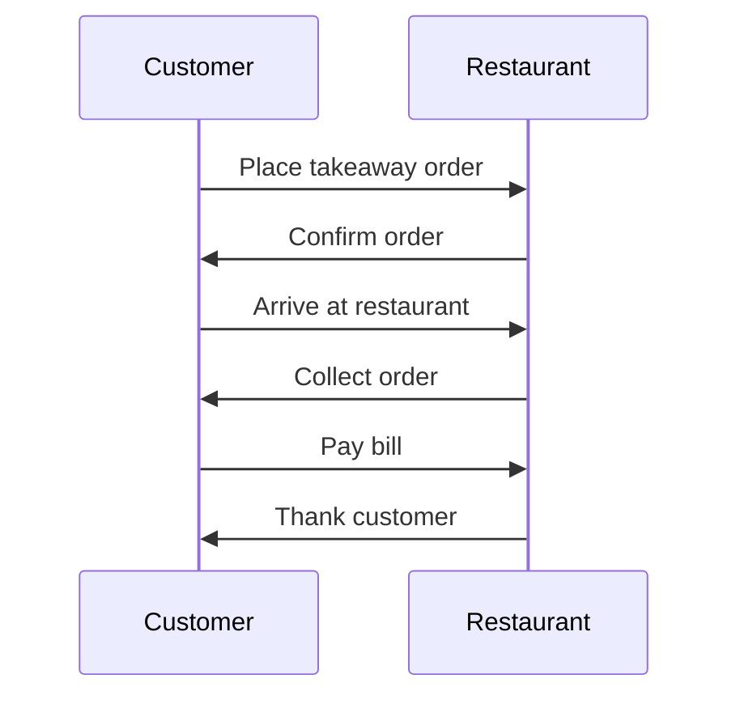
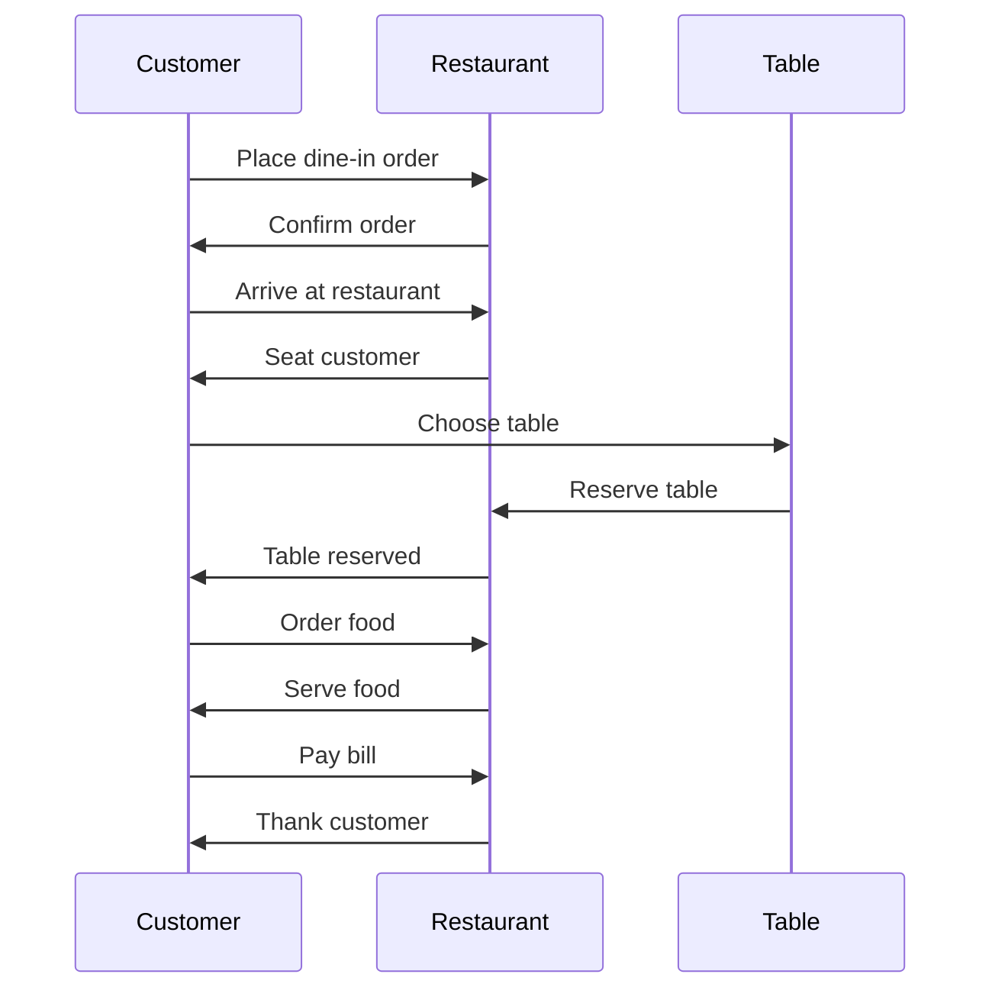
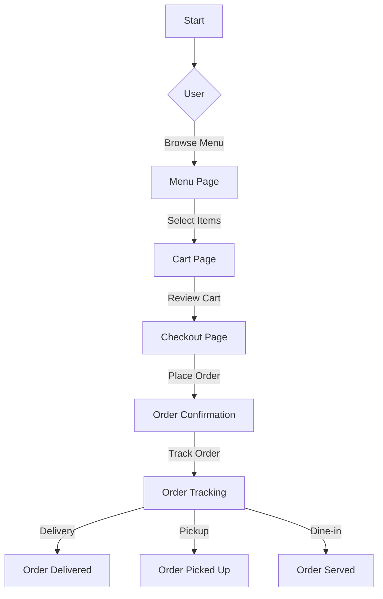
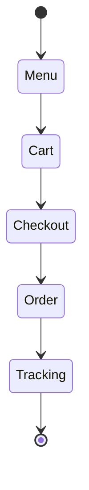
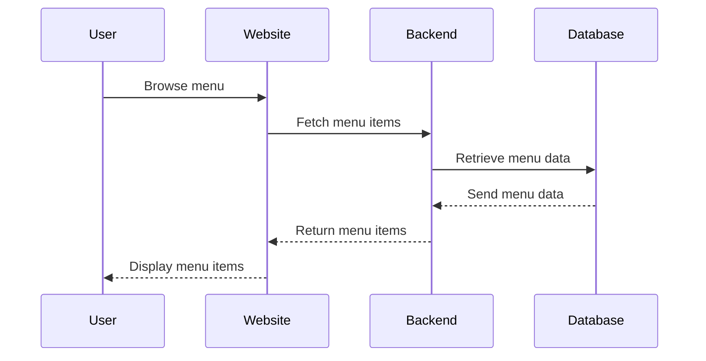

# 1. Comprehensive Website Handbook

## 1.1. Index

- [1. Comprehensive Website Handbook](#1-comprehensive-website-handbook)
  - [1.1. Index](#11-index)
  - [1.2. Introduction](#12-introduction)
    - [1.2.1. About the Website](#121-about-the-website)
    - [1.2.2. Purpose of the Handbook](#122-purpose-of-the-handbook)
    - [1.2.3. Target Audience (Developers, Marketers, Testers, etc.)](#123-target-audience-developers-marketers-testers-etc)
    - [1.2.4. How to Use This Handbook](#124-how-to-use-this-handbook)
  - [1.3. Website Overview](#13-website-overview)
    - [1.3.1. Vision and Mission of the Website](#131-vision-and-mission-of-the-website)
    - [1.3.2. Key Features and Offerings](#132-key-features-and-offerings)
    - [1.3.3. Target Audience for the Website (end-users)](#133-target-audience-for-the-website-end-users)
    - [1.3.4. High-Level Overview of the Website Workflow](#134-high-level-overview-of-the-website-workflow)
    - [1.3.5. Glossary of Terms (for technical and non-technical users)](#135-glossary-of-terms-for-technical-and-non-technical-users)
      - [General Terms](#general-terms)
      - [Order Types](#order-types)
      - [User Roles](#user-roles)
      - [Technical Terms](#technical-terms)
      - [Payment Terms](#payment-terms)
      - [Features](#features)
  - [1.4. Functional Flow](#14-functional-flow)
    - [1.4.1. User Flows](#141-user-flows)
    - [1.4.2. Visual Flow Diagrams for Each User Flow](#142-visual-flow-diagrams-for-each-user-flow)
      - [delivery order flow](#delivery-order-flow)
      - [takeaway order flow](#takeaway-order-flow)
      - [dine-in order flow](#dine-in-order-flow)
    - [Use case diagrams](#use-case-diagrams)
      - [Activity diagrams](#activity-diagrams)
      - [State machine diagrams](#state-machine-diagrams)
      - [Sequence diagrams](#sequence-diagrams)
      - [Communication diagrams](#communication-diagrams)
      - [Interaction overview diagrams](#interaction-overview-diagrams)
      - [Timing diagrams](#timing-diagrams)
    - [1.4.3. Key Use Cases and Scenarios](#143-key-use-cases-and-scenarios)
  - [1.5. Technical Architecture](#15-technical-architecture)
    - [1.5.1. Technology Stack Overview](#151-technology-stack-overview)
    - [1.5.2. High-Level Architecture Diagram](#152-high-level-architecture-diagram)
    - [1.5.3. Deployment and Hosting Details](#153-deployment-and-hosting-details)
    - [1.5.4. Environment Setup](#154-environment-setup)
  - [1.6. Beginner’s Guide to Programming](#16-beginners-guide-to-programming)
    - [1.6.1. Introduction to Web Development Basics](#161-introduction-to-web-development-basics)
    - [1.6.2. Overview of Tools and Software to Install](#162-overview-of-tools-and-software-to-install)
    - [1.6.3. Step-by-Step Guide to Setting Up the Project Locally](#163-step-by-step-guide-to-setting-up-the-project-locally)
    - [1.6.4. Suggested Learning Path](#164-suggested-learning-path)
    - [1.6.5. Debugging Basics](#165-debugging-basics)
  - [1.7. Codebase Structure and Flow](#17-codebase-structure-and-flow)
    - [1.7.1. Overview of the Codebase](#171-overview-of-the-codebase)
    - [1.7.2. Code Execution Flow](#172-code-execution-flow)
    - [1.7.3. Understanding Functions and Modules](#173-understanding-functions-and-modules)
    - [1.7.4. Step-by-Step Explanation of a Key Feature](#174-step-by-step-explanation-of-a-key-feature)
    - [1.7.5. Reading the Code](#175-reading-the-code)
    - [1.7.6. Code Standards and Best Practices](#176-code-standards-and-best-practices)
  - [1.8. API Documentation](#18-api-documentation)
    - [1.8.1. Overview of API Usage and Purpose](#181-overview-of-api-usage-and-purpose)
    - [1.8.2. API Endpoint List](#182-api-endpoint-list)
    - [1.8.3. Error Codes and Handling](#183-error-codes-and-handling)
    - [1.8.4. How to Test APIs as a Beginner](#184-how-to-test-apis-as-a-beginner)
  - [1.9. Database Design](#19-database-design)
    - [1.9.1. Database Schema Overview](#191-database-schema-overview)
    - [1.9.2. Key Tables and Their Purpose](#192-key-tables-and-their-purpose)
    - [1.9.3. Entity-Relationship Diagrams (ERD)](#193-entity-relationship-diagrams-erd)
    - [1.9.4. Sample Queries for Common Use Cases](#194-sample-queries-for-common-use-cases)
  - [1.10. User Interface (UI)](#110-user-interface-ui)
    - [1.10.1. Screenshots of All Pages (annotated with descriptions)](#1101-screenshots-of-all-pages-annotated-with-descriptions)
    - [1.10.2. Navigation Map](#1102-navigation-map)
    - [1.10.3. Design Principles Used](#1103-design-principles-used)
  - [1.11. Ad Hoc Process Configuration](#111-ad-hoc-process-configuration)
    - [1.11.1. Payment Gateway Integration](#1111-payment-gateway-integration)
      - [1.11.1.1. Overview of Payment Gateway Used](#11111-overview-of-payment-gateway-used)
      - [1.11.1.2. API Keys, Credentials, and Configuration Steps](#11112-api-keys-credentials-and-configuration-steps)
      - [1.11.1.3. Step-by-Step Guide for Setting Up Payment Flow](#11113-step-by-step-guide-for-setting-up-payment-flow)
    - [1.11.3. Messaging Service Integration (e.g., SMS, WhatsApp)](#1113-messaging-service-integration-eg-sms-whatsapp)
      - [1.11.3.1. Overview of Messaging Providers](#11131-overview-of-messaging-providers)
      - [1.11.3.2. Setting Up API Access and Authentication](#11132-setting-up-api-access-and-authentication)
      - [1.11.3.3. Sending Messages](#11133-sending-messages)
  - [1.12. Testing Guidelines](#112-testing-guidelines)
    - [1.12.1. Overview of Testing Strategy](#1121-overview-of-testing-strategy)
    - [1.12.2. Functional Testing Scenarios](#1122-functional-testing-scenarios)
    - [1.12.3. Technical Testing](#1123-technical-testing)
    - [1.12.4. Bug Reporting Guidelines](#1124-bug-reporting-guidelines)
  - [1.13. Deployment and Maintenance](#113-deployment-and-maintenance)
    - [1.13.1. Deployment Process](#1131-deployment-process)
    - [1.13.2. Version Control Guidelines](#1132-version-control-guidelines)
    - [1.13.3. Backup and Recovery Plan](#1133-backup-and-recovery-plan)
  - [1.14. Troubleshooting Guide](#114-troubleshooting-guide)
    - [1.14.1. Common Issues and Fixes](#1141-common-issues-and-fixes)
    - [1.14.2. Debugging Tips for Developers](#1142-debugging-tips-for-developers)
  - [1.15. Security Considerations](#115-security-considerations)
    - [1.15.1. Security Practices Implemented](#1151-security-practices-implemented)
    - [1.15.2. Guidelines for Handling Sensitive Data](#1152-guidelines-for-handling-sensitive-data)
  - [1.16. FAQ](#116-faq)
    - [1.16.1. Common Questions by Non-Technical Staff](#1161-common-questions-by-non-technical-staff)
    - [1.16.2. Questions Related to API Usage](#1162-questions-related-to-api-usage)
    - [1.16.3. Testing and Debugging FAQs](#1163-testing-and-debugging-faqs)
  - [1.17. Appendix](#117-appendix)
    - [1.17.1. Resources and References](#1171-resources-and-references)
    - [1.17.2. Links to Tools, Libraries, and Frameworks Used](#1172-links-to-tools-libraries-and-frameworks-used)
    - [1.17.3. Glossary of Technical Terms](#1173-glossary-of-technical-terms)

## 1.2. Introduction

### 1.2.1. About the Website

The website isa platformfor the userto order food online. The website provides a list of restaurants, their menus, and allows users to place orders for delivery or pickup or dine in . Users can create accounts, save their favorite orders, and track the status of their orders in real-time.

### 1.2.2. Purpose of the Handbook

The purpose of this handbook is to provide a comprehensive guide to the website's architecture, codebase, and functionality. It is intended for developers, testers, and other stakeholders who need to understand how the website works, how to set it up locally, and how to maintain and troubleshoot it.

### 1.2.3. Target Audience (Developers, Marketers, Testers, etc.)

The target audience for this handbook includes:

- Developers who need to understand the codebase, APIs, and database design.
- Testers who need to know how to test the website and report bugs.
- Marketers who need to understand the website's features and target audience.
- Project managers who need to oversee the development and deployment of the website.
- Non-technical staff who need a high-level overview of the website's functionality.
- New team members who need to onboard quickly and understand the project.
- Anyone interested in learning about web development and programming.

### 1.2.4. How to Use This Handbook

This handbook is organized into sections that cover different aspects of the website, from the high-level overview to the technical details of the codebase and database design. You can use the table of contents to navigate to specific sections or read through the entire handbook to get a comprehensive understanding of the website.

## 1.3. Website Overview

### 1.3.1. Vision and Mission of the Website

The vision of the website is to provide a seamless and convenient online ordering experience for users, connecting them with their favorite restaurants and enabling them to order food with ease. The mission of the website is to offer a wide variety of food options, ensure timely delivery, and provide a user-friendly interface that makes ordering food a pleasant experience.

### 1.3.2. Key Features and Offerings

The website offers the following key features and offerings:

- User registration and account creation
- Restaurant listings with menus and reviews
- Order placement for delivery, pickup, or dine-in
- Real-time order tracking
- Favorite orders and reordering
- Payment gateway integration
- Messaging service integration for order updates

### 1.3.3. Target Audience for the Website (end-users)

The target audience for the website includes:

- Working professionals who want to order food for lunch or dinner
- Families looking to order meals for home delivery
- Students who want to order food for study sessions
- Tourists and travelers looking for local cuisine
- Food enthusiasts who want to explore new restaurants
- Event organizers who need catering services
- Anyone who prefers the convenience of online food ordering
- Anyone who wants to avoid the hassle of cooking

### 1.3.4. High-Level Overview of the Website Workflow

### 1.3.5. Glossary of Terms (for technical and non-technical users)

#### General Terms

- **Digital Menu**: An electronic version of a restaurant's menu that can be accessed through web browsers or mobile devices
- **POS (Point of Sale)**: The system where transactions are processed and orders are managed
- **QR Code**: A square barcode that can be scanned by smartphones to quickly access the digital menu
- **Cart**: A virtual collection of items selected by the customer before placing an order

#### Order Types

- **Dine-in**: Customers eating at the restaurant premises
- **Takeaway**: Customers picking up their order from the restaurant
- **Delivery**: Food being delivered to the customer's specified location

#### User Roles

- **Customer**: End-user who browses the menu and places orders
- **Restaurant Staff**: Personnel who manage orders and update menu items
- **Admin**: System administrator with full access to manage the platform
- **Delivery Partner**: Person responsible for delivering orders to customers

#### Technical Terms

- **Frontend**: The user interface that customers interact with (website/app)
- **Backend**: Server-side system that processes requests and manages data
- **API (Application Programming Interface)**: System that allows different parts of the application to communicate
- **Database**: System that stores all menu items, orders, and user information
- **Authentication**: Process of verifying user identity
- **Cache**: Temporary storage of frequently accessed data for faster performance

#### Payment Terms

- **Payment Gateway**: System that processes online payments securely
- **Transaction**: A completed order payment
- **Payment Status**: Current state of payment (pending/completed/failed)
- **Refund**: Return of payment to customer's account

#### Features

- **Real-time Tracking**: Live monitoring of order status
- **Menu Customization**: Ability to modify menu items based on availability
- **Order History**: Record of all past orders
- **Favorites**: Saved list of frequently ordered items
- **Reviews & Ratings**: Customer feedback system

## 1.4. Functional Flow

### 1.4.1. User Flows



### 1.4.2. Visual Flow Diagrams for Each User Flow

#### delivery order flow



#### takeaway order flow



#### dine-in order flow



### Use case diagrams

#### Activity diagrams



#### State machine diagrams



#### Sequence diagrams



#### Communication diagrams


#### Interaction overview diagrams


#### Timing diagrams


### 1.4.3. Key Use Cases and Scenarios

1. **User Registration and Login**
   - Users can create an account using their phonenumber.
   - Users can log in to their account to access personalized features.

2. **Browsing Restaurant Listings**
   - Users can browse a list of available restaurants based on their location.
   - Users can view restaurant details, including menus, reviews, and ratings.

3. **Placing an Order**
   - Users can select items from a restaurant's menu and add them to their cart.
   - Users can customize their order with special instructions or preferences.
   - Users can choose between delivery, pickup, or dine-in options.

4. **Order Tracking**
   - Users can track the status of their order in real-time.
   - Users receive notifications about order updates, including preparation, delivery, and completion.

5. **Payment Processing**
   - Users can pay for their order using various payment methods, including credit/debit cards, digital wallets, and UPI.
   - Users receive a confirmation of their payment and order details.

6. **User Reviews and Ratings**
   - Users can leave reviews and ratings for restaurants they have ordered from.
   - Users can read reviews and ratings from other customers to make informed decisions.

7. **Customer Support**
   - Users can contact customer support for assistance with their orders.
   - Users can report issues or provide feedback about their experience.

8. **Promotions and Discounts**
   - Users can apply promotional codes or discounts to their orders.
   - Users receive notifications about special offers and promotions.

9. **Account Management**
    - Users can update their account information, including contact details and payment methods.
    - Users can manage their notification preferences and privacy settings.

## 1.5. Technical Architecture

### 1.5.1. Technology Stack Overview

The website is built using the following technologies:

- Frontend: Angular - angular is a platform and framework for building single-page client applications using HTML and TypeScript. Angular is written in TypeScript. It implements core and optional functionality as a set of TypeScript libraries that you import into your apps.
- Backend: Node.js - Node.js is an open-source, cross-platform, back-end JavaScript runtime environment that runs on the V8 engine and executes JavaScript code outside a web browser.
- Database: MongoDB - MongoDB is a general-purpose, document-based, distributed database built for modern application developers and for the cloud era.
- Hosting: firebase.com - Firebase is a platform developed by Google for creating mobile and web applications. It was originally an independent company founded in 2011. In 2014, Google acquired the platform and it is now their flagship offering for app development.
- Payment Gateway: razorpay - Razorpay is a payment gateway that allows businesses to accept, process, and disburse payments with its product suite.
- Messaging Service: whatsapp - WhatsApp is a messaging service that allows users to send text messages, voice messages, images, and videos over the internet.
- Other Tools: Git, Postman, VS Code - Git is a distributed version control system for tracking changes in source code during software development. Postman is a collaboration platform for API development that allows users to design, mock, document, monitor, and test APIs. VS Code is a source-code editor developed by Microsoft for Windows, Linux, and macOS.

### 1.5.2. High-Level Architecture Diagram

### 1.5.3. Deployment and Hosting Details

The website is deployed on firebase.com and hosted on Google Cloud Platform. The deployment process involves building the Angular frontend and deploying it to firebase hosting. The backend is deployed as a Node.js application on firebase functions. The database is hosted on MongoDB Atlas.

### 1.5.4. Environment Setup

1. create a firebase project
2. enable firestore and storage
3. create a web app
4. copy the firebase config and paste it in the environment.ts file
5. run `npm run dev` to run the project in development mode
6. run `firebase use staging` to use the staging environment
7. run `firebase deploy` to deploy the project

## 1.6. Beginner’s Guide to Programming

### 1.6.1. Introduction to Web Development Basics

Web development is the process of building websites and web applications using a combination of HTML, CSS, and JavaScript. HTML is used to create the structure of a web page, CSS is used to style the page, and JavaScript is used to add interactivity and dynamic behavior to the page. Web development also involves working with backend technologies like Node.js and databases like MongoDB to create full-stack applications.

### 1.6.2. Overview of Tools and Software to Install

1. Node.js - Node.js is a JavaScript runtime built on Chrome's V8 JavaScript engine. You can download Node.js from the official website and install it on your machine.
2. Angular CLI - The Angular CLI is a command-line interface tool that you use to initialize, develop, scaffold, and maintain Angular applications directly from a command shell.
3. MongoDB - MongoDB is a general-purpose, document-based, distributed database built for modern application developers and for the cloud era. You can download MongoDB from the official website and install it on your machine.
4. Git - Git is a distributed version control system for tracking changes in source code during software development. You can download Git from the official website and install it on your machine.
5. Postman - Postman is a collaboration platform for API development that allows users to design, mock, document, monitor, and test APIs. You can download Postman from the official website and install it on your machine.
6. VS Code - Visual Studio Code is a source-code editor developed by Microsoft for Windows, Linux, and macOS. You can download VS Code from the official website and install it on your machine.
7. Firebase CLI - The Firebase Command Line Interface (CLI) provides a variety of tools for managing, viewing, and deploying to Firebase projects. You can install the Firebase CLI using npm.
8. Angular Material - Angular Material is a UI component library for Angular that provides a set of high-quality UI components built with Angular and TypeScript. You can install Angular Material using npm.
9. Razorpay - Razorpay is a payment gateway that allows businesses to accept, process, and disburse payments with its product suite. You can sign up for a Razorpay account and get API keys to integrate with your application.
10. WhatsApp Business API - The WhatsApp Business API allows businesses to communicate with customers over WhatsApp. You can sign up for a WhatsApp Business API account and get API credentials to send messages.

### 1.6.3. Step-by-Step Guide to Setting Up the Project Locally

1. Clone the repository from GitHub using the `git clone https://github.com/Harsh98992/digitalMenu.git` command.
2. Install Node.js from the official website.
3. Install Angular CLI using the `npm install -g @angular/cli` command.
4. Install MongoDB from the official website.
5. Install Git from the official website.
6. Install Postman from the official website.

### 1.6.4. Suggested Learning Path

If you are new to web development, here is a suggested learning path to get started:

1. Learn HTML, CSS, and JavaScript basics.
2. Learn Angular basics and build a simple application.
3. Learn Node.js basics and build a simple backend application.
4. Learn MongoDB basics and integrate it with your backend application.
5. Learn how to deploy your application to firebase hosting.
6. Learn how to integrate a payment gateway like Razorpay.
7. Learn how to integrate a messaging service like WhatsApp.
8. Learn how to test and debug your application.

### 1.6.5. Debugging Basics

Debugging is the process of finding and fixing errors in your code. Here are some basic debugging techniques:

1. Use console.log() statements to print values and debug information.
2. Use the browser developer tools to inspect elements, view console logs, and debug JavaScript code.
3. Use breakpoints in your code to pause execution and inspect variables.
4. Use the Angular CLI to run the project in development mode and view error messages in the console.
5. Use the Postman tool to test APIs and view response data.
6. Use the VS Code debugger to step through your code and inspect variables.
7. Use the Firebase CLI to view logs and debug cloud functions.

## 1.7. Codebase Structure and Flow

### 1.7.1. Overview of the Codebase

The codebase is organized into the following directories:

- `src` - Contains the source code for the Angular frontend application.
- `src/app` - Contains the Angular components, services, and modules.
- `src/assets` - Contains static assets like images, fonts, and stylesheets.
- `src/api` - Contains API endpoints and services for interacting with the backend.

### 1.7.2. Code Execution Flow

The code execution flow follows these steps:

1. The user interacts with the frontend application by browsing menus, selecting items, and placing orders.
2. The frontend application makes API calls to the backend to fetch data, submit orders, and track order status.
3. The backend application processes API requests, interacts with the database, and sends responses back to the frontend.
4. The database stores user data, restaurant data, order data, and other information needed by the application.
5. The payment gateway processes payment transactions and sends payment status updates to the backend.
6. The messaging service sends order updates and notifications to users via WhatsApp.
7. The application logic handles user authentication, authorization, and business logic for order processing.
8. The frontend application displays order status, menus, and other information to the user.
9. The backend application handles API requests, database queries, and external service integrations.
10. The database stores and retrieves data needed by the application.
11. The payment gateway processes payment transactions and sends payment status updates.
12. The messaging service sends order updates and notifications to users.
13. The application logic handles user authentication, authorization, and business logic.
14. The frontend application displays order status, menus, and other information.

### 1.7.3. Understanding Functions and Modules

### 1.7.4. Step-by-Step Explanation of a Key Feature

### 1.7.5. Reading the Code

### 1.7.6. Code Standards and Best Practices

## 1.8. API Documentation

### 1.8.1. Overview of API Usage and Purpose

### 1.8.2. API Endpoint List

### 1.8.3. Error Codes and Handling

### 1.8.4. How to Test APIs as a Beginner

## 1.9. Database Design

### 1.9.1. Database Schema Overview

### 1.9.2. Key Tables and Their Purpose

### 1.9.3. Entity-Relationship Diagrams (ERD)

### 1.9.4. Sample Queries for Common Use Cases

## 1.10. User Interface (UI)

### 1.10.1. Screenshots of All Pages (annotated with descriptions)

1. **Login Page**
   - User authentication interface
   - Phone number input
   - OTP verification

2. **Menu Page**
   - Category-wise menu items
   - Item details with images
   - Add to cart functionality

3. **Cart Page**
   - Order summary
   - Item quantity adjustment
   - Checkout process

4. **Admin Dashboard**
   - Order management
   - Menu management
   - Analytics overview

### 1.10.2. Navigation Map

### 1.10.3. Design Principles Used

1. **Material Design**
   - Consistent UI components
   - Responsive layouts
   - Intuitive interactions

2. **User Experience**
   - Clear navigation
   - Fast loading
   - Error handling

## 1.11. Ad Hoc Process Configuration

### 1.11.1. Payment Gateway Integration

#### 1.11.1.1. Overview of Payment Gateway Used

- Razorpay integration
- Secure payment processing
- Multiple payment methods

#### 1.11.1.2. API Keys, Credentials, and Configuration Steps

1. Obtain Razorpay API keys
2. Configure in environment files
3. Set up webhook endpoints

#### 1.11.1.3. Step-by-Step Guide for Setting Up Payment Flow

1. Initialize Razorpay
2. Create order
3. Handle payment response
4. Verify payment status

### 1.11.3. Messaging Service Integration (e.g., SMS, WhatsApp)

#### 1.11.3.1. Overview of Messaging Providers

- WhatsApp Business API
- Firebase Cloud Messaging
- SMS gateway integration

#### 1.11.3.2. Setting Up API Access and Authentication

1. WhatsApp Business account setup
2. API key configuration
3. Template message approval

#### 1.11.3.3. Sending Messages

```typescript
async function sendWhatsAppMessage(to: string, template: string, params: any[]) {
  // Implementation
}
```

## 1.12. Testing Guidelines

### 1.12.1. Overview of Testing Strategy

1. **Unit Testing**
   - Component testing
   - Service testing
   - Utility function testing

2. **Integration Testing**
   - API endpoint testing
   - Database operations
   - Authentication flow

### 1.12.2. Functional Testing Scenarios

1. **Order Flow Testing**
   - Menu item selection
   - Cart operations
   - Checkout process
   - Payment integration

2. **Admin Operations**
   - Menu management
   - Order processing
   - User management

### 1.12.3. Technical Testing

1. **Performance Testing**
   - Load time optimization
   - API response times
   - Database query performance

2. **Security Testing**
   - Authentication
   - Authorization
   - Data encryption

### 1.12.4. Bug Reporting Guidelines

1. **Bug Report Format**

    - Title: Short description of the issue
    - Description: Detailed explanation of the problem
    - Steps to Reproduce: Step-by-step guide to reproduce the bug
    - Expected Behavior: What should happen
    - Actual Behavior: What is happening
    - Screenshots: Visual evidence of the bug
    - Environment: Browser, device, OS
    - Severity: Low/Medium/High
    - Priority: Low/Medium/High

## 1.13. Deployment and Maintenance

### 1.13.1. Deployment Process

1. **Build Process**

   ```bash
   ng build --configuration production
   ```

2. **Firebase Deployment**

   ```bash
   firebase use production
   firebase deploy
   ```

### 1.13.2. Version Control Guidelines

1. **Branch Strategy**
   - main: production
   - develop: development
   - feature/*: new features
   - hotfix/*: urgent fixes

2. **Commit Messages**
   - feat: new feature
   - fix: bug fix
   - docs: documentation
   - style: formatting
   - refactor: code restructuring

### 1.13.3. Backup and Recovery Plan

1. **Database Backup**
   - Daily automated backups
   - Manual backup before major updates
   - Backup verification process

2. **Recovery Procedures**
   - Database restoration
   - Application rollback
   - Emergency contacts

## 1.14. Troubleshooting Guide

### 1.14.1. Common Issues and Fixes

1. **Authentication Issues**
   - Check Firebase configuration
   - Verify API keys
   - Clear browser cache

2. **Payment Issues**
   - Verify Razorpay integration
   - Check webhook configuration
   - Monitor payment logs

### 1.14.2. Debugging Tips for Developers

1. **Frontend Debugging**
   - Use Chrome DevTools
   - Check console logs
   - Monitor network requests

2. **Backend Debugging**
   - Firebase Functions logs
   - Database queries
   - API responses

## 1.15. Security Considerations

### 1.15.1. Security Practices Implemented

1. **Authentication**
   - Phone number verification
   - JWT token management
   - Session handling

2. **Data Security**
   - HTTPS encryption
   - Firebase security rules
   - Input validation

### 1.15.2. Guidelines for Handling Sensitive Data

1. **User Data**
   - Encryption at rest
   - Secure transmission
   - Access control

2. **Payment Information**
   - PCI compliance
   - Tokenization
   - Secure storage

## 1.16. FAQ

### 1.16.1. Common Questions by Non-Technical Staff

Q: How do I update menu items?
A: Use the admin dashboard's menu management section.

Q: How do I process orders?
A: Monitor the order management dashboard and update order statuses.

### 1.16.2. Questions Related to API Usage

Q: How do I test API endpoints?
A: Use Postman or the Firebase Emulator Suite.

Q: How do I handle API errors?
A: Check error codes and implement proper error handling.

### 1.16.3. Testing and Debugging FAQs

Q: How do I run tests?
A: Use `ng test` for unit tests.

Q: How do I debug issues?
A: Use browser DevTools and Firebase Console.

## 1.17. Appendix

### 1.17.1. Resources and References

1. **Documentation**
   - [Angular Documentation](https://angular.io/docs)
   - [Firebase Documentation](https://firebase.google.com/docs)
   - [Razorpay Documentation](https://razorpay.com/docs)

2. **Tutorials**
   - Angular tutorials
   - Firebase guides
   - Testing guides

### 1.17.2. Links to Tools, Libraries, and Frameworks Used

1. **Development Tools**
   - [Visual Studio Code](https://code.visualstudio.com)
   - [Git](https://git-scm.com)
   - [Node.js](https://nodejs.org)

2. **Frameworks and Libraries**
   - [Angular](https://angular.io)
   - [Angular Material](https://material.angular.io)
   - [Firebase](https://firebase.google.com)

### 1.17.3. Glossary of Technical Terms

- **Angular**: Frontend framework
- **Firebase**: Backend platform
- **API**: Application Programming Interface
- **JWT**: JSON Web Token
- **REST**: Representational State Transfer
- **OTP**: One-Time Password
- **UI/UX**: User Interface/User Experience
- **CI/CD**: Continuous Integration/Continuous Deployment
